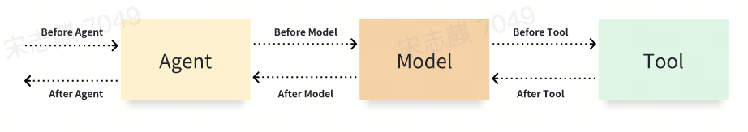
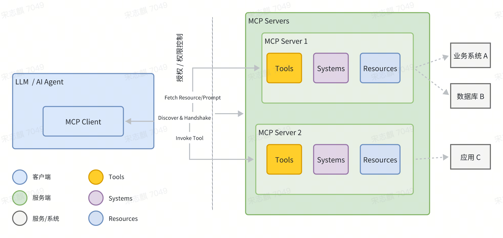

= Mastering the Art of Agents
:toc: manual

== Concepts

=== What Developer really want?

To give developers a powerful, open foundation for building complex, production-ready AI agents intuitively and with greater control.

Open Foundation:

* Model Agnostic: Doubao, Gemini
* Deployment Agnostic: VKE, Google Cloud
* Interoperability: Easy to integrate with any framework

=== Agent Development Kit 

https://google.github.io/adk-docs/

Agent Development Kit (ADK) is a flexible and modular framework for developing and deploying AI agents. While optimized for Gemini and the Google ecosystem, ADK is model-agnostic, deployment-agnostic, and is built for compatibility with other frameworks. ADK was designed to make agent development feel more like software development, to make it easier for developers to create, deploy, and orchestrate agentic architectures that range from simple tasks to complex workflows.

Agent Development Kit offers several key advantages for developers building agentic applications:

1. Multi-Agent Systems: Build modular and scalable applications by composing multiple specialized agents in a hierarchy. Enable complex coordination and delegation.
2. Rich Tool Ecosystem: Equip agents with diverse capabilities: use pre-built tools (Search, Code Execution, etc.), create custom functions, integrate tools from third-party agent frameworks (LangChain, CrewAI), or even use other agents as tools.
3. Flexible Orchestration: Define workflows using workflow agents (SequentialAgent, ParallelAgent, and LoopAgent) for predictable pipelines, or leverage LLM-driven dynamic routing (LlmAgent transfer) for adaptive behavior.
4. Integrated Developer Experience: Develop, test, and debug locally with a powerful CLI and an interactive dev UI. Inspect events, state, and agent execution step-by-step.
5. Built-in Evaluation: Systematically assess agent performance by evaluating both the final response quality and the step-by-step execution trajectory against predefined test cases.
6. Deployment Ready: Containerize and deploy your agents anywhere – run locally, scale with Vertex AI Agent Engine, or integrate into custom infrastructure using Cloud Run or Docker.

Google ADK is built around a few core concepts that make it powerful and flexible:

* Agent: Agents are core building blocks designed to accomplish specific tasks. They can be powered by LLMs to reason, plan, and utilize tools to achieve goals, and can even collaborate on complex projects.
* Tools: Tools give agents abilities beyond conversation, letting them interact with external APIs, search information, run code, or call other services.
* Session Services: Session services handle the context of a single conversation (Session), including its history (Events) and the agent's working memory for that conversation (State).
* Callbacks: Custom code snippets you provide to run at specific points in the agent's process, allowing for checks, logging, or behavior modifications.
* Artifact Management: Artifacts allow agents to save, load, and manage files or binary data (like images or PDFs) associated with a session or user.
* Runner: The engine that manages the execution flow, orchestrates agent interactions based on Events, and coordinates with backend services.

=== VE Agent Development Kit

https://volcengine.github.io/veadk-python/

火山引擎智能体框架 VeADK（Volcengine Agent Development Kit），是由火山引擎推出的为 Agent 智能体的应用构建提供开发、部署、观测、评测等全流程云原生解决方案。

相较于现有的智能体开发框架，VeADK 具备与火山引擎产品体系深度融合的优势，帮助开发者更高效地构建企业级 AI 智能体应用。

=== Course

* link:https://www.skills.google/course_templates/1382[Build intelligent agents with Agent Development Kit (ADK)]
* link:https://www.skills.google/course_templates/1275[Deploy Multi-Agent Systems with Agent Development Kit (ADK)]
* link:https://github.com/volcengine/veadk-python/blob/main/veadk_tutorial.ipynb[Volcengine Agent Development Kit 教程]

== Development Environment

=== Python

[source,bash]
----
uv venv --python 3.12
source .venv/bin/activate
uv pip install google-adk
uv pip install veadk-python
----

=== Mysql

[source, bash]
----
docker run -d \
  --name mysql \
  -e MYSQL_ROOT_PASSWORD=root \
  -p 3306:3306 \
  mysql:8.0
----

[source, bash]
----
docker exec -it mysql bash
mysql -uroot -p
----

[source, bash]
----
CREATE DATABASE VEADK;
USE VEADK;
SHOW TABLES;
----

== Getting Start

=== my_agent

[source, bash]
.*1. create project*
----
adk create my_agent
----

*2. update code*

link:my_agent/agent.py[agent.py]

[source, bash]
.*3. run agent*
----
veadk web
----

[source, bash]
.*4. Run Agent CLI*
----
python my_agent/agent.py
----

=== web_search_agent 

[source, bash]
----
web_search_agent/agent.py
----

=== terminal_agent

[source, bash]
.*ShortTermMemory Local File*
----
python terminal_agent/short_mem_local_agent.py
----

[source, bash]
.*ShortTermMemory Mysql*
----
python terminal_agent/short_mem_mysql_agent.py
----

[source, bash]
.*LongTermMemory Opensearch*
----
python terminal_agent/long_mem_opensearch_agent.py
----

[source, bash]
.*LongTermMemory Viking*
----
terminal_agent/long_mem_viking_agent.py
----

=== intent_recognition_agent

[source, bash]
----
python intent_recognition_agent/agent.py 
----

== Empower Agent

=== Callback

[source, bash]
.*1. define callback fuction*
----
chinese_content_moderator_agent = Agent(
    name="ChineseContentModerator",
    description="一个演示全链路回调和护栏功能的中文内容审查助手。",
    instruction="你是一个内容助手，可以根据用户要求撰写文章。利用好工具",
    tools=[write_article],
    before_agent_callback=before_agent_callback,
    before_model_callback=before_model_callback,
    after_model_callback=after_model_callback,
    before_tool_callback=before_tool_callback,
    after_tool_callback=after_tool_callback,
    after_agent_callback=after_agent_callback,
)
----

[source, bash]
.*2. start adk web*
----
veadk web
----

[source, bash]
.*3. test prompt*
----
// 场景1: 正常调用，触发工具和PII过滤 
请帮我写一篇关于'人工智能未来'的500字文章。

// 场景2: 输入包含敏感词，被护栏拦截
你好，我想了解一些关于 zanghua 的信息。

// 场景3: 工具参数校验失败 
写一篇关于'太空探索'的文章，字数-100。
----

=== MCP

* Model Context Protocol (MCP) is an open standard designed to standardize how Large Language Models (LLMs) like Doubao, Gemini and Claude communicate with external applications, data sources, and tools. Think of it as a universal connection mechanism that simplifies how LLMs obtain context, execute actions, and interact with various systems.
* MCP follows a client-server architecture, defining how data (resources), interactive templates (prompts), and actionable functions (tools) are exposed by an MCP server and consumed by an MCP client (which could be an LLM host application or an AI agent).

* The MCPToolset class is ADK's primary mechanism for integrating tools from an MCP server. When you include an MCPToolset instance in your agent's tools list, it automatically handles the interaction with the specified MCP server. Here's how it works:
** Connection Management: On initialization, MCPToolset establishes and manages the connection to the MCP server. This can be a local server process (using StdioServerParameters for communication over standard input/output) or a remote server (using SseServerParams for Server-Sent Events). The toolset also handles the graceful shutdown of this connection when the agent or application terminates.
** Tool Discovery & Adaptation: Once connected, MCPToolset queries the MCP server for its available tools (via the list_tools MCP method). It then converts the schemas of these discovered MCP tools into ADK-compatible BaseTool instances.

==== Local MCP Server

[source, bash]
----
tools=[
    MCPToolset(
        connection_params=StdioConnectionParams(
            server_params = StdioServerParameters(
                command='python3', 
                args=[PATH_TO_YOUR_MCP_SERVER_SCRIPT], 
            )
        )
    )
],
----

[source, bash]
.*1. start local mcp server*
----
python mcp_local/local_mcp_server.py
----

[source, bash]
.*2. test from cli*
----
python mcp_local/cli.py
----

[source, bash]
.*3. test from web*
----
veadk web
----

==== Remote(Gaode Maps) MCP Server

[source, bash]
----
tools=[
    MCPToolset(
    connection_params=StdioConnectionParams(
        server_params=StdioServerParameters(
            command='npx',
            args=[
                "-y",
                "@modelcontextprotocol/server-google-maps",
            ],
            env={
                "GOOGLE_MAPS_API_KEY": google_maps_api_key
            }
        ),
        timeout=15,
        ),
    )
],
----

[source, bash]
.*test from cli*
----
python mcp_amap/cli.py
----

[source, bash]
.*test from web*
----
veadk web
----

=== A2A

The Agent2Agent (A2A) protocol addresses a critical challenge in the AI landscape: enabling Gen AI agents, built on diverse frameworks by different companies running on separate servers, to communicate and collaborate effectively - as agents, not just as tools. A2A aims to provide a common language for agents, fostering a more interconnected, powerful, and innovative AI ecosystem.

image:img/adk_a2a_arch.png[]

A2A is built around a few core concepts that make it powerful and flexible:

* Standardized Communication: JSON-RPC 2.0 over HTTP(S).
* Agent Discovery: Agent Cards detail an agent's capabilities and connection info, so agents can discover each other and learn about each other's capabilities
* Rich Data Exchange: Handles text, files, and structured JSON data.
* Flexible Interaction: Supports synchronous request/response, streaming (SSE), and asynchronous push notifications.
* Enterprise-Ready: Designed with security, authentication, and observability in mind.

==== Remote Agent

[source, bash]
.*1. start remote agent*
----
cd a2a_remote
uvicorn agent:a2a_app --host localhost --port 8001
----

[source, json]
.*2. check the agent card from http://localhost:8001/.well-known/agent-card.json*
----
{
  "capabilities": {},
  "defaultInputModes": [
    "text/plain"
  ],
  "defaultOutputModes": [
    "text/plain"
  ],
  "description": "hello world agent that can roll a dice of 8 sides and check prime numbers.",
  "name": "hello_world_agent",
  "preferredTransport": "JSONRPC",
  "protocolVersion": "0.3.0",
  "skills": [
    {
      "description": "hello world agent that can roll a dice of 8 sides and check prime numbers. \n      I roll dice and answer questions about the outcome of the dice rolls.\n      I can roll dice of different sizes.\n      I can use multiple tools in parallel by calling functions in parallel(in one request and in one round).\n      It is ok to discuss previous dice roles, and comment on the dice rolls.\n      When I am asked to roll a die, I must call the roll_die tool with the number of sides. Be sure to pass in an integer. Do not pass in a string.\n      I should never roll a die on my own.\n      When checking prime numbers, call the check_prime tool with a list of integers. Be sure to pass in a list of integers. I should never pass in a string.\n      I should not check prime numbers before calling the tool.\n      When I am asked to roll a die and check prime numbers, I should always make the following two function calls:\n      1. I should first call the roll_die tool to get a roll. Wait for the function response before calling the check_prime tool.\n      2. After I get the function response from roll_die tool, I should call the check_prime tool with the roll_die result.\n        2.1 If user asks I to check primes based on previous rolls, make sure I include the previous rolls in the list.\n      3. When I respond, I must include the roll_die result from step 1.\n      I should always perform the previous 3 steps when asking for a roll and checking prime numbers.\n      I should not rely on the previous history on prime results.\n    ",
      "id": "hello_world_agent",
      "name": "model",
      "tags": [
        "llm"
      ]
    },
    {
      "description": "Roll a die and return the rolled result.\n\nArgs:\n  sides: The integer number of sides the die has.\n  tool_context: the tool context\nReturns:\n  An integer of the result of rolling the die.",
      "id": "hello_world_agent-roll_die",
      "name": "roll_die",
      "tags": [
        "llm",
        "tools"
      ]
    },
    {
      "description": "Check if a given list of numbers are prime.\n\nArgs:\n  nums: The list of numbers to check.\n\nReturns:\n  A str indicating which number is prime.",
      "id": "hello_world_agent-check_prime",
      "name": "check_prime",
      "tags": [
        "llm",
        "tools"
      ]
    }
  ],
  "supportsAuthenticatedExtendedCard": false,
  "url": "http://localhost:8001",
  "version": "0.0.1"
}
----

[source, bash]
.*3. test via A2AClient*
----
python a2a_client/local_client.py
----

==== Client Agent

[source, bash]
----
veadk web
----

|===
|ID |PROMPT |RESULT 

|1
|掷一个骰子，并检查结果是否为质数
|The number I rolled with an 8-sided die is 5. According to the prime check result, 5 is a prime number.

|2
|请投掷10次骰子并统计结果
|返回频率分布和质数统计

|3
|投掷20次骰子，分析概率分布
|概率分布图表和统计报告

|4
|请投掷一个12面的骰子
|The result of rolling the 12-sided die is 5

|5
|查看之前的投掷记录
|历史投掷记录和统计

|6
|检查数字[2,3,5,7,10,11]是否为质数
|对应检查结果
|===

=== RAG

==== RAG Opensearch

[source, bash]
.*start from cli*
----
python rag_opensearch/cli.py
----

[source, bash]
.*start webui*
----
veadk web
----

==== RAG Viking

[source, bash]
.*start from cli*
----
python rag_viking/cli.py
----

[source, bash]
.*start webui*
----
veadk web
----

=== Multiple Agents

[source, bash]
----
veadk web

python assistant_agent/main.py
----

=== Agent Deploy

[source, bash]
----
veadk deploy --access-key YOUR_AK --secret-key YOUR_SK --vefaas-app-name=youragentname --use-adk-web
----
