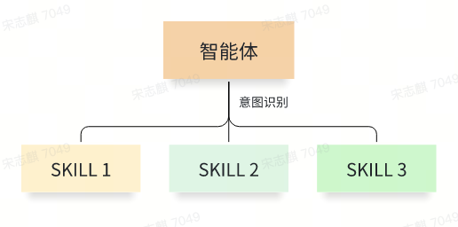
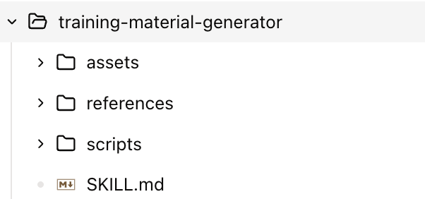

= Agent Skills
:toc: manual

== 什么是 Skill？

如果说大模型是 CPU，智能体是 OS，那么 Skill 就是 APP。 

Skill 是一个*能力单元*，它把专业知识、工作流程和最佳实践打包起来，让大模型结合上下文自动调用。

[source, bash]
.*Skill Structure*
----
my-skill/
├── SKILL.md          # Required: instructions + metadata
├── scripts/          # Optional: executable code
├── references/       # Optional: documentation
└── assets/           # Optional: templates, resources
----

Skill 规范：https://agentskills.io/specification

[source, bash]
.*SKILL.md Header*
----
---
name: <the name of skill>
description: <the description of skill, very important, llm select the Skill base on description, must be 1-1024 characters, describe both what the skill does and when to use it>
license: Apache-2.0
metadata:
  author: kylin
  version: "1.0"
---
----

== The First Skill

code.coze.cn 有生成 Skill 的能力，在扣子中输入

[source, bash]
----
生成一个培训内容准备的技能，可根据培训的主题以及听众，生成一个Word 版本的 详细培训材料
----

* link:training-material-generator/SKILL.md[training-material-generator/SKILL.md]
* link:training-material-generator/scripts/create_training_docx.py[training-material-generator/scripts/create_training_docx.py]
* link:training-material-generator/references/training_structure.md[training-material-generator/references/training_structure.md]
* link:training-material-generator/assets/[training-material-generator/assets/]   

将training-material-generator 部署后可以进行使用，大模型提示词如下

[source, bash]
----
Agent Skill 培训
---- 

对应生成的内容: link:file/Agent-Skill培训材料-7f5d7a8f3c.docx[Agent-Skill培训材料-7f5d7a8f3c.docx]

NOTE: Skill 需要部署且有智能体支持，目前支持 Skill 的平台包括 link:https://www.coze.cn/[扣子空间], link:https://www.volcengine.com/docs/86681/1844861?lang=zh[AgentKit]
