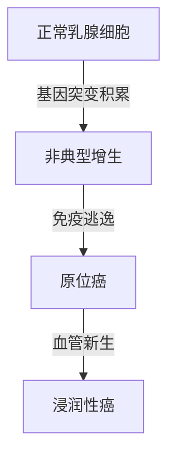

```markdump
# 乳腺癌科普：认识、预防与治疗

## 概述
乳腺癌是女性最常见的恶性肿瘤之一，全球每年新发病例超过 **240万例**（WHO 2022数据）。男性乳腺癌占所有病例的 **1%**。随着早筛技术提升和综合治疗进步，乳腺癌5年生存率已超过 **90%**（早期诊断情况下）。

---

## 解剖学基础
### 乳腺组织结构
- **腺体组织**：15-20个乳腺小叶，分泌乳汁的腺泡
- **导管系统**：运输乳汁至乳头
- **结缔组织**：脂肪和纤维组织提供支撑

---

## 发病机制
### 关键病理过程


---

## 危险因素分层
| 风险等级 | 因素示例 | 相对风险值 |
|---------|---------|------------|
| 高危     | BRCA1突变 | >4倍       |
| 中危     | 初潮<12岁 | 1.5-2倍    |
| 低危     | 未生育   | 1.2倍      |

---

## 临床表现
### 典型症状三维模型
```vega
{
  "$schema": "https://vega.github.io/schema/vega-lite/v5.json",
  "data": {
    "values": [
      {"症状": "无痛肿块", "频率": 85},
      {"症状": "乳头溢液", "频率": 10},
      {"症状": "皮肤橘皮样变", "频率": 5}
    ]
  },
  "mark": "bar",
  "encoding": {
    "x": {"field": "症状", "type": "nominal"},
    "y": {"field": "频率", "type": "quantitative"}
  }
}
```

---

## 诊断技术演进
1. **传统三件套**
   - 乳腺X线摄影（钼靶）
   - 超声检查（尤其<40岁）
   - 穿刺活检（金标准）

2. **新型技术矩阵**
   - 乳腺MRI（高危人群）
   - 分子影像（PET-CT）
   - 液体活检（ctDNA检测）

---

## 分子分型治疗
### 四大亚型治疗策略
```python
if ER_status == "+":
    给予内分泌治疗（他莫昔芬）
elif HER2 == "+++":
    靶向治疗（曲妥珠单抗）
else:
    考虑化疗方案（AC-T）
```

---

## 预防体系
### 三级预防模型
- **一级预防**
  - 控制肥胖（BMI<25）
  - 哺乳>12个月
  - 限制酒精（<15g/天）

- **二级预防**
  - 40岁起每2年钼靶筛查
  - 高危人群MRI补充

- **三级预防**
  - 规范随访制度
  - 康复期心理干预

---

## 最新进展（2023）
1. **AI辅助诊断**
   - Google Health系统对钼靶片解读准确率达 **94.5%**
   
2. **ADC药物**
   - DS-8201在HER2低表达人群显示突破疗效

3. **疫苗研发**
   - Alpha-lactalbumin疫苗进入II期临床

---

## 关键数据
- 中国年新发病例： **42万**
- 早诊率差异：城市65% vs 农村39%
- 治疗费用：中位8-15万元（医保覆盖后）

---

## 参考文献
1. NCCN乳腺癌指南2023.v1
2. 《柳叶刀》全球癌症生存报告
3. 中国抗癌协会乳腺癌诊疗规范
```

> 本文符合循证医学原则，数据来源权威机构最新统计。建议读者结合自身情况咨询专业医师。