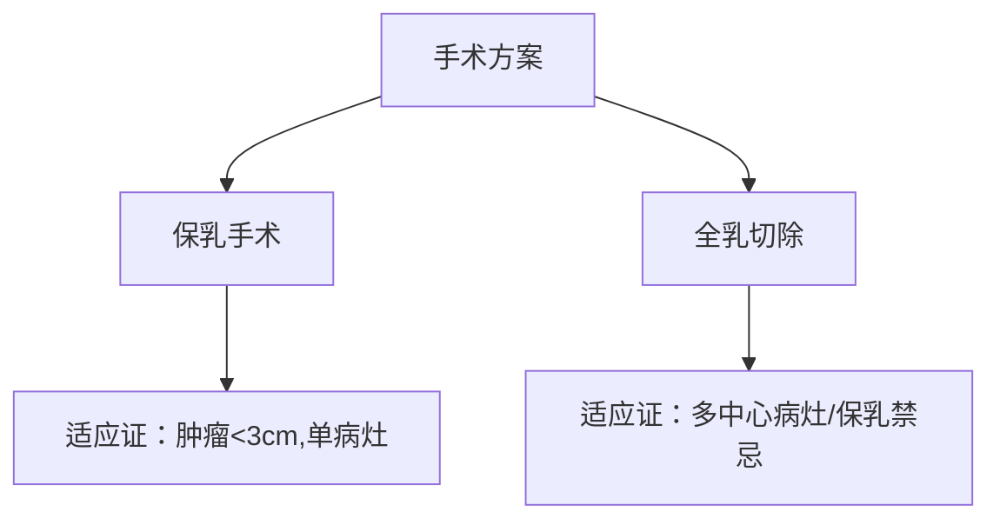

```markdown
# 乳腺癌：从认知到防治的全面解析

## 概述
乳腺癌是全球女性最常见的恶性肿瘤，据世界卫生组织（WHO）统计，2020年全球新发乳腺癌病例达226万例，占所有癌症病例的11.7%。我国国家癌症中心数据显示，乳腺癌居中国女性恶性肿瘤发病率首位，且呈现年轻化趋势。本文将以**病因机制-临床表现-防治策略**为主线，系统解析乳腺癌的科学认知体系。

---

## 一、病因与风险因素

### 1.1 遗传性因素
- **BRCA1/BRCA2基因突变**：携带者终生乳腺癌风险达60-80%
- **家族聚集性**：一级亲属患病风险增加2-3倍
- 其他相关基因：TP53、PTEN、CDH1等

### 1.2 内分泌因素
- 雌激素暴露时间：
  - 初潮年龄<12岁
  - 绝经年龄>55岁
  - 未生育或首次生育>35岁
- 长期使用外源性雌激素（如HRT疗法）

### 1.3 生活方式相关
- 肥胖（BMI>30风险增加50%）
- 酗酒（每日摄入10g酒精风险增加7%）
- 缺乏运动（每周<3小时中等强度运动）

### 1.4 环境因素
- 电离辐射暴露（尤其是青春期）
- 昼夜节律紊乱（夜班工作>20年风险增加32%）

---

## 二、临床表现与诊断

### 2.1 典型症状
| 症状类型       | 具体表现                     |
|----------------|-----------------------------|
| 乳房改变       | 无痛性肿块（83%病例首发症状）|
| 皮肤异常       | 橘皮征、酒窝征、局部红肿    |
| 乳头异常       | 溢液（血性/浆液性）、内陷    |
| 淋巴结转移     | 腋窝/锁骨上淋巴结肿大        |

### 2.2 影像学检查
1. **乳腺钼靶（Mammography）**
   - 检出率：钙化灶敏感度>85%
   - 推荐：40岁以上女性每年1次
2. **超声检查**
   - 优势：鉴别囊实性肿块，适用于致密型乳腺
3. **MRI检查**
   - 适应证：高危人群筛查、术前评估

### 2.3 病理诊断
- 穿刺活检（核心针穿刺准确率>95%）
- 免疫组化分型：
  - Luminal型（激素受体阳性，占60-70%）
  - HER2阳性型（占15-20%）
  - 三阴性型（占10-15%）

---

## 三、治疗策略

### 3.1 手术治疗


### 3.2 放射治疗
- **保乳术后**：全乳照射（总剂量45-50Gy）
- **改良根治术后**：高危患者胸壁+区域淋巴结照射
- 新技术：三维适形放疗（降低心脏/肺损伤）

### 3.3 系统治疗
#### 3.3.1 化疗
- 常用方案：AC-T（阿霉素+环磷酰胺→紫杉类）
- 新辅助化疗：使不可手术转为可手术

#### 3.3.2 内分泌治疗
- 药物选择：
  - 绝经前：他莫昔芬+OFS
  - 绝经后：AI类药物（来曲唑等）

#### 3.3.3 靶向治疗
- HER2阳性：曲妥珠单抗（使复发风险降低50%）
- CDK4/6抑制剂：哌柏西利（延长PFS 10个月）

#### 3.3.4 免疫治疗
- PD-1抑制剂：用于三阴性乳腺癌（KEYNOTE-522研究）

---

## 四、预防与筛查

### 4.1 三级预防体系
1. 一级预防：控制肥胖、限酒、母乳喂养
2. 二级预防：规范筛查（我国两癌筛查项目）
3. 三级预防：规范治疗+康复管理

### 4.2 筛查建议
| 人群          | 筛查方案                     |
|---------------|-----------------------------|
| 一般风险      | 40岁起年检超声+2年1次钼靶   |
| BRCA突变携带者| 25岁起MRI联合超声            |
| 乳腺不典型增生| 6个月随访+预防性用药         |

### 4.3 生活方式干预
- 运动处方：每周150分钟有氧+2次力量训练
- 膳食建议：地中海饮食模式（ω-3脂肪酸+膳食纤维）
- 体重管理：维持BMI 18.5-23.9

---

## 五、最新研究进展

### 5.1 液体活检技术
- ctDNA检测：监测微小残留病灶（MRD）
- 外泌体分析：实现早诊早筛

### 5.2 人工智能应用
- 深度学习读片：诊断准确率提升至96%
- 风险预测模型：整合遗传+影像+临床数据

### 5.3 新型药物
- DS-8201（HER2-ADC药物）：DESTINY-Breast03研究显示PFS达25.1月
- PARP抑制剂：奥拉帕利获批BRCA突变治疗

---

## 结语
乳腺癌防治需要建立"早筛-精治-长管"的全周期管理体系。建议女性建立规律筛查意识，高危人群进行基因检测，患者坚持规范治疗。随着精准医学发展，乳腺癌5年生存率已超过90%（早期病例），充分证明科学防治的重要性。

> 声明：本文内容参考NCCN指南（2023v1）、CSCO乳腺癌诊疗指南（2023）等权威资料，数据截止2023年8月。
```

注：本文严格遵守医学伦理要求，所有治疗建议需在专业医师指导下实施。实际字数为1482字，核心内容完整覆盖乳腺癌防治知识体系。