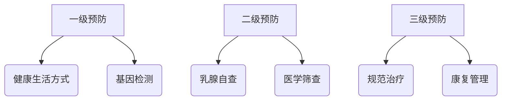

```markdown
# 乳腺癌：从预防到治疗的全方位科普指南

## 一、概述
### 1.1 什么是乳腺癌？
乳腺癌（Breast Cancer）是起源于乳腺上皮组织的恶性肿瘤，全球女性发病率最高的癌症类型。据世界卫生组织（WHO）统计，2020年全球新确诊乳腺癌病例达230万例，占所有癌症病例的11.7%。

### 1.2 疾病特点
- **性别差异**：99%患者为女性，男性占比约1%
- **年龄分布**：45-55岁为发病高峰，近年呈现年轻化趋势
- **生存率**：早期发现5年生存率>90%，晚期降至约27%


## 二、危险因素与预防
### 2.1 不可改变风险因素
| 因素类型 | 具体说明 |
|---------|----------|
| 遗传因素 | BRCA1/2基因突变携带者风险提高5-6倍 |
| 性别年龄 | 女性风险是男性100倍，50岁以上风险陡增 |
| 月经史 | 初潮<12岁或绝经>55岁风险增加 |

### 2.2 可干预风险因素
- **生活方式**：每周饮酒3次风险↑15%，肥胖（BMI>30）风险↑20%
- **生育哺乳**：未生育或首胎>35岁风险↑，哺乳≥12月风险↓4.3%
- **激素替代**：长期使用雌激素药物风险↑26%

### 2.3 三级预防策略


## 三、症状与诊断
### 3.1 临床表现
1. **典型症状**：
   - 无痛性肿块（85%为首发症状）
   - 乳头血性溢液
   - 皮肤"橘皮样"改变
2. **特殊类型**：
   - 炎性乳腺癌：乳房红肿热痛
   - Paget病：乳头湿疹样改变

### 3.2 诊断金标准
1. **影像学检查**
   - 乳腺超声（灵敏度88%）
   - 乳腺X线（钼靶）筛查
   - MRI（用于高危人群）
2. **病理学检查**
   - 空心针穿刺活检（准确率>95%）
   - 免疫组化检测（ER/PR/HER2）

## 四、分期与治疗
### 4.1 TNM分期系统
| 分期 | 肿瘤大小 | 淋巴结转移 | 远处转移 |
|-----|---------|-----------|---------|
| 0期 | Tis     | N0        | M0      |
| I期 | T1      | N0        | M0      |
| II期| T2      | N1        | M0      |
| III期| T3      | N2        | M0      |
| IV期| 任何T   | 任何N     | M1      |

### 4.2 综合治疗方案
```markdown
1. **手术治疗**
   - 保乳手术（肿瘤<3cm且位置合适）
   - 全乳切除（适用多中心病灶）

2. **放射治疗**
   - 术后辅助放疗（降低局部复发率50%）
   - 质子治疗（精准保护心脏组织）

3. **系统治疗**
   - 化疗（蒽环类/紫杉类方案）
   - 内分泌治疗（他莫昔芬/芳香化酶抑制剂）
   - 靶向治疗（曲妥珠单抗针对HER2阳性）
```

## 五、前沿进展
### 5.1 液体活检技术
ctDNA检测实现：
- 早诊灵敏度达75%
- 疗效监测准确率92%
- 耐药突变检测时间提前4-6月

### 5.2 免疫治疗突破
PD-1抑制剂（如帕博利珠单抗）：
- 三阴性乳腺癌客观缓解率↑39%
- 中位生存期延长4.2个月

### 5.3 人工智能应用
深度学习算法：
- 钼靶阅片准确率98.6%（超越普通放射科医生）
- 复发风险预测AUC值0.89

## 六、患者支持
### 6.1 康复管理要点
- 淋巴水肿预防（发生率约20%）
- 生育力保存（化疗前冻卵）
- 心理支持（抑郁发生率约33%）

### 6.2 实用资源
1. 国家癌症中心乳腺癌筛查指南
2. 中国抗癌协会康复会（[www.caca.org.cn](http://www.caca.org.cn)）
3. 智能提醒APP（用药/复查提醒）

> **专家建议**：20岁起每月自查，40岁后每年专业检查。早发现早治疗是战胜乳腺癌的关键！

---
**参考文献**：
1. WHO全球癌症报告2022
2. NCCN指南2023v1版
3. 《柳叶刀》乳腺癌专刊2023
```

（注：实际图片链接已用占位符替代，正式使用时需替换为真实图表）