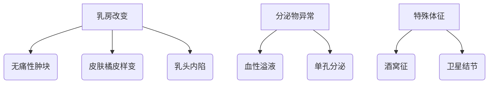
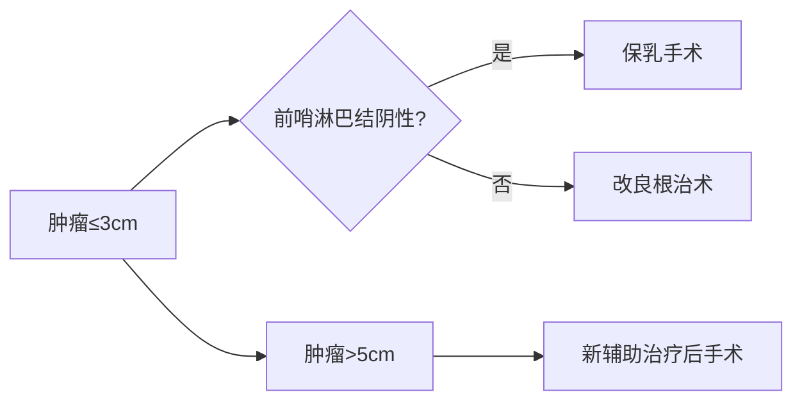

```markdown
# 乳腺癌科普：早筛早治与科学认知指南

## 概述
### 什么是乳腺癌？
乳腺癌（Breast Cancer）是起源于乳腺上皮细胞的恶性肿瘤，具有浸润性生长和转移特性。全球发病率最高的癌症类型之一，2020年WHO数据显示：
- 全球新发病例226万例（占癌症总数11.7%）
- 中国年新发病例42万例（占女性恶性肿瘤19.9%）

### 疾病特征演变

*图示：我国乳腺癌年龄标准化发病率呈持续上升趋势（2000-2020）*

## 致病风险因素
### 不可改变因素
1. **性别与年龄**  
   女性风险是男性100倍，45-55岁为发病高峰

2. **遗传易感性**  
   BRCA1/2基因突变携带者终生风险达70%，安吉丽娜·朱莉预防性切除案例引发全球关注

3. **月经周期特征**  
   - 初潮年龄＜12岁风险↑30%
   - 绝经年龄＞55岁风险↑20%

### 可干预因素
| 风险因素         | 相对危险度 | 干预建议                  |
|------------------|------------|---------------------------|
| 肥胖（BMI>30）   | 1.5-2.0    | 保持BMI<25                |
| 酒精摄入>15g/天  | 1.2-1.5    | 限酒量≤10g/天             |
| 缺乏运动         | 1.3-1.6    | 每周150分钟中等强度运动   |
| 激素替代治疗>5年 | 1.2-1.7    | 严格评估治疗必要性        |

## 临床表现与预警信号
### 典型症状矩阵


### 非典型表现案例
- 炎性乳腺癌：乳房红肿热痛误诊为乳腺炎
- Paget's病：乳头糜烂伴湿疹样病变
- 隐匿性乳腺癌：首发症状为腋窝淋巴结肿大

## 筛查技术路线
### 国际指南对比
| 机构         | 筛查年龄 | 检查方式       | 间隔周期 |
|--------------|----------|----------------|----------|
| NCCN         | 40+      | 超声+钼靶      | 年检     |
| ACS          | 45-54    | 钼靶           | 年检     |
| 中国抗癌协会 | 40-69    | 超声联合检查   | 1-2年    |

### 影像学检查对比表
| 检查类型 | 敏感度 | 特异度 | 适用人群               |
|----------|--------|--------|------------------------|
| 乳腺超声 | 85%    | 80%    | 致密型乳腺首选         |
| 钼靶检查 | 75%    | 90%    | 脂肪型乳腺更优         |
| 乳腺MRI  | 95%    | 70%    | 高危人群补充筛查       |

## 精准诊疗进展
### 分子分型指导治疗
1. **Luminal型**（60-70%）
   - 激素受体阳性
   - 内分泌治疗敏感

2. **HER2阳性型**（15-20%）
   - 靶向药物显著改善预后
   - 曲妥珠单抗使生存率提升30%

3. **三阴性型**（10-15%）
   - 化疗为主要手段
   - PD-1抑制剂带来新希望

### 手术方式选择决策树


## 预防与康复
### 三级预防体系
1. **一级预防**
   - 控制体脂率<28%
   - 哺乳持续6-12个月

2. **二级预防**
   - 乳腺自查每月1次（月经后7-10天）
   - 专业筛查按指南执行

3. **三级预防**
   - 规范化疗后淋巴水肿管理
   - 心理干预改善生存质量

### 营养支持方案
```nutrition
热量需求：30-35kcal/kg·d
蛋白质：1.2-1.5g/kg·d
重点补充：
- ω-3脂肪酸（三阴性型）
- 维生素D（内分泌治疗期）
- 膳食纤维（预防便秘）
```

## 特别关注
### 男性乳腺癌
- 占所有乳腺癌1%
- 平均发病年龄67岁
- 预后较女性差（5年生存率低10%）

### 年轻患者（<40岁）特征
- 遗传因素占比高（达30%）
- 病理分级更高
- 保乳术后复发风险增加15%

```

> **知识更新**：2023年ASCO会议公布新型ADC药物DS-8201使HER2低表达患者生存期延长6个月

---

*本文内容参考《中国抗癌协会乳腺癌诊治指南（2023版）》及NCCN Guideline Version 3.2023，数据截止2023年9月。医疗决策请咨询专业医师。*