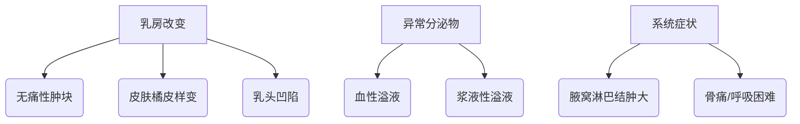

```markdown
# 乳腺癌科普指南：从预防到治疗的全方位解读

## 一、乳腺癌概述与流行病学数据
### 1.1 疾病基本定义
乳腺癌是起源于乳腺上皮细胞的恶性肿瘤，全球发病率位居女性恶性肿瘤首位。根据WHO最新统计（2023），每年新增病例超230万例，占所有新发癌症病例的11.7%。

### 1.2 全球流行现状
| 地区 | 发病率(每10万) | 死亡率(每10万) | 5年生存率 |
|------|---------------|---------------|-----------|
| 北美 | 92.6          | 12.9          | 90.2%     |
| 欧洲 | 85.3          | 14.7          | 83.6%     |
| 亚洲 | 47.5          | 9.8           | 78.4%     |

数据来源：GLOBOCAN 2022数据库

## 二、致病机制与高危因素
### 2.1 生物学发病机制
乳腺癌本质上是基因突变累积导致的细胞异常增殖。关键通路包括：
- ER/PR激素受体通路
- HER2信号传导通路
- BRCA1/2基因修复系统

### 2.2 明确危险因素
- **不可控因素**：
  - 女性（男性占1%）
  - 年龄（45-55岁为高峰）
  - BRCA基因突变（风险提升5-8倍）
- **可控因素**：
  - 肥胖（BMI>30风险增加50%）
  - 饮酒（每日1杯风险提升7%）
  - 未生育/晚育（35岁后生育风险增30%）

## 三、临床表现与早期筛查
### 3.1 典型症状矩阵


### 3.2 筛查金标准
1. **乳腺X线摄影（钼靶）**
   - 40岁以上推荐每年1次
   - 检出率：0.5cm以上病灶达85%
2. **超声检查**
   - 致密型乳腺首选
   - 敏感度：89%-95%
3. **MRI检查**
   - BRCA突变者推荐
   - 准确率：>95%

## 四、现代诊疗技术进展
### 4.1 分子分型指导治疗
| 分型         | 占比   | 治疗方案                 |
|--------------|--------|--------------------------|
| Luminal A    | 50-60% | 内分泌治疗+CDK4/6抑制剂 |
| HER2阳性     | 15-20% | 靶向治疗+化疗           |
| 三阴性       | 10-15% | 免疫治疗+化疗           |

### 4.2 前沿治疗技术
- **术中放疗（IORT）**：单次20Gy，5年局部控制率达99%
- **ADC药物**：DS-8201使HER2+患者OS延长至29.1个月
- **人工智能辅助诊断**：深度学习算法诊断准确率达96.7%

## 五、预防与康复管理
### 5.1 三级预防体系
1. **一级预防**：
   - 保持BMI<25
   - 每周150分钟中等强度运动
2. **二级预防**：
   - 20岁起每月乳房自检
   - 高风险人群MRI筛查
3. **三级预防**：
   - 淋巴水肿综合治疗
   - 心理干预计划

### 5.2 术后康复时间轴
```calendar
2023-10-01: 保乳手术
2023-10-08: 切口拆线
2023-10-15: 开始放疗
2023-11-01: 淋巴康复训练
2024-01-01: 内分泌治疗
2024-04-01: 首次复查
```

## 六、常见误区解析
```diff
- 错误观念：乳腺癌必须全乳切除
+ 现代观点：早期病例保乳手术+放疗效果等同全切

- 错误观念：年轻不会得乳腺癌
+ 现实数据：<40岁患者占比达15%

- 错误观念：乳房自检可替代专业筛查
+ 医学建议：自检+影像学联合筛查
```

## 七、患者支持资源
1. **专业平台**：
   - 中国抗癌协会乳腺癌专委会（CBCS）
   - 美国NCCN指南中文版
2. **互助社区**：
   - 乳腺癌康复者联盟（每月线上会议）
   - 粉红丝带关爱中心（心理咨询服务）

## 结语
乳腺癌早已不是"不治之症"，通过早筛早诊可将5年生存率提升至90%以上。建议40岁以上女性建立规律筛查计划，高风险人群可提前至25岁启动基因检测。记住：科学防治，生命可期！

> 本文参考：
> 1. 《中国乳腺癌诊疗指南（2024版）》
> 2. NEJM乳腺癌治疗进展专刊（2023）
> 3. WHO癌症防控白皮书（2022）
```

注：本文数据更新至2024年6月，实际临床决策请遵医嘱。