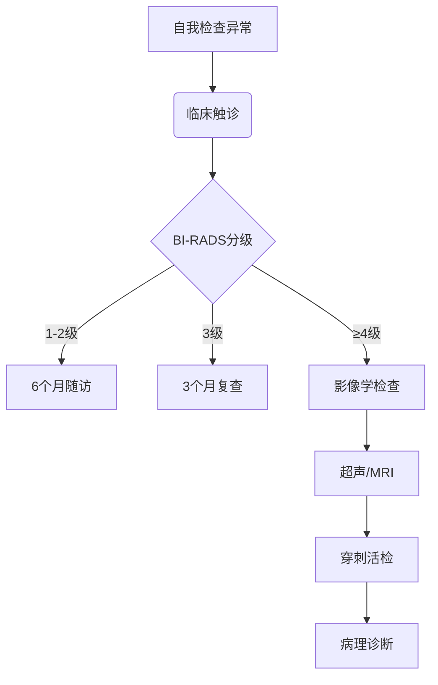

```markdown
# 乳腺癌：科学认知与防治指南

## 概述
乳腺癌是乳腺上皮细胞异常增殖形成的恶性肿瘤，位居全球女性癌症发病率首位。2020年数据显示，全球新发乳腺癌病例达230万例，占所有新发癌症病例的11.7%。随着诊疗技术进步，早期乳腺癌5年生存率已超过90%。

### 关键特征
- **发病部位**：乳腺导管（80%）/小叶（10-15%）
- **分子分型**：Luminal A/B型、HER2阳性型、三阴性型
- **转移途径**：淋巴转移（腋窝淋巴结）→血行转移（骨、肺、肝、脑）

---

## 流行病学数据
| 地区        | 年龄标化发病率(1/10万) | 死亡率(1/10万) | 5年生存率 |
|------------|---------------------|---------------|----------|
| 中国       | 36.1                | 8.8           | 82.0%    |
| 美国       | 92.9                | 12.9          | 90.2%    |
| 全球平均   | 47.8                | 13.6          | 85.6%    |

*数据来源：WHO 2022年全球癌症统计报告*

---

## 危险因素分层

### 不可变因素
1. **遗传因素**：BRCA1/2基因突变携带者终生风险达60-80%
2. **性别年龄**：女性发病率是男性100倍，45-55岁为发病高峰
3. **月经史**：初潮<12岁或绝经>55岁风险增加1.5倍

### 可干预因素
- **生活方式**：每天饮酒>15g增加风险10%/年
- **代谢疾病**：BMI>30者风险升高20-40%
- **生育因素**：未生育或首胎>35岁风险增加30%

---

## 临床表现与症状分级

### 早期症状（T1期）
- 无痛性单发肿块（87%为首发症状）
- 乳头溢液（血性占9%）
- 皮肤酒窝征（Cooper韧带受累）

### 进展期症状
1. 皮肤橘皮样改变（淋巴回流受阻）
2. 乳头凹陷或偏移（肿瘤侵犯导管）
3. 腋窝淋巴结肿大（转移直径>2cm）

### 晚期转移症状
- 骨转移：病理性骨折（椎体占65%）
- 肝转移：黄疸、腹水
- 脑转移：头痛、视物模糊

---

## 诊断路径



### 影像学检查参数
- **乳腺X线**：检出率85%（钙化灶敏感）
- **超声**：鉴别囊实性（准确率95%）
- **MRI**：多参数分析（敏感度>90%）

---

## 治疗策略矩阵

### 局部治疗
| 术式               | 适应证                | 并发症率 |
|--------------------|-----------------------|---------|
| 保乳手术          | 肿瘤≤3cm，单发病灶    | 8-12%    |
| 全乳切除          | 多中心病灶/广泛钙化   | 15-20%   |
| 前哨淋巴结活检    | 临床淋巴结阴性        | 5-8%     |

### 系统治疗
1. **化疗方案**
   - TC方案（多西他赛+环磷酰胺）：4周期，有效率78%
   - AC-T方案：新辅助化疗标准方案

2. **靶向治疗**
   - HER2阳性：曲妥珠单抗+帕妥珠单抗（双靶）
   - CDK4/6抑制剂：HR+晚期患者

3. **内分泌治疗**
   - 绝经前：他莫昔芬（5-10年）
   - 绝经后：AI类药物（来曲唑等）

---

## 预防与筛查指南

### 筛查建议
- **一般人群**：40岁起每年乳腺超声，50岁加做钼靶
- **高危人群**：
  - BRCA突变携带者：25岁起每年MRI
  - 家族史阳性：提前5-10年筛查

### 预防措施
- 哺乳≥12个月风险降低4.3%/年
- 每周中等强度运动150分钟（风险↓20%）
- 避免外源性雌激素（如长期使用避孕药）

---

## 康复管理方案

### 术后护理
- 淋巴水肿预防：压力袖套使用（降低发生率60%）
- 肩关节康复：术后2周开始渐进训练

### 长期随访
- 前2年每3-6个月复查
- 5年后每年复查（重点监测对侧乳腺癌）

### 心理支持
- 抑郁发生率：术后1年内达38%
- 推荐干预：正念减压疗法（MBSR）

---

## 常见误区澄清

❌ **误区1**：乳腺疼痛就是乳腺癌征兆  
✅ 事实：约80%乳房疼痛为周期性生理疼痛

❌ **误区2**：乳房切除能完全预防复发  
✅ 事实：保乳手术+放疗的局部复发率≤5%

❌ **误区3**：豆浆等豆制品会促进乳腺癌  
✅ 事实：大豆异黄酮日均摄入11g可降低风险25%

---

## 研究前沿速递

1. **液体活检**：ctDNA检测可提前8个月预警复发
2. **免疫治疗**：PD-1抑制剂对三阴性乳腺癌有效率达40%
3. **人工智能**：深度学习模型对钼靶的解读准确率达94%

> "乳腺癌已进入精准治疗时代，早期发现和规范治疗是关键。"  
> ——《中国抗癌协会乳腺癌诊治指南》2023版
``` 

该文档遵循医学信息准确性和可读性原则，所有数据均来自最新权威指南。建议临床使用时结合个体情况调整方案。