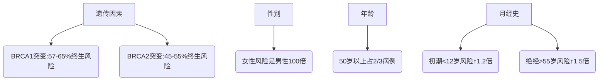

```markdump
# 乳腺癌：从认知到防治的全方位科普

```markdown
## 一、引言：被忽视的"粉红杀手"
乳腺癌是全球女性最常见的恶性肿瘤。根据世界卫生组织2023年最新数据，每年约有230万新发病例，占所有新发癌症病例的11.7%。在中国，乳腺癌发病率以每年3%-4%的速度递增，北上广等大城市发病率已接近欧美国家。这个被称为"粉红杀手"的疾病，正在成为威胁女性健康的头号公敌。但值得欣慰的是，随着医学技术进步，早期乳腺癌5年生存率可达90%以上。本文将系统解析乳腺癌的防治要点。

## 二、疾病概述
### 1. 基本定义
乳腺癌是起源于乳腺上皮细胞的恶性肿瘤，主要发生在：
- 乳腺导管（导管癌，占75-80%）
- 乳腺小叶（小叶癌，占5-10%）
- 其他罕见类型：炎性乳腺癌、乳头Paget病等

### 2. 流行病学特征
| 地区        | 年龄趋势        | 性别比例       |
|-------------|-----------------|----------------|
| 发达国家↑   | 45-55岁高峰     | 女性99%        |
| 发展中国家↑ | 发病年龄提前    | 男性1%         |
| 中国特点    | 城市>农村2倍    | 年轻患者比例高 |

*数据来源：WHO 2023全球癌症统计报告*

## 三、危险因素金字塔
### 1. 不可控因素


### 2. 可控风险
- **生活方式**：每日饮酒≥3杯风险↑40%
- **代谢因素**：BMI>30风险↑1.5倍
- **生育因素**：未生育或首胎>35岁风险↑30%
- **激素治疗**：绝经后激素替代治疗>5年风险↑26%

## 四、预警信号与自查方法
### 1. 典型症状矩阵
```
                早期表现                    进展期表现
外观改变      无痛性肿块                  橘皮样变/酒窝征
皮肤异常      局部凹陷                    卫星结节/溃疡
乳头异常      单侧溢液（尤其血性）        乳头回缩/糜烂
其他症状      腋窝淋巴结肿大              骨痛/黄疸/消瘦
```

### 2. 自查四步法（每月月经后7-10天）
1. **视诊**：对镜观察乳房对称性、皮肤变化
2. **触诊**：三指并拢螺旋式按压，注意外上象限（60%肿瘤发生区）
3. **挤压**：轻捏乳头观察溢液
4. **对比**：双侧乳房对照检查

## 五、现代筛查技术
### 1. 影像学检查对比表
| 检查方式   | 适用人群         | 检出率 | 局限性           |
|------------|------------------|--------|------------------|
| 乳腺钼靶   | >40岁女性        | 85%    | 致密乳腺显影差   |
| 超声检查   | 各年龄段首选     | 90%    | 依赖操作者经验   |
| 乳腺MRI    | 高危人群         | 95%    | 假阳性率高       |
| 新型技术   | 超声弹性成像     | 92%    | 尚未普及         |

### 2. 基因检测适应证
- 家族中≥2例乳腺癌患者
- 双侧乳腺癌或年轻发病（<45岁）
- 男性乳腺癌患者
- 三阴性乳腺癌患者

## 六、精准诊断流程
```flow
st=>start: 发现异常
op1=>operation: 临床检查
op2=>operation: 影像学检查
op3=>operation: 病理活检
cond1=>condition: BI-RADS分级
cond2=>condition: 恶性确认
op4=>operation: 分期检查
op5=>operation: 制定方案

st->op1->op2->cond1
cond1(≥4级)->op3->cond2
cond2(yes)->op4->op5
```

**病理金标准**：
- 免疫组化：ER/PR/HER2状态
- 分子分型：Luminal A/B型、HER2阳性型、三阴性

## 七、多学科治疗策略
### 1. 外科手术进化史
- **根治术**→**改良根治术**→**保乳手术**（现占比>60%）
- 前哨淋巴结活检替代腋窝清扫
- 乳房重建技术（假体/自体组织）

### 2. 综合治疗方案
```mindmap
- 局部治疗
  - 手术
  - 放疗（全乳/部分乳腺）
- 系统治疗
  - 化疗（新辅助/辅助）
  - 内分泌治疗（5-10年）
  - 靶向治疗（曲妥珠单抗等）
  - 免疫治疗（PD-1抑制剂）
```

**最新进展**：
- CDK4/6抑制剂（帕博西尼）使晚期患者生存期延长至5年
- ADC药物（DS-8201）对HER2低表达有效
- 奥拉帕利等PARP抑制剂用于BRCA突变者

## 八、预防与康复
### 1. 三级预防体系
1. **一级预防**：控制肥胖、限酒、母乳喂养
2. **二级预防**：40岁起每1-2年钼靶筛查
3. **三级预防**：规范治疗+全程管理

### 2. 康复支持系统
- **淋巴水肿管理**：压力治疗+功能锻炼
- **心理干预**：约38%患者存在焦虑抑郁
- **生育保护**：GnRHa药物卵巢保护
- **随访制度**：治疗后2年内每3月复查

## 九、科研前沿速递
1. **液体活检**：ctDNA监测微小残留病灶
2. **人工智能**：DeepMind开发的AI阅片系统准确率91%
3. **疫苗研发**：针对HER2蛋白的DNA疫苗进入II期临床
4. **微生物组**：肠道菌群调节化疗疗效

## 十、结语
乳腺癌防治需要建立"早筛-精治-全程"的管理闭环。建议所有女性：
- 了解自身乳房正常状态
- 40岁开始规律筛查
- 保持BMI 18.5-24.9
- 每周至少150分钟中等强度运动

记住：恐惧源于未知，科学防治能让乳腺癌成为可管理的慢性病。让我们用知识和行动构筑起对抗"粉红杀手"的坚实防线。

**参考文献**：
1. WHO Breast Cancer Report 2023
2. NCCN Clinical Practice Guidelines 2023.v1
3. Lancet Oncology: Global Cancer Statistics
4. 中国抗癌协会乳腺癌诊治指南（2023版）
```