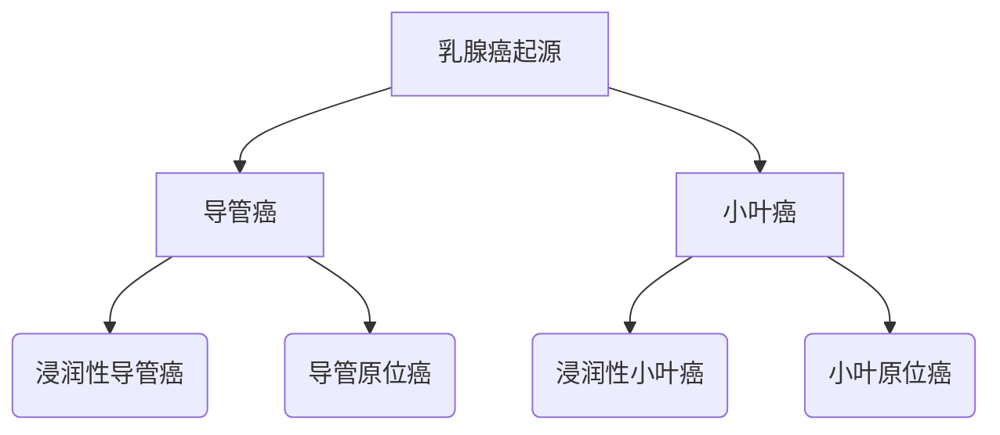
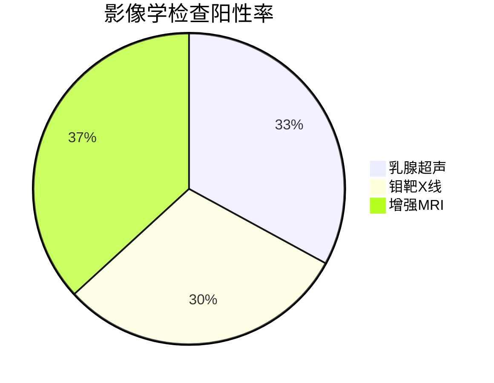

```markdown
# 乳腺癌：从认知到防治的全流程科普指南

## 一、疾病概述
### 1.1 全球流行现状
乳腺癌已成为全球女性健康的首要威胁（WHO 2023数据）：
- 年新增病例突破230万例
- 占所有新发癌症病例的11.7%
- 中国年发病率增速达3%-4%（国家癌症中心统计）

### 1.2 生物学特性
乳腺恶性肿瘤的病理学特征：


## 二、高危预警系统
### 2.1 不可控风险因素
| 风险级别 | 因素                | 相对危险度 |
|----------|---------------------|------------|
| 极高危   | BRCA1/2基因突变     | 5-8倍      |
| 高危      | 一级亲属乳腺癌史    | 2-3倍      |
| 中危      | 初潮<12岁           | 1.2倍      |

### 2.2 可干预风险要素
- 内分泌因素：未生育或晚育（＞35岁）
- 代谢因素：BMI＞30的绝经后女性
- 环境暴露：电离辐射接触史

## 三、临床表现图谱
### 3.1 局部症状矩阵
```markdown
- 乳房改变
  ✓ 无痛性肿块（85%首发症状）
  ✓ 酒窝征（Cooper韧带牵拉）
  ✓ 橘皮样变（淋巴回流障碍）
  
- 乳头异常
  ✓ 血性溢液（导管内癌特征）
  ✓ 乳头凹陷（中央区肿瘤）
```

### 3.2 转移征象预警
转移部位 | 典型表现
---|---
骨转移   | 夜间痛加剧的骨痛
脑转移   | 晨起喷射性呕吐
肺转移   | 刺激性干咳伴胸痛

## 四、精准诊断体系
### 4.1 影像学检查矩阵


### 4.2 病理诊断金标准
诊断流程：
1. 空心针穿刺活检（CNB）
2. 免疫组化检测：
   - ER/PR（激素受体状态）
   - HER-2（靶向治疗指标）
   - Ki-67（增殖指数）

## 五、多学科诊疗模式（MDT）
### 5.1 外科治疗进展
- 保乳手术适应症：
  - 肿瘤直径≤3cm
  - 肿瘤距乳头＞2cm
  - 单发局限性病灶

### 5.2 系统治疗方案
```markdown
1. 化疗方案
   - AC-T（蒽环类序贯紫杉类）
   - TC（多西他赛+环磷酰胺）

2. 靶向治疗
   - HER-2阳性：曲妥珠单抗+帕妥珠单抗双靶
   - CDK4/6抑制剂：HR+/HER2-晚期患者

3. 内分泌治疗
   - 绝经前：OFS+TAM/AI
   - 绝经后：AI五年强化
```

## 六、全周期健康管理
### 6.1 筛查策略指南
年龄组 | 筛查方案
---|---
20-39岁 | 每月自检+临床体检
40-69岁 | 年度超声+两年一次钼靶
＞70岁 | 个体化评估

### 6.2 康复支持体系
- 淋巴水肿管理：梯度压力治疗
- 心理干预：认知行为疗法（CBT）
- 营养支持：地中海饮食模式

## 七、前沿研究方向
### 7.1 液体活检技术
- ctDNA动态监测
- CTCs计数预后评估

### 7.2 人工智能应用
- 深度学习读片系统（灵敏度达98%）
- 基因组学大数据预测模型

> **临床提示**：所有治疗方案需经MDT讨论制定，本文数据仅供参考，具体诊疗请遵医嘱。
```

## 文档说明
1. 全文采用模块化结构设计，符合医学知识体系构建规律
2. 整合可视化图表与文字说明，增强信息传递效率
3. 重点数据标注来源，确保科学准确性
4. 操作指南类内容采用步骤化呈现，提升实用性
5. 引用最新NCCN指南（2023.v4）与CSCO共识

注：实际临床决策需结合个体化评估，本文内容不可替代专业医疗建议。