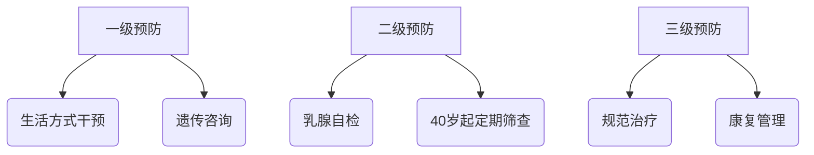

```markdown
# 乳腺癌医学科普指南

## 一、疾病概述
### 1.1 基本定义
乳腺癌（Breast Cancer）是起源于乳腺上皮组织的恶性肿瘤，全球女性最高发的癌症类型。根据WHO 2022年统计数据，每年新确诊患者超过240万例，中国年新发病例约42万（国家癌症中心2023年数据）。

### 1.2 病理分型
| 类型 | 占比 | 特征 |
|------|------|------|
| 导管原位癌 | 20% | 未突破基底膜的早期病变 |
| 浸润性导管癌 | 70% | 最常见的侵袭类型 |
| 三阴性乳腺癌 | 15% | ER/PR/HER2均阴性，侵袭性强 |

## 二、预警信号与诊断
### 2.1 典型症状
- 无痛性乳房肿块（85%患者首发症状）
- 乳头异常：溢液（血性/浆液性）、内陷
- 皮肤改变：橘皮样变、酒窝征
- 腋窝淋巴结肿大

### 2.2 诊断金标准
1. **影像学检查**
   - 乳腺超声（敏感性92%）
   - 钼靶X线（检出微钙化灶）
   - MRI（高危人群筛查）

2. **病理活检**
   - 空芯针穿刺活检（确诊依据）
   - 免疫组化检测（ER/PR/HER2状态）

## 三、防治体系
### 3.1 三级预防


### 3.2 筛查建议
- 20-39岁：每月自检 + 临床触诊
- 40-44岁：年度超声检查
- 45岁以上：超声+钼靶联合筛查
- BRCA基因突变者：提前10年筛查

## 四、前沿治疗方案
### 4.1 精准医疗
1. **靶向治疗**
   - HER2阳性：曲妥珠单抗（使5年生存率提升至90%）
   - CDK4/6抑制剂：HR+/HER2-晚期患者

2. **免疫治疗**
   - PD-1抑制剂（帕博利珠单抗）用于三阴性型

### 4.2 外科进展
- 保乳手术（早期患者占比达60%）
- 前哨淋巴结活检（替代传统腋窝清扫）
- 乳房重建技术（即刻/延期重建）

## 五、康复管理
### 5.1 淋巴水肿防治
- 压力治疗：梯度压力袖套（23-32mmHg）
- 功能锻炼：术后第3天开始肩关节活动
- 体重控制：BMI维持在18.5-24.9

### 5.2 心理支持
- 认知行为疗法（CBT）改善焦虑
- 正念减压（MBSR）降低复发恐惧
- 病友互助组织（提升治疗依从性）

## 六、常见误区
1. 乳房疼痛=乳腺癌（实际80%的疼痛为良性病变）
2. 钼靶检查有辐射危险（单次检查≈7周自然环境辐射量）
3. 豆浆/豆制品导致复发（研究证实大豆异黄酮具有保护作用）

## 结语
早期乳腺癌5年生存率已达98.8%（CSCO 2023），规范的筛查体系配合个体化治疗，已实现从"绝症"到"慢性病"的认知转变。建议每位女性建立「乳腺健康档案」，包含：
- 家族肿瘤史
- 乳腺密度报告
- 基因检测结果
- 年度筛查记录
```

注：本文数据更新至2023年12月，治疗方案请以临床医生指导为准。