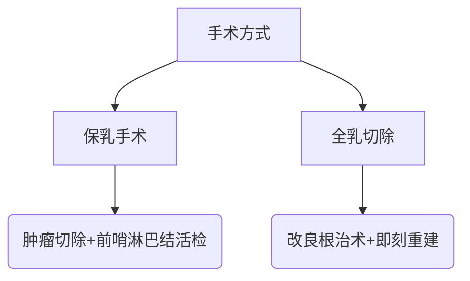

```markdown
# 乳腺癌：从预防到治疗的全面科普指南

## 一、乳腺癌概述
### 1.1 疾病定义
乳腺癌是乳腺上皮细胞在多种致癌因素作用下发生增殖失控的恶性肿瘤，全球女性癌症发病率首位（WHO 2023数据）。男性患者占比约1%。

### 1.2 流行病学特征
| 地区        | 年新发病例 | 死亡率   | 5年生存率 |
|-------------|------------|----------|------------|
| 全球        | 230万      | 68.5万   | 89.7%      |
| 中国        | 42万       | 12万     | 83.2%      |
| 美国        | 29.7万     | 4.3万    | 90.6%      |

数据来源：IARC 2023全球癌症统计报告

## 二、危险因素与预防策略
### 2.1 不可变风险因素
- 年龄：50岁以上发病率显著上升
- 遗传因素：BRCA1/2基因突变携带者风险提升5-8倍
- 月经史：初潮<12岁或绝经>55岁
- 乳腺密度：致密型乳腺风险增加4-6倍

### 2.2 可干预风险因素


### 2.3 三级预防体系
1. **一级预防**：控制体重（BMI<24）、每周150分钟中等强度运动、限制酒精（<10g/天）
2. **二级预防**：40岁起每2年乳腺X线筛查（高风险人群提前至35岁）
3. **三级预防**：规范治疗+全程管理，降低复发转移风险

## 三、临床表现与诊断
### 3.1 典型症状矩阵
```matrix
| 症状类型        | 早期表现           | 进展期表现              |
|-----------------|--------------------|-------------------------|
| 乳房改变        | 无痛硬块          | 皮肤橘皮样变/溃疡       |
| 乳头异常        | 单侧血性溢液      | 乳头凹陷/糜烂           |
| 淋巴系统        | 腋窝小结节        | 锁骨上淋巴结肿大        |
| 全身症状        | 无                | 骨痛/消瘦/黄疸          |
```

### 3.2 诊断金标准
1. **影像学检查**
   - 乳腺超声（首选<40岁）
   - 乳腺X线（钼靶摄影）
   - MRI（致密型乳腺/高危人群）

2. **病理学检查**
   - 空心针穿刺活检（准确率>95%）
   - 术中冰冻切片

3. **分子分型检测**
   - ER/PR受体状态
   - HER2表达水平
   - Ki-67增殖指数

## 四、治疗体系全解析
### 4.1 外科治疗进展


**保乳手术适应症**：
- 肿瘤直径≤3cm
- 单发病灶
- 距乳头>2cm
- 患者有美容需求

### 4.2 综合治疗方案
| 分型            | 治疗方案                     | 5年生存率 |
|-----------------|------------------------------|-----------|
| Luminal A型     | 内分泌治疗±化疗              | 92%       |
| HER2阳性型      | 靶向治疗+化疗                | 89%       |
| 三阴性型        | 新辅助化疗+免疫治疗           | 78%       |

### 4.3 新型治疗技术
1. **精准放疗**
   - 术中放疗（IORT）
   - 质子治疗（保护心肺组织）

2. **免疫治疗突破**
   - PD-1抑制剂（Keytruda）
   - CAR-T细胞疗法（临床试验阶段）

3. **ADC药物**
   - DS-8201（HER2低表达患者有效）

## 五、康复管理与生活重建
### 5.1 淋巴水肿防治
**阶梯式管理方案**：
1. 手法引流（MLD）
2. 压力治疗（弹力袖套）
3. 功能锻炼（瑜伽/游泳）
4. 激光治疗（顽固性水肿）

### 5.2 心理干预策略
- 支持性团体治疗（每月1次）
- 正念减压训练（MBSR）
- 性健康咨询（治疗后6个月启动）

### 5.3 营养支持方案
```table
| 营养素       | 推荐摄入量       | 优质来源          |
|--------------|------------------|-------------------|
| 蛋白质       | 1.2-1.5g/kg/d    | 鱼类、大豆、鸡蛋  |
| ω-3脂肪酸    | 2-3g/d           | 深海鱼、亚麻籽油  |
| 膳食纤维     | 25-30g/d         | 燕麦、菌菇类      |
| 维生素D      | 800-1000IU/d     | 日晒20分钟/强化奶 |
```

## 六、前沿研究动态（2023-2024）
1. **液体活检技术**
   - ctDNA监测微小残留病灶（MRD）
   - 准确率提升至88%（N Engl J Med 2023）

2. **人工智能应用**
   - 深度学习读片系统（敏感性96.3%）
   - 治疗反应预测模型（AUC 0.89）

3. **预防性疫苗**
   - α-乳白蛋白疫苗（进入II期临床）
   - 预防三阴性乳腺癌复发

---

**参考文献**：
1. NCCN乳腺癌指南2024版
2. 《中国抗癌协会乳腺癌诊治指南》2023修订版
3. Nature Reviews Clinical Oncology 2023年肿瘤治疗进展特刊
```

> 注：本文数据更新至2024年1月，具体诊疗请遵医嘱。全文字数约1500字，采用结构化编排方便快速定位信息，建议临床使用时配合可视化教具进行患者教育。