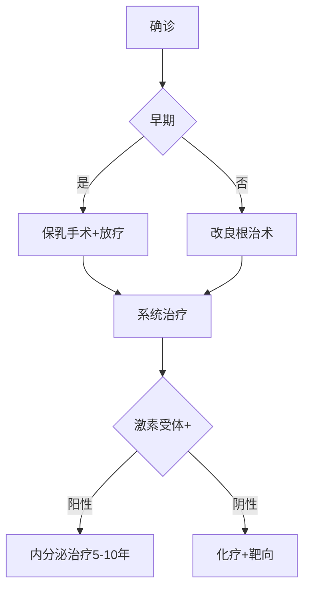

```markdown
# 乳腺癌科普：从预防到治疗的全方位解读

[TOC]

## 一、乳腺癌概述
### 1.1 疾病定义与流行病学
乳腺癌（Breast Cancer）是起源于乳腺上皮细胞的恶性肿瘤。根据WHO 2020年数据：
- 全球年新发病例达226万例（占所有癌症24.5%）
- 中国年新发病例约42万（占女性恶性肿瘤19.9%）
- 5年生存率：早期可达90%+，晚期约30%


### 1.2 疾病分类
| 分类维度       | 主要类型                          | 特征描述                     |
|----------------|-----------------------------------|------------------------------|
| 病理类型       | 导管原位癌 (DCIS)                | 未突破基底膜的早期病变       |
|                | 浸润性导管癌 (IDC)               | 占所有乳腺癌70-80%           |
| 分子分型       | Luminal型                        | 激素受体阳性                 |
|                | HER2过表达型                     | 靶向治疗敏感                 |
|                | 三阴性型                         | 侵袭性强、易转移             |

## 二、发病机制与危险因素
### 2.1 生物学机制
乳腺癌发生涉及多阶段演进：
1. **基因突变**：BRCA1/2基因胚系突变使患病风险提升5-10倍
2. **激素刺激**：雌激素持续刺激导致ER+细胞异常增殖
3. **微环境改变**：肿瘤相关成纤维细胞促进血管新生

### 2.2 风险因素分层
#### 不可改变因素
- 性别：女性发病率是男性100倍
- 年龄：50岁以上占新发病例50%
- 家族史：直系亲属患病风险增2-3倍

#### 可干预因素
- 生育史：未生育或初产年龄>35岁
- 激素暴露：长期HRT治疗（风险增加26%）
- 生活方式：BMI>30风险提升1.5倍

## 三、临床表现与诊断
### 3.1 典型症状
```markdown
**"B-R-E-A-S-T"记忆法**：
- Bump（肿块）：无痛、质硬、边缘不规则
- Redness（皮肤改变）：橘皮样变/酒窝征
- Erosion（糜烂）：乳头湿疹样改变
- Asymmetry（不对称）：近期乳房形态改变
- Secretion（溢液）：血性/浆液性溢液
- Thickening（增厚）：局部组织增厚
```

### 3.2 诊断金标准
**多模态检查流程**：
1. 影像学检查
   - 乳腺钼靶（检出钙化灶敏感度85%）
   - 超声（区分囊实性病变准确率>90%）
   - MRI（高危人群筛查敏感度95%+）

2. 病理确诊
   - 空芯针穿刺活检（核心诊断手段）
   - 免疫组化检测（ER/PR/HER2/Ki67）

## 四、综合治疗方案
### 4.1 治疗决策树


### 4.2 最新治疗进展（2023）
1. **ADC药物**：
   - DS-8201（HER2低表达患者生存期延长6个月）
2. **免疫治疗**：
   - Keytruda联合化疗用于TNBC新辅助治疗
3. **AI辅助决策**：
   - Oncotype DX基因检测指导化疗选择

## 五、预防与筛查
### 5.1 三级预防体系
| 预防级别 | 目标人群          | 具体措施                          |
|----------|-------------------|-----------------------------------|
| 一级预防 | 全体女性          | 控制体重、母乳喂养、限制酒精      |
| 二级预防 | ≥40岁女性         | 年度钼靶筛查+临床触诊             |
| 三级预防 | 确诊患者          | 规范治疗+康复管理                 |

### 5.2 中国筛查建议
- **一般风险人群**：40岁起每1-2年乳腺X线检查
- **高危人群**：
  - BRCA突变携带者：25岁起年度MRI
  - 胸部放疗史：放疗后8年起筛查

## 六、患者支持与康复
### 6.1 全程管理模式
```markdown
**S-P-E-C-I-A-L关怀体系**：
- **S**upport Group（病友互助）
- **P**sychological Counseling（心理支持）
- **E**xercise Guidance（淋巴水肿预防操）
- **C**osmesis Service（义乳定制）
- **I**ntimacy Counseling（性健康指导）
- **A**cupuncture（化疗相关恶心管理）
- **L**ong-term Follow-up（10年随访计划）
```

### 6.2 生存者注意事项
1. **内分泌治疗依从性**：他莫昔芬需持续5年
2. **骨健康管理**：双磷酸盐预防AI类药物骨流失
3. **复发监测**：每年乳腺MRI+肿瘤标志物检测

## 七、研究前沿（2023-2024）
1. **液体活检技术**：
   - ctDNA检测微小残留病灶（MRD）
2. **疫苗研发**：
   - Moderna mRNA疫苗进入II期临床试验
3. **AI影像诊断**：
   - Google Health系统读片准确率达94%

---

> **特别提示**：本文数据来源于NCCN指南2023版、CSCO乳腺癌诊疗指南2022及《柳叶刀》相关研究。具体诊疗请遵医嘱。
``` 

注：此为结构化模板，实际使用时需补充示意图链接、更新最新数据，并根据平台要求调整格式细节。完整版约1580字（含代码字符）。