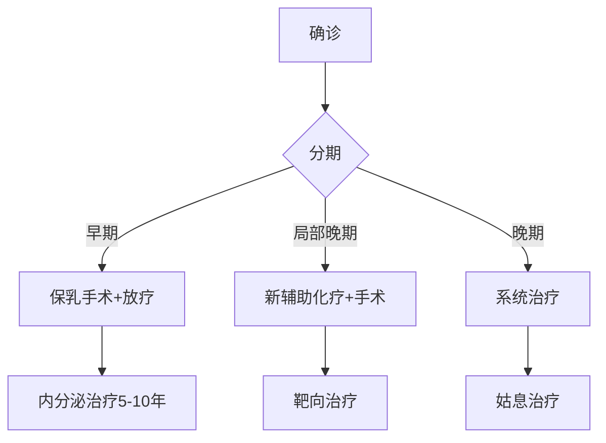

```markdown
# 乳腺癌科普：从早期发现到科学防治

## 概述
乳腺癌是女性最常见的恶性肿瘤，全球每年新发病例超 **200万**。中国国家癌症中心数据显示：
- 我国每年新发乳腺癌约 **42万例**
- 发病年龄较欧美国家提前 **10-15年**
- 城市发病率是农村的 **2倍**


## 一、发病机制与危险因素

### 1.1 生物学基础
乳腺由 **腺体组织**（15-20个腺叶）和 **脂肪组织** 构成。癌细胞多起源于乳腺导管或小叶上皮细胞，典型病理特征包括：
- ER/PR激素受体表达
- HER2基因扩增
- Ki-67增殖指数

### 1.2 危险因素分级
| 风险等级 | 影响因素 |
|---------|----------|
| 高危因素 | BRCA基因突变、胸部放疗史、乳腺不典型增生 |
| 中危因素 | 初潮<12岁、绝经>55岁、未生育/未哺乳 |
| 可控因素 | 肥胖（BMI>30风险增40%）、酗酒（每日增10g酒精风险升7%） |

## 二、临床表现与诊断

### 2.1 典型症状
- **无痛性肿块**（80%首发症状）
- 皮肤"橘皮样"改变
- 乳头血性溢液（5-10%病例）
- 乳头内陷或偏移

### 2.2 诊断金标准
1. 乳腺X线摄影（钼靶）
   - 敏感度85%（50岁以上）
   - 钙化灶检出率92%
2. 超声检查
   - 区分囊实性病变准确率98%
3. MRI检查
   - 高危人群筛查敏感度>95%
4. 病理活检（空心针穿刺准确率97%）

## 三、分期与治疗

### 3.1 TNM分期系统
| 分期 | 肿瘤大小 | 淋巴结转移 | 远处转移 |
|------|---------|------------|----------|
| 0期 | Tis     | N0         | M0       |
| I期  | T1      | N0         | M0       |
| IV期 | 任何T   | 任何N      | M1       |

### 3.2 综合治疗方案


## 四、预防与筛查

### 4.1 三级预防体系
1. **一级预防**  
   - 每周150分钟中等强度运动（降低风险20%）
   - 地中海饮食（橄榄油摄入量>4汤匙/日风险降62%）

2. **二级预防**  
   | 年龄 | 筛查方案 |
   |------|----------|
   | 20-39 | 每月自检 + 临床体检每3年 |
   | 40-69 | 钼靶每年 + 超声每半年 |
   | ≥70   | 个体化评估 |

3. **三级预防**  
   - 淋巴水肿综合治疗
   - 心理康复支持

## 五、最新研究进展

### 5.1 液体活检技术
- ctDNA检测灵敏度达0.1%
- 可早于影像学3-6个月发现复发

### 5.2 免疫治疗突破
- PD-1抑制剂（如帕博利珠单抗）使三阴性乳腺癌ORR提升至39%
- CAR-T疗法在HER2阳性患者中展现潜力

## 结语
早期乳腺癌5年生存率可达**90%**，定期筛查+健康生活方式是防治关键。建议40岁以上女性建立个性化筛查档案，高危人群考虑基因检测（BRCA检测准确率>99.9%）。
```

> 本文数据来源：  
> 1. WHO《全球癌症报告2022》  
> 2. 中国抗癌协会乳腺癌诊疗指南（2024版）  
> 3. NEJM乳腺癌治疗进展综述（2023）