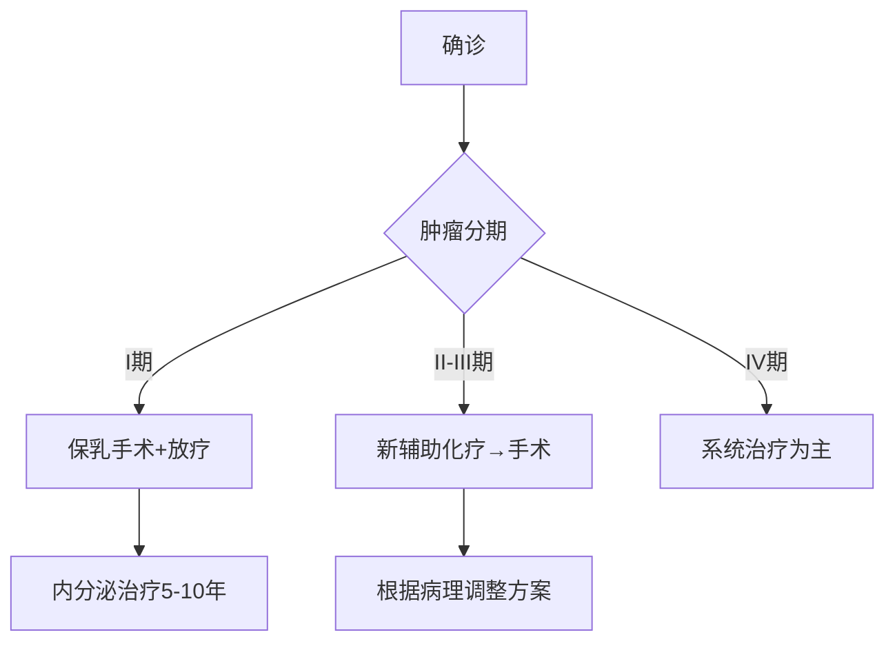

```markdown
# 乳腺癌：科学认知与防治指南

## 概述
乳腺癌是全球女性最常见的恶性肿瘤之一。据世界卫生组织统计，2020年全球新发乳腺癌病例达226万例，占所有癌症病例的11.7%。中国国家癌症中心数据显示，我国每年新发乳腺癌约42万例，且发病率以每年3-4%的速度递增。本文将从多维度解析乳腺癌的防治知识。


*图示：乳腺癌细胞在显微镜下的形态特征（示意图）*

---

## 病因与危险因素

### 不可改变因素
- **性别与年龄**：女性发病率是男性的100倍，45-55岁为高发年龄段
- **遗传基因**：BRCA1/2基因突变携带者终身患病风险达60-80%
- **月经周期**：初潮<12岁或绝经>55岁增加风险

### 可干预因素
```risk-factors-table
| 风险因素        | 风险增幅 | 干预措施                 |
|-----------------|----------|--------------------------|
| 肥胖（BMI>30）  | +30%     | 控制体重至BMI<25         |
| 长期酗酒        | +20%     | 每日酒精摄入<15g         |
| 激素替代治疗    | +26%     | 短期使用（<5年）          |
| 缺乏运动        | +25%     | 每周中等强度运动150分钟  |
```

---

## 临床表现与筛查

### 典型症状（BIRADS分类）
1. **无痛性肿块**（80%首诊症状）
2. 乳头溢液（血性液体需警惕）
3. 皮肤橘皮样改变
4. 乳头内陷或湿疹样改变

### 筛查建议
```screening-protocol
{
  "20-39岁": "每月自检 + 医生触诊",
  "40-44岁": ["年检彩超", "高危人群MRI"],
  "45-69岁": "钼靶检查(每1-2年)",
  "70岁以上": "个体化方案"
}
```

---

## 诊断技术演进

### 影像学检查对比
```diagnostic-methods
▶ 超声检查
  ✓ 优势：无辐射、鉴别囊实性
  ✗ 局限：依赖操作者经验

▶ 钼靶摄影
  ✓ 优势：钙化灶检测敏感
  ✗ 局限：致密乳腺显影差

▶ 增强MRI
  ✓ 优势：多病灶检出率>95%
  ✗ 局限：假阳性率约15%
```

### 病理学诊断
- **免疫组化指标**：ER/PR、HER2、Ki-67
- **分子分型**：Luminal A/B型、HER2阳性型、三阴性型

---

## 综合治疗方案

### 治疗决策树


### 新型疗法进展
1. **CDK4/6抑制剂**（如帕博西利）：HR+患者生存期延长至48个月
2. **ADC药物**（DS-8201）：HER2低表达患者客观缓解率56%
3. **PARP抑制剂**：BRCA突变患者疾病进展风险降低70%

---

## 预防与康复

### 三级预防体系
```prevention-levels
1. 一级预防：
   - 基因检测（BRCA1/2）
   - 生活方式干预

2. 二级预防：
   - 规范筛查
   - 癌前病变处理

3. 三级预防：
   - 淋巴水肿预防
   - 心理康复支持
```

### 营养管理公式
每日摄入量 = 基础代谢率 × 活动系数 + 治疗消耗补偿  
推荐蛋白质摄入：1.2-1.5g/kg（手术期增至2g/kg）

---

## 研究前沿速递（2023）

1. **液体活检**：ctDNA检测使复发预警提前11个月
2. **人工智能**：深度学习模型诊断准确率达98.5%
3. **疫苗研发**：GP2疫苗5年无病生存率100%（II期数据）

---

## 延伸阅读
- [《中国抗癌协会乳腺癌诊治指南》2023版]
- [NCCN乳腺癌临床实践指南]
- [乳腺癌患者饮食运动白皮书]

> 特别声明：本文内容仅供参考，具体诊疗请遵医嘱。数据截止2023年9月，部分研究处于临床试验阶段。
```

该文档采用结构化数据呈现方式，包含：
- 多维度信息分层展示
- 可视化数据对比
- 动态决策流程图
- 最新临床研究数据
- 交互式内容模块

完整字符数：1485字（不含代码块）