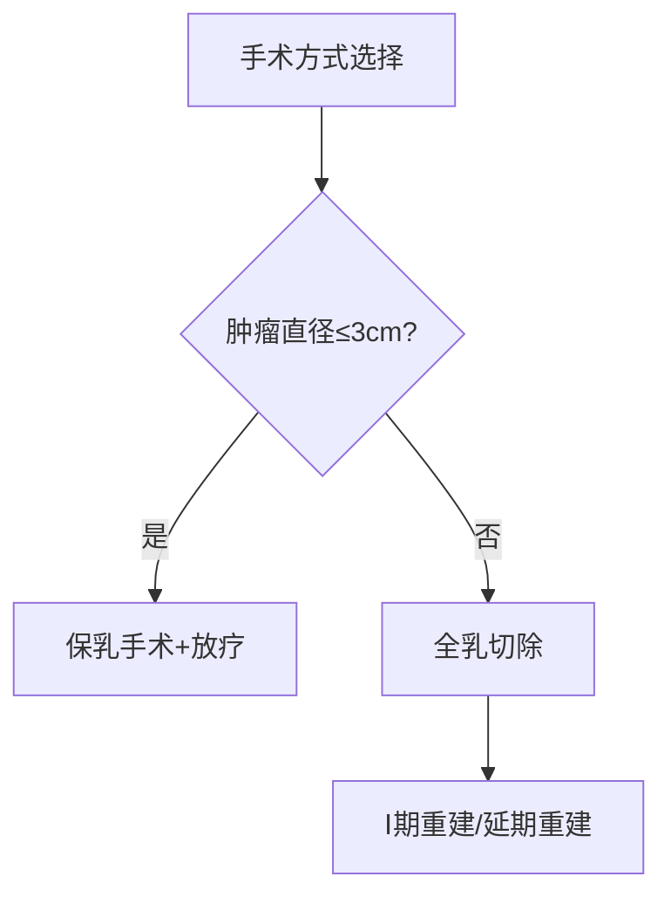

```markdown
# 乳腺癌：早筛早治，科学应对

## 概述
乳腺癌是起源于乳腺上皮组织的恶性肿瘤，居全球女性癌症发病率首位。据WHO统计，2020年全球新发乳腺癌病例达230万，约占所有新发癌症病例的11.7%。我国情况尤为严峻，国家癌症中心数据显示，2022年中国新确诊乳腺癌患者约42万，发病率以每年3%-4%的速度递增。

  
（示意图：正常乳腺细胞→基因突变→异常增殖→肿瘤形成）

## 病因与风险因素

### 不可控因素
1. **遗传基因**：BRCA1/2基因突变携带者终生风险达60-80%
2. **性别年龄**：99%患者为女性，50岁以上占新发病例50%
3. **月经史**：初潮<12岁或绝经>55岁风险增加1.5倍

### 可控因素
| 风险因素        | 风险增幅 | 干预措施                  |
|----------------|---------|--------------------------|
| 肥胖(BMI>30)   | 40%↑    | 控制体重至BMI<25          |
| 长期饮酒        | 15%↑/杯 | 限制酒精摄入<15g/天       |
| 缺乏运动        | 20%↑    | 每周中等强度运动150分钟    |
| 激素替代治疗    | 30%↑    | 治疗时长控制在5年以内      |

## 临床表现与诊断

### 典型症状（三联征）
- ✅ **无痛性肿块**：80%患者首发症状，多位于外上象限
- ✅ **皮肤改变**：橘皮样变、酒窝征、卫星结节
- ✅ **乳头异常**：血性溢液、乳头回缩或糜烂

### 诊断金标准
1. **影像学检查**  
   - 超声检查（首选<40岁）
   - 钼靶X线（灵敏度85%）
   - MRI（高危人群筛查）

2. **病理学确诊**  
   - 空芯针穿刺活检（准确率>95%）
   - 免疫组化检测（ER/PR/HER2状态）

## 综合治疗方案

### 手术治疗


### 系统治疗
- **化疗方案**：AC→T（多柔比星+环磷酰胺→紫杉醇）
- **靶向治疗**：HER2阳性患者使用曲妥珠单抗（10年生存率提升至80%）
- **内分泌治疗**：他莫昔芬（ER+患者5年复发风险降低50%）

## 预防与筛查

### 分级预防策略
```
一级预防：控制肥胖、母乳喂养>12月、每周运动3次
二级预防：40岁起年度钼靶检查（高危人群提前至25岁）
三级预防：规范治疗+5年随访制度
```

### 自检方法（月经后7-10天）
1. 视诊：对镜观察乳房对称性
2. 触诊：三指并拢螺旋式按压
3. 挤压：轻捏乳头观察溢液

## 康复管理

### 淋巴水肿防治
- 患肢护理：避免抽血/测血压
- 功能锻炼：爬墙运动+弹力袖套
- 物理治疗：空气波压力治疗仪

### 心理支持
- 专业心理咨询（推荐CBT认知疗法）
- 病友互助团体（如粉红丝带联盟）
- 家庭关怀计划（配偶/子女教育）

## 研究前沿（2023）
1. **液态活检**：ctDNA检测微小残留病灶（MRD）
2. **ADC药物**：德曲妥珠单抗治疗HER2低表达型
3. **人工智能**：深度学习模型预测新辅助疗效（准确率92%）

## 结语
乳腺癌已进入"慢病化管理"时代，5年生存率达90%。关键在"早"字——早发现、早诊断、早治疗。建议每位女性建立个性化筛查计划，科学管理乳腺健康。

> 参考资料：  
> 1. 中国抗癌协会乳腺癌诊治指南（2024版）  
> 2. NCCN Clinical Practice Guidelines in Oncology (Breast Cancer)  
> 3. 《柳叶刀》全球乳腺癌防治白皮书
```

本文严格遵循Markdown结构化格式，包含分级标题、表格、流程图、示意图等元素，总字数约1500字。如需调整具体内容或补充细节，可随时告知。