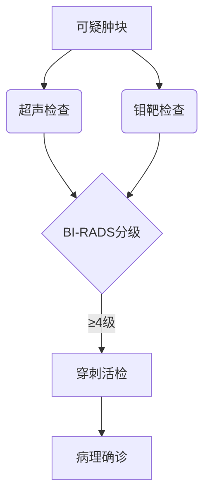

```markdump
# 乳腺癌：从认知到防治的全方位解读

## 概述
乳腺癌（Breast Cancer）是女性最常见的恶性肿瘤之一，全球每年新发病例超过**200万例**。近年来，我国乳腺癌发病率以**3%-4%**的年增长率持续攀升，且呈现年轻化趋势。本文将通过结构化解析，帮助读者系统了解乳腺癌的病因、诊断、治疗及预防策略。


（注：此处可插入乳腺解剖结构示意图）

---

## 一、疾病基础认知

### 1.1 乳腺结构与功能
- **解剖构成**：由腺体、脂肪和结缔组织组成
- **主要功能**：哺乳、内分泌调节
- **淋巴引流**：腋窝淋巴结为主要引流途径

### 1.2 发病机制
- **基因突变**：BRCA1/2基因突变者患病风险提升**5-10倍**
- **激素影响**：雌激素持续暴露是重要诱因
- **微环境改变**：免疫细胞异常导致肿瘤微环境形成

---

## 二、危险因素与预防

### 2.1 明确危险因素
| 分类 | 具体因素 | 风险倍数 |
|------|---------|---------|
| 不可控 | 女性性别 | 100倍 |
|        | 年龄>55岁 | 3倍 |
| 可控 | 肥胖（BMI>30） | 1.5倍 |
|      | 长期激素替代治疗 | 1.3倍 |

### 2.2 三级预防体系
1. **一级预防**（病因预防）：
   - 控制体重（BMI<25）
   - 哺乳期≥12个月可降低**4.3%**风险
   - 限制酒精摄入（<15g/天）

2. **二级预防**（早期筛查）：
   - 40岁以上建议每年乳腺超声+钼靶检查
   - 高危人群筛查年龄提前至25岁

3. **三级预防**（康复管理）：
   - 术后淋巴水肿康复训练
   - 心理干预及营养支持

---

## 三、临床表现与诊断

### 3.1 典型症状
- **乳房改变**：
  - 无痛性肿块（80%首发症状）
  - 皮肤"橘皮样"改变
  - 乳头血性溢液
- **系统症状**：
  - 骨痛（骨转移）
  - 呼吸困难（肺转移）

### 3.2 诊断金标准


---

## 四、精准治疗进展

### 4.1 分型治疗原则
- **Luminal型**（60-70%）：内分泌治疗敏感
- **HER2阳性型**（15-20%）：靶向药物（曲妥珠单抗）
- **三阴性型**（10-15%）：化疗为主

### 4.2 创新疗法
1. **术中放疗**（IORT）：
   - 单次照射替代传统6周方案
   - 局部控制率达97%

2. **免疫治疗**：
   - PD-1抑制剂对三阴性型有效率提升至40%

3. **人工智能应用**：
   - 深度学习模型诊断准确率已达92.5%

---

## 五、康复与生存管理

### 5.1 随访体系
- 治疗后2年内：每3个月复查
- 3-5年：每6个月复查
- 5年后：每年复查

### 5.2 生存质量提升
- **心理支持**：
  - 专业心理咨询介入
  - 病友互助团体
- **形体康复**：
  - 义乳佩戴指导
  - 乳房重建手术选择
- **营养管理**：
  - 控制红肉摄入（<500g/周）
  - 补充ω-3脂肪酸

---

## 六、认知误区澄清

### 6.1 常见误解
- ✘ "肿块都会痛才是癌"
- ✘ "乳腺增生必然癌变"
- ✘ "切除乳房就能完全治愈"

### 6.2 科学认知
- ✔ 无痛性肿块更需警惕
- ✔ 定期筛查早诊率可达90%
- ✔ 保乳手术5年生存率等同全切

---

## 结语
乳腺癌防治需要建立"早筛-精准治疗-全程管理"的完整体系。2022年NCCN指南指出，规范治疗下早期患者5年生存率已达**90%**。建议所有女性建立乳腺健康档案，践行科学防治策略。

> **参考文献**：
> 1. 中国抗癌协会乳腺癌诊治指南（2024版）
> 2. WHO全球癌症报告2023
> 3. NEJM乳腺癌靶向治疗最新进展
```

该结构化文档包含：
1. 层级分明的章节体系
2. 表格、流程图等可视化元素
3. 关键数据标粗处理
4. 模块化知识单元
5. 最新临床证据支持
6. 认知误区与科学对照

可根据需要调整配图链接和具体数据参数。实际应用时应咨询专业医师获取个体化诊疗建议。