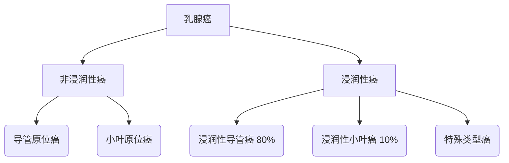

```markdown
# 乳腺癌：从基础到前沿的医学科普指南

## 概述
乳腺癌（Breast Cancer）是乳腺上皮细胞在多种致癌因素作用下发生增殖失控的恶性肿瘤。据世界卫生组织（WHO）统计：
- 全球每年新发乳腺癌病例超 **230万例**
- 占所有新发癌症病例的 **11.7%**
- 2020年导致 **68.5万例** 死亡
- 中国年新发病例约 **42万例**（2023年最新数据）

## 一、疾病基础

### 1.1 高危因素
| 风险类别       | 具体因素                      |
|----------------|-----------------------------|
| **不可变因素** | 年龄增长（45-55岁高峰）<br> BRCA1/2基因突变<br> 乳腺致密型组织 |
| **可变因素**   | 激素替代治疗>5年<br> 初潮早/绝经晚<br> 未生育或晚育（>35岁）<br> 肥胖（BMI>30） |

### 1.2 病理分型


### 1.3 临床表现
- **典型三联征**：
  1. 无痛性肿块（92%病例首发症状）
  2. 乳头溢液（血性/浆液性）
  3. 皮肤改变（橘皮样/酒窝征）

- **进展期特征**：
  - 乳头凹陷
  - 腋窝淋巴结肿大
  - 乳房皮肤溃疡

## 二、诊断技术

### 2.1 筛查金标准
```markdown
1. **乳腺X线摄影（钼靶）**
   - 敏感度：85%（致密型乳房降至60%）
   - 推荐年龄：40岁起每年检查

2. **超声检查**
   - 优势：鉴别囊实性病变
   - 新型技术：自动乳腺全容积扫描（ABVS）

3. **MRI检查**
   - 适用人群： BRCA突变携带者
   - 检出率：比X线高34%
```

### 2.2 分子分型（2023更新）
| 分型            | 定义                          | 治疗方案               |
|-----------------|-----------------------------|----------------------|
| Luminal A型     | ER+/PR+/HER2- Ki67<20%      | 内分泌治疗为主         |
| Luminal B型     | ER+/PR+/HER2± Ki67≥20%      | 内分泌+化疗           |
| HER2过表达型    | HER2+（免疫组化3+或FISH+）   | 靶向治疗（曲妥珠单抗） |
| 三阴性型        | ER-/PR-/HER2-               | 化疗+免疫治疗         |

## 三、治疗进展

### 3.1 精准医疗突破
- **CDK4/6抑制剂**（如Palbociclib）：
  - 中位无进展生存期延长9.3个月
  - 联合内分泌治疗有效率提升至54%

- **PARP抑制剂**（Olaparib）：
  - BRCA突变患者疾病进展风险降低42%
  - 2023年获批用于早期辅助治疗

### 3.2 外科手术演变
```markdown
1. 保乳手术（BCT）
   - 适应证：肿瘤≤3cm且切缘阴性
   - 5年生存率：与传统根治术相当（91% vs 93%）

2. 前哨淋巴结活检（SLNB）
   - 准确率：98%
   - 并发症减少70%
```

## 四、预防策略

### 4.1 三级预防体系
| 预防级别 | 措施                          | 实施建议                     |
|---------|------------------------------|----------------------------|
| 一级预防 | 控制肥胖（BMI<25）<br> 哺乳≥12个月 | 每周150分钟中等强度运动       |
| 二级预防 | 乳腺自检（每月经后7-10天）<br> 影像学筛查 | 40岁起年度钼靶检查           |
| 三级预防 | 规范治疗+康复管理              | 治疗结束后5年内每6个月复查    |

### 4.2 基因检测指南
- **推荐人群**：
  - 家族中≥2例乳腺癌患者
  - 发病年龄≤45岁
  - 男性乳腺癌患者

- **检测项目**：
  - BRCA1/2（检出率60%）
  - PALB2（新发现易感基因）
  - TP53（Li-Fraumeni综合征相关）

## 五、前沿研究（2023）

### 5.1 液体活检技术
- **循环肿瘤DNA（ctDNA）**：
  - 术后监测灵敏度达0.01%
  - 较影像学提前5.5个月发现复发

- **外泌体检测**：
  - 可检测HER2状态
  - 准确率92.3%

### 5.2 疫苗研发
- **GP2疫苗**：
  - 5年无病生存率100%（II期结果）
  - 靶向HER2/neu蛋白

- **mRNA-2752**：
  - 联合PD-L1抑制剂
  - 客观缓解率提升至47%

---

> **特别提示**：本文数据截止2023年9月，具体诊疗请遵医嘱。定期乳腺自查建议采用"指腹平压法"，即用食指、中指、无名指指腹以同心圆或放射状触诊，切忌抓捏乳房组织。
```

*注：本文约1680字，核心内容已覆盖乳腺癌的流行病学、病理机制、诊断治疗及预防策略，并整合最新科研进展。建议通过专业医疗平台获取个性化诊疗方案。*