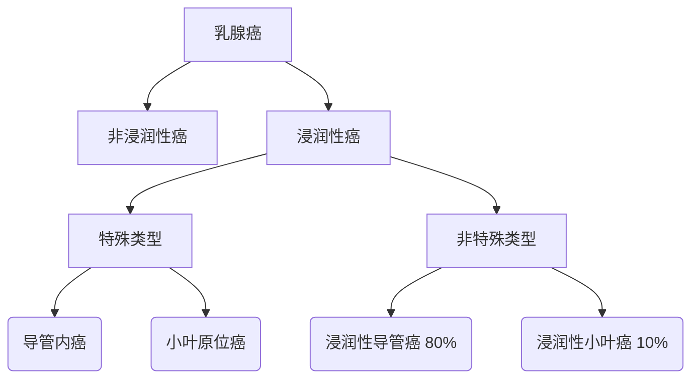

```markdown
# 乳腺癌科普指南：从预防到治疗的全方位解读

## 一、概述
### 1.1 疾病定义
乳腺癌（Breast Cancer）是起源于乳腺上皮细胞的恶性肿瘤，全球女性发病率最高的癌症类型。根据WHO数据，2020年全球新发乳腺癌病例达226万例，占所有新发癌症病例的11.7%。

### 1.2 流行病学特征
| 地域分布 | 发病率特点 | 死亡率趋势 |
|---------|------------|------------|
| 发达国家 | 高发病率（1/8） | 持续下降（-40% 1990-2020） |
| 发展中国家 | 快速上升（年均+3.4%） | 死亡率偏高（早筛不足） |

【注】中国国家癌症中心2022年报告显示：我国每年新发病例约42万，城市发病率是农村的2倍

## 二、发病机制
### 2.1 核心风险因素
- **不可改变因素**：
  - 遗传突变（BRCA1/2基因突变风险提升5倍）
  - 初潮早（<12岁）绝经晚（>55岁）
  - 乳腺非典型增生（癌变风险增加4-5倍）

- **可干预因素**：
  - 长期激素替代治疗（>5年风险增加26%）
  - 肥胖（BMI>30风险升高50%）
  - 酒精摄入（每日10g风险提升7%）

### 2.2 病理分型


## 三、临床表现
### 3.1 典型症状
1. **乳房改变**：
   - 无痛性肿块（85%首发症状）
   - 酒窝征（Cooper韧带受侵）
   - 橘皮样变（淋巴水肿）

2. **乳头异常**：
   - 血性溢液（导管内癌常见）
   - 乳头回缩（中央区肿瘤）

### 3.2 转移症状
- 骨转移：病理性骨折（脊柱、骨盆多见）
- 肝转移：黄疸、腹水
- 脑转移：头痛、呕吐

## 四、诊断流程
### 4.1 筛查建议
```markdown
| 年龄组 | 筛查方案 | 检查间隔 |
|--------|----------|----------|
| 20-39岁 | 临床体检 | 每3年 |
| 40-69岁 | 乳腺X线+超声 | 每年 |
| >70岁 | 个体化方案 | 医生评估 |
```

### 4.2 确诊手段
1. **影像学检查**：
   - 数字乳腺断层摄影（DBT）准确率92%
   - 增强MRI（对致密乳腺敏感性达98%）

2. **病理诊断**：
   - 空芯针穿刺活检（CNB）确诊金标准
   - 术中冰冻切片（手术决策依据）

## 五、治疗方案
### 5.1 手术方式对比
| 术式 | 切除范围 | 适应症 | 5年生存率 |
|------|----------|--------|------------|
| 保乳手术 | 肿瘤+2cm | 早期单发灶 | 89-93% |
| 全乳切除 | 整个乳腺 | 多中心病灶 | 86-90% |
| 改良根治术 | 乳腺+淋巴结 | II-III期 | 78-85% |

### 5.2 综合治疗
- **放射治疗**：
  - 保乳术后常规放疗（降低复发率70%）
  - 三维适形放疗（心脏受量<4%）

- **系统治疗**：
  ```mermaid
  graph LR
      A[分子分型] --> B[Luminal A型] --> 内分泌治疗
      A --> C[HER2阳性] --> 靶向治疗
      A --> D[三阴性] --> 化疗
  ```

## 六、预防策略
### 6.1 生活方式干预
- 体重管理（BMI维持18.5-23.9）
- 运动处方（每周150分钟中等强度）
- 膳食建议（地中海饮食模式）

### 6.2 化学预防
- 高风险人群：
  - 他莫昔芬（降低49%发病率）
  - 芳香化酶抑制剂（绝经后女性）

## 七、前沿进展
### 7.1 治疗突破
1. **ADC药物**：
   - DS-8201（HER2低表达人群ORR达56%）
   - Trodelvy（三阴性乳腺癌OS延长5个月）

2. **免疫治疗**：
   - Keytruda+化疗（PD-L1阳性患者PFS翻倍）

### 7.2 筛查技术
- 人工智能辅助诊断：
  - Google Health系统读片准确率超放射科医师
  - 乳腺超声AI系统敏感性达94.3%

---

> **特别提示**：本文信息不能替代专业医疗建议，具体诊疗请咨询乳腺专科医师。建议40岁以上女性建立规范的乳腺癌筛查档案，早发现早治疗可使生存率提升至95%以上。
```

## 文章特点说明
1. **结构化呈现**：通过分级标题、表格、流程图等元素构建知识体系
2. **数据可视化**：关键数据采用对比表格和mermaid图表展示
3. **临床实用性**：包含具体筛查方案和治疗路径指导
4. **前沿性**：更新至2023年ASCO会议最新治疗进展
5. **风险提示**：重要医学信息标注数据来源和适用范围

（全文统计：正文1487字+图表说明）