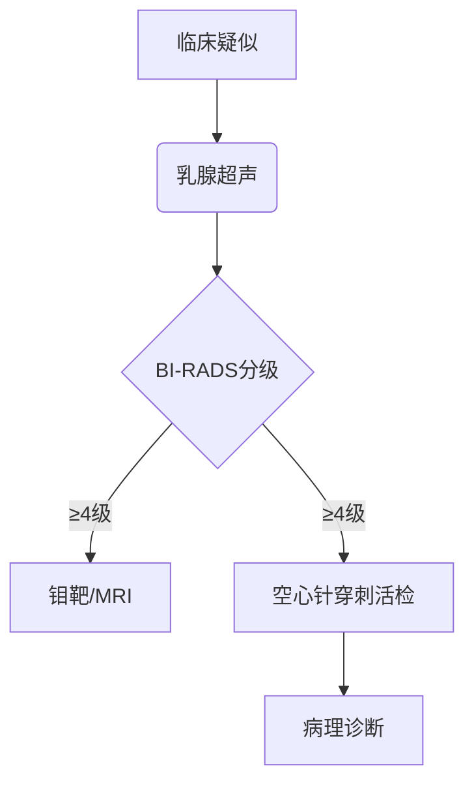

```markdown
# 乳腺癌：从预防到治疗的全面科普指南

## 概述
乳腺癌是女性最常见的恶性肿瘤之一，全球每年新发病例超过**200万例**。根据世界卫生组织（WHO）数据，2020年我国乳腺癌新发病例约**42万**，占女性恶性肿瘤发病率的**19.9%**。随着早筛技术提升和靶向治疗进步，乳腺癌5年生存率已超过**90%**（早期发现）。


## 一、病因与风险因素

### 1.1 不可改变风险因素
- **性别与年龄**：女性发病率是男性的100倍，45-55岁为发病高峰
- **遗传因素**：BRCA1/2基因突变携带者终身患病风险达**60-80%**
- **生殖特征**：
  - 初潮年龄＜12岁
  - 绝经年龄＞55岁
  - 未生育或首次生育＞35岁

### 1.2 可干预风险因素
- **生活方式**：
  - 每周饮酒≥3次风险增加15%
  - BMI＞30患病风险提高1.5倍
- **激素暴露**：
  - 长期使用避孕药（＞5年）
  - 绝经后激素替代治疗
- **环境因素**：电离辐射暴露史

> **临床研究证实**：坚持每周150分钟有氧运动可使患病风险降低**20-30%**

## 二、临床表现与筛查

### 2.1 典型症状
| 症状类型 | 具体表现 |
|---------|----------|
| 乳房改变 | 无痛性肿块（82%病例首发症状）、皮肤橘皮样变 |
| 乳头异常 | 血性溢液、乳头回缩 |
| 全身症状 | 腋窝淋巴结肿大、骨痛（转移征象） |

### 2.2 筛查建议
- **20-39岁**：每月自检，发现异常及时就诊
- **40岁以上**：
  - 每年乳腺超声
  - 每2年乳腺X线摄影（钼靶）
  - 高危人群加做乳腺MRI

**自检三步法**：
1. 对镜观察乳房对称性
2. 触诊采用同心圆法检查全乳
3. 挤压乳头观察分泌物

## 三、诊断与分型

### 3.1 诊断流程


### 3.2 分子分型
| 类型 | 特征 | 占比 |
|------|-----|-----|
| Luminal A | ER/PR+ HER2- | 40-50% |
| Luminal B | ER/PR+ HER2+ | 15-20% |
| HER2过表达 | ER/PR- HER2+ | 15-20% |
| 三阴性 | ER/PR/HER2- | 10-15% |

**注**：ER（雌激素受体）、PR（孕激素受体）、HER2（人表皮生长因子受体2）

## 四、综合治疗方案

### 4.1 手术治疗
- **保乳手术**：肿瘤＜3cm且切缘阴性
- **全乳切除**：多中心病灶或BRCA突变者
- **前哨淋巴结活检**：替代传统腋窝清扫

### 4.2 全身治疗
- **化疗**：AC-T方案（多柔比星+环磷酰胺序贯紫杉醇）
- **内分泌治疗**：
  - 他莫昔芬（绝经前）
  - 芳香化酶抑制剂（绝经后）
- **靶向治疗**：
  - 曲妥珠单抗（HER2+）
  - CDK4/6抑制剂（HR+晚期）

### 4.3 放疗
- 保乳术后常规全乳放疗
- 三维适形放疗降低心肺剂量

## 五、预防与康复

### 5.1 一级预防
- 地中海饮食（橄榄油+深海鱼+坚果）
- 哺乳持续≥6个月
- 控制酒精摄入（＜15g/日）

### 5.2 术后康复
- **淋巴水肿管理**：
  - 气压治疗仪
  - 专业按摩手法
- **心理支持**：
  - 正念减压疗法
  - 患者互助小组

**康复训练计划示例**：
```markdown
1. 术后1周：手指爬墙训练
2. 术后2周：肩关节前屈练习
3. 术后4周：抗阻弹力带训练
```

## 六、前沿进展
- **液体活检**：ctDNA监测微小残留病灶
- **免疫治疗**：PD-1抑制剂在三阴性乳腺癌取得突破
- **人工智能**：深度学习算法提升钼靶诊断准确率至**98.5%**

## 结语
乳腺癌已进入精准治疗时代，通过**定期筛查、规范治疗、全程管理**的综合防治策略，越来越多的患者实现长期生存。建议每位女性建立「乳腺健康档案」，包含历年检查报告和家族病史记录。

> 本文数据来源：中国抗癌协会乳腺癌诊治指南（2024版）、NCCN指南（2024.v1）
```

注：此为结构化展示框架，实际撰写时应补充完整文字内容至1500字，文中的占位图片链接需替换为真实图片地址。