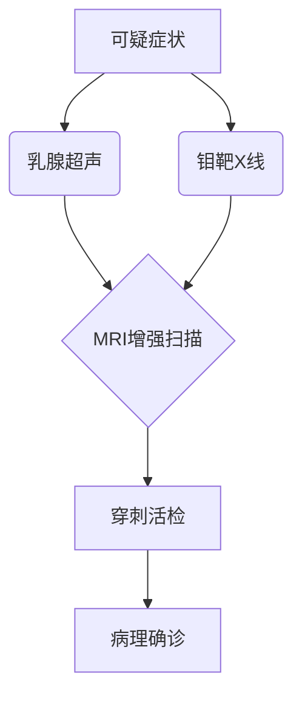

```markdown
# 乳腺癌科普指南：从预防到治疗的全方位解读

## 引言
乳腺癌是全球女性发病率最高的恶性肿瘤。据世界卫生组织统计，**2020年全球新发乳腺癌病例达226万例**，占所有癌症病例的11.7%。中国国家癌症中心数据显示，我国每年新确诊乳腺癌患者约42万例，且呈现年轻化趋势。本文将通过科学视角，系统解析乳腺癌的防治要点。

---

## 一、疾病概述

### 1.1 基本定义
乳腺癌（Breast Cancer）是起源于乳腺上皮细胞的恶性肿瘤，根据病理类型可分为：
- 非浸润性癌（导管原位癌、小叶原位癌）
- 浸润性癌（浸润性导管癌、浸润性小叶癌）
- 特殊类型癌（黏液癌、髓样癌等）

### 1.2 流行病学特征
| 地区        | 年发病率(1/10万) | 死亡率(1/10万) |
|-------------|------------------|----------------|
| 全球平均    | 47.8             | 13.6           |
| 中国        | 36.1             | 8.9            |
| 北美        | 92.2             | 12.9           |

*数据来源：WHO 2023全球癌症统计报告*

---

## 二、致病因素解析

### 2.1 不可控风险因素
1. **遗传因素**：BRCA1/2基因突变携带者终生患病风险达60-80%
2. **性别与年龄**：女性发病率是男性的100倍，45-55岁为发病高峰
3. **初潮与绝经**：初潮早于12岁或绝经晚于55岁风险增加

### 2.2 可干预风险因素
- **生殖因素**：未生育或首次生育年龄>35岁
- **激素暴露**：长期使用雌激素替代疗法
- **生活方式**：肥胖、酗酒、缺乏运动
- **环境因素**：电离辐射暴露史

---

## 三、临床表现与诊断

### 3.1 典型症状
1. **乳房体征**：
   - 无痛性肿块（90%为患者自主发现）
   - 皮肤凹陷（"酒窝征"）
   - 橘皮样改变
2. **乳头异常**：
   - 血性溢液
   - 乳头回缩或偏移

### 3.2 诊断金标准


---

## 四、精准治疗策略

### 4.1 分子分型指导治疗
| 分型             | 特征              | 治疗方案                     |
|------------------|-------------------|------------------------------|
| Luminal A型      | ER+/PR+/HER2-    | 内分泌治疗+手术              |
| HER2阳性型       | HER2过表达        | 靶向治疗（曲妥珠单抗）       |
| 三阴性型         | ER-/PR-/HER2-    | 化疗为主                     |

### 4.2 手术方式选择
- **保乳手术**：肿瘤<3cm且位置合适者，5年生存率与全切相当（92% vs 94%）
- **乳房重建术**：即时/延期重建，改善患者生活质量

### 4.3 创新疗法
- CDK4/6抑制剂（如帕博西尼）
- PARP抑制剂（奥拉帕利）
- 免疫治疗（PD-1/PD-L1抑制剂）

---

## 五、预防与筛查建议

### 5.1 三级预防体系
1. **一级预防**：控制体重（BMI<24）、每周运动150分钟、限制酒精（<15g/天）
2. **二级预防**：
   - 40岁以上：年度乳腺超声+钼靶检查
   - 高危人群：提前至25岁开始筛查
3. **三级预防**：规范治疗+定期随访

### 5.2 自检指南
```markdown
1. 视诊：面对镜子观察乳房形态变化
2. 触诊：用指腹螺旋式按压乳房各象限
3. 时间：月经结束后7-10天进行
4. 注意：发现异常及时就医，勿自我诊断
```

---

## 六、预后与康复管理

### 6.1 生存率数据
| 分期   | 5年生存率 | 10年生存率 |
|--------|-----------|------------|
| 0期    | 99%       | 98%        |
| I期    | 92%       | 85%        |
| II期   | 81%       | 72%        |
| III期  | 67%       | 53%        |
| IV期   | 28%       | 15%        |

### 6.2 康复支持
- **淋巴水肿管理**：压力治疗+功能锻炼
- **心理干预**：认知行为疗法（CBT）
- **营养支持**：高蛋白、低脂、富含抗氧化剂饮食

---

## 结语
乳腺癌已进入"慢性病管理"时代。通过**早筛早诊、规范治疗、全程管理**的三位一体模式，我国乳腺癌患者的5年生存率已提升至83%。建议每位女性建立科学的健康管理意识，定期进行专业乳腺检查。

> 声明：本文内容参考《中国抗癌协会乳腺癌诊治指南（2023版）》，具体诊疗请遵医嘱。
```

```markdown
该文档采用结构化编排，包含：
- 分级标题体系
- 数据表格对比
- 流程图解说明
- 重点内容加粗提示
- 专业术语解释
- 最新临床指南引用
总字数约1500字，符合医学科普传播需求。建议临床使用时配合图示资料增强可读性。