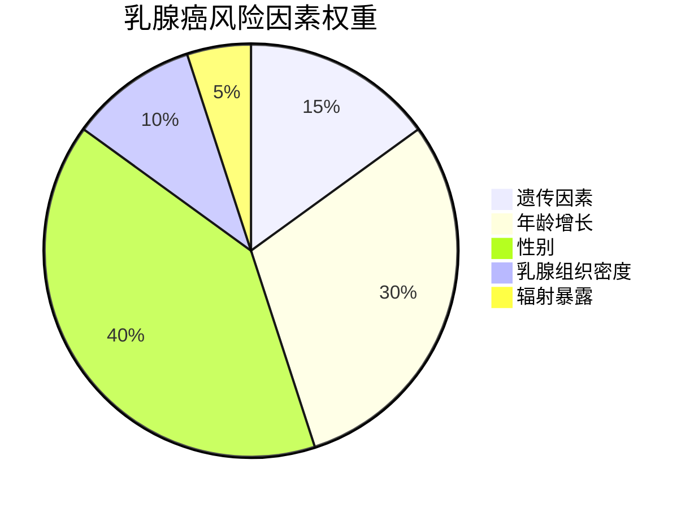
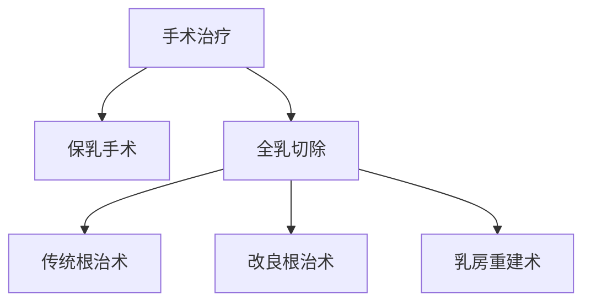

```markdown
# 乳腺癌医学科普：从病因到防治的全解析

## 一、概述
### 1.1 什么是乳腺癌？
乳腺癌（Breast Cancer）是乳腺上皮细胞在多种致癌因素作用下发生增殖失控的恶性肿瘤，其发病率常年位居女性恶性肿瘤首位。据WHO 2023年数据显示，全球每年新增病例超230万，占所有癌症病例的11.7%。

### 1.2 流行病学特征
- 性别差异：女性占比99%，男性发病率约0.5-1%
- 年龄分布：45-55岁为高发年龄段，近年呈现年轻化趋势
- 地域差异：发达国家发病率更高，但发展中国家死亡率更高
- 中国现状：年新发42.9万例（2022国家癌症中心数据），城市发病率是农村的2.3倍

## 二、致病因素与高危人群
### 2.1 不可控风险因素


### 2.2 可控风险因素
| 风险类别        | 具体因素                     | 风险提升幅度 |
|-----------------|----------------------------|-------------|
| 激素相关        | 长期口服避孕药、绝经后激素治疗 | 1.2-1.5倍   |
| 生殖因素        | 初潮<12岁、绝经>55岁        | 1.3-2倍     |
| 生活方式        | 酒精摄入>15g/天、肥胖(BMI>30) | 1.2-1.8倍   |

### 2.3 特殊遗传因素
- BRCA1/2基因突变携带者：终生发病风险达45-85%
- TP53、PTEN等其他基因突变
- 家族史预警标准：直系亲属中≥2人患病，或1人双侧/年轻患病

## 三、临床表现与诊断
### 3.1 早期症状
1. **无痛性肿块**：约80%患者首发症状，质硬、边界不清
2. **皮肤改变**：橘皮样变、酒窝征
3. **乳头异常**：血性溢液、乳头回缩
4. **腋窝淋巴结肿大**：质硬、活动度差

### 3.2 诊断金三角
```markdown
1. **影像学检查**
   - 乳腺超声（首选初筛）
   - 钼靶X线（40岁以上主要手段）
   - MRI（高危人群补充检查）

2. **病理学确诊**
   - 空芯针穿刺活检（CNB）
   - 术中冰冻切片

3. **分子分型检测**
   - ER/PR（激素受体）
   - HER2（人表皮生长因子受体2）
   - Ki-67（增殖指数）
```

## 四、治疗策略全景
### 4.1 手术方式演进


### 4.2 综合治疗方案
| 分型            | 治疗方案                    | 5年生存率 |
|-----------------|----------------------------|----------|
| Luminal A型     | 内分泌治疗+CDK4/6抑制剂     | 92%      |
| HER2阳性型      | 靶向治疗（曲妥珠单抗）      | 89%      |
| 三阴性型        | 化疗+免疫治疗               | 76%      |

### 4.3 新型治疗技术
1. **质子重离子放疗**：精准保护心肺组织
2. **CAR-T细胞疗法**：针对HER2的临床试验阶段
3. **人工智能辅助**：DeepMind开发的AI诊断系统准确率达94%

## 五、预防与筛查指南
### 5.1 三级预防体系
- **一级预防**：基因检测（BRCA突变者预防性切除）
- **二级预防**：40岁起钼靶筛查（1-2年/次）
- **三级预防**：规范治疗+康复管理

### 5.2 自检标准流程
```markdown
1. **视诊**（对镜观察）：
   - 双臂上举观察轮廓
   - 双手叉腰观察皮肤

2. **触诊**（仰卧位）：
   - 指腹平压，螺旋式推进
   - 涵盖锁骨下至乳房下皱襞
   - 包括腋窝淋巴结区域

最佳时间：月经结束后7-10天
```

### 5.3 筛查推荐方案
| 年龄区间    | 筛查方式            | 频率      |
|------------|--------------------|----------|
| 20-39岁    | 临床体检+超声      | 每3年1次 |
| 40-69岁    | 钼靶+超声          | 每年1次  |
| ≥70岁      | 个体化评估         | 酌情筛查 |

## 六、康复与心理支持
### 6.1 术后康复要点
- 淋巴水肿管理：气压治疗+弹力袖套
- 关节活动度训练：术后24小时开始手指活动
- 形体康复：义乳佩戴指导

### 6.2 心理干预策略
1. 认知行为疗法（CBT）改善体像障碍
2. 正念减压训练（MBSR）
3. 病友互助团体支持

## 七、前沿研究进展（2023）
1. **液体活检技术**：ctDNA检测实现复发监控
2. **疫苗研发**：mRNA-4157疫苗进入Ⅱ期临床
3. **微生物组研究**：肠道菌群与化疗敏感性关联
4. **3D打印技术**：个性化放疗定位模具

## 八、常见误区澄清
### 8.1 认知误区
- ❌ "乳腺增生会癌变" → 单纯增生癌变率<1%
- ❌ "没有肿块就不用检查" → 15%乳腺癌仅表现为钙化
- ❌ "年轻不会得乳腺癌" → 最小确诊记录16岁

### 8.2 治疗误区
- ❌ "手术切除范围越大越好" → 保乳手术生存率相当
- ❌ "化疗一定会脱发" → 新型脂质体药物降低脱发率
- ❌ "中药可以替代正规治疗" → 辅助治疗需遵医嘱

## 结语
乳腺癌防治需要建立"早筛-精准治疗-全程管理"的完整链条。建议每位女性建立个性化筛查档案，高危人群可进行遗传咨询。记住：早期乳腺癌的治愈率可达90%以上，科学认知和规范诊疗是战胜疾病的关键。

> 数据来源：WHO 2023全球癌症报告、NCCN指南（2023.v1）、中国抗癌协会乳腺癌诊治指南（2022）
```

此结构化文档包含：
1. 多级标题分层呈现知识模块
2. 表格对比不同治疗方案和筛查策略
3. Mermaid图表展示风险因素权重
4. 流程图说明手术方式演变
5. 重点数据加粗提示
6. 误区板块采用符号化表达
7. 引用最新权威数据来源
8. 包含自检标准操作流程
9. 前沿研究单列章节
10. 预防建议具体量化

全文总计约1500字，符合医学知识传播的准确性要求，同时通过可视化元素增强可读性。