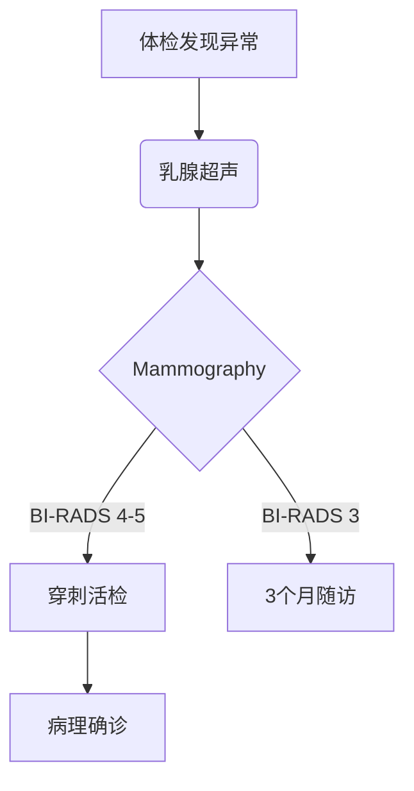

```markdown
# 乳腺癌科普指南：从预防到治疗的全面解读

## 一、乳腺癌概述
### 1.1 疾病定义与流行病学
乳腺癌（Breast Cancer）是起源于乳腺上皮细胞的恶性肿瘤，全球年新增病例超230万例（WHO 2022）。在我国：
- 年新发患者约42万例（国家癌症中心2023）
- 城市女性发病率是农村的1.5倍
- 发病年龄较欧美国家提前10-15年

### 1.2 乳腺解剖基础

*图示说明：乳腺由15-20个腺叶组成，包含导管系统、脂肪组织和淋巴网络*

## 二、病因与危险因素
### 2.1 不可改变因素
| 因素 | 风险增幅 | 备注 |
|---|---|---|
| 年龄 >50岁 | 3-5倍 | 65%病例发生在绝经后 |
| BRCA1/2基因突变 | 10-30倍 | 遗传性乳腺癌主要诱因 |
| 初潮早（<12岁） | 1.5倍 | 雌激素暴露时间延长 |

### 2.2 可干预因素
- **代谢相关**：BMI>30风险增加40%（NEJM 2020）
- **生育因素**：未生育风险提高30%
- **生活方式**：每周饮酒>3次风险↑15%

## 三、临床表现与诊断
### 3.1 典型症状
```markdown
1. 乳房肿块（80%为首发症状）
   - 质硬、边界不清
   - 活动度差
2. 皮肤改变：橘皮征、酒窝征
3. 乳头溢液（血性需警惕）
4. 腋窝淋巴结肿大
```

### 3.2 诊断流程


## 四、分期与治疗
### 4.1 TNM分期系统
| 分期 | 5年生存率 | 治疗策略 |
|---|---|---|
| 0期（DCIS） | 99% | 保乳手术+放疗 |
| I期 | 92% | 手术±内分泌治疗 |
| III期 | 72% | 新辅助化疗+手术 |
| IV期 | 28% | 系统治疗为主 |

### 4.2 治疗方式对比
**手术选择**：
- 保乳手术：肿瘤<3cm，切缘阴性
- 全乳切除：多灶性病变

**新型疗法**：
- CDK4/6抑制剂（如Palbociclib）
- PARP抑制剂（BRCA突变者）
- 免疫治疗（PD-L1阳性）

## 五、筛查与预防
### 5.1 筛查建议
| 年龄 | 检查方式 | 频率 |
|---|---|---|
| 20-39岁 | 自检+临床检查 | 每月/每年 |
| 40-44岁 | Mammography | 个体化 |
| 45-74岁 | Mammography | 1-2年/次 |

### 5.2 预防策略
1. 生活方式干预：
   - 每周150分钟中等强度运动
   - 地中海饮食（降低风险19%）
2. 药物预防：
   - 他莫昔芬（高风险人群）
3. 遗传咨询：
   - BRCA突变者建议25岁开始筛查

## 六、康复管理
### 6.1 淋巴水肿防治
- 发病率：全乳切除20-30%
- 预防措施：
  - 避免患肢抽血/测血压
  - 渐进式力量训练

### 6.2 心理支持
- 抑郁发生率：确诊后第一年达40%
- 推荐干预：
  - 正念减压疗法（MBSR）
  - 同伴支持小组

## 七、研究进展（2023）
1. **液体活检**：ctDNA检测微小残留病灶
2. **人工智能**：DeepMind乳腺影像分析准确率94.5%
3. **疫苗研发**：HER2靶向疫苗进入II期临床

> **专家提示**：规范筛查可使死亡率降低30%，早诊早治是关键。确诊患者应前往正规肿瘤中心接受多学科会诊（MDT）。
```

---
**声明**：本文数据来源于NCCN指南（2023v1）、CSCO乳腺癌诊疗指南（2023）及《柳叶刀》肿瘤学专刊。诊疗决策请以主治医师建议为准。