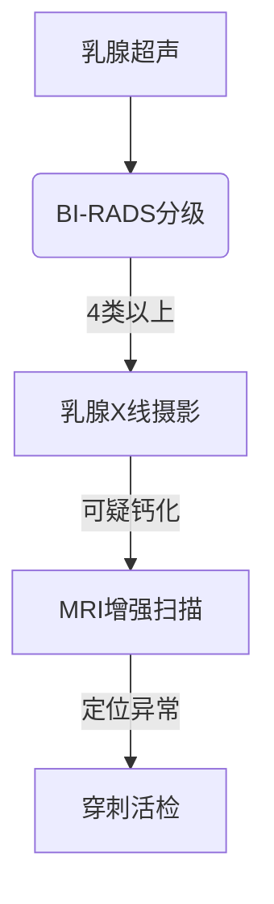

```markdown
# 乳腺癌：从病因到防治的全方位科普

## 引言
乳腺癌是全球女性发病率最高的恶性肿瘤。据世界卫生组织统计，2020年全球新发乳腺癌病例达226万例，占所有新发癌症病例的11.7%。在我国，乳腺癌发病率以每年3%-4%的速度递增，且呈现年轻化趋势。早期发现可使5年生存率超过90%，因此科学认知和规范筛查尤为重要。

---

## 一、乳腺癌的病因与危险因素

### 1.1 基因遗传因素
- **BRCA1/BRCA2基因突变**：携带者终生患病风险达45-85%
- **家族聚集性**：一级亲属患病风险增加2-3倍
- **其他基因变异**：TP53、PTEN等基因异常

### 1.2 激素暴露因素
| 因素 | 风险系数 | 作用机制 |
|------|----------|----------|
| 初潮年龄<12岁 | 1.3倍 | 雌激素暴露时间延长 |
| 绝经年龄>55岁 | 1.5倍 |  |
| 未生育/未哺乳 | 1.2倍 | 孕激素保护作用缺失 |

### 1.3 生活方式相关
- **肥胖（BMI>30）**：脂肪组织产生过量雌激素
- **酒精摄入**：每日10g酒精增加7%风险
- **缺乏运动**：每周<3小时中等强度运动风险↑

---

## 二、临床表现与诊断方法

### 2.1 典型症状（附图说明）
1. **无痛性肿块**：80%为首发症状，多位于外上象限
2. **皮肤改变**：橘皮征、酒窝征
3. **乳头异常**：血性溢液、乳头内陷
4. **腋窝淋巴结肿大**：提示可能转移

### 2.2 诊断金标准组合


---

## 三、现代治疗体系解析

### 3.1 手术治疗发展史
1. **传统根治术（1894）**：切除胸大肌+腋窝清扫
2. **改良根治术（1970s）**：保留胸肌
3. **保乳手术（1990s）**：肿瘤切除+放疗
4. **腔镜手术（2010s）**：隐蔽切口+快速康复

### 3.2 精准治疗策略
```markdown
- **HR+/HER2-型**：内分泌治疗（他莫昔芬）+ CDK4/6抑制剂
- **HER2+型**：曲妥珠单抗+帕妥珠单抗双靶向
- **三阴性型**：新辅助化疗+免疫检查点抑制剂
```

---

## 四、预防与筛查指南

### 4.1 风险分层筛查方案
| 风险等级 | 筛查方案 | 起始年龄 |
|----------|----------|----------|
| 普通风险 | 超声年检+X线每2年 | 40岁 |
| 中风险 | X线年检+MRI补充 | 35岁 |
| 高风险 | MRI半年检+基因检测 | 25岁 |

### 4.2 生活干预实证数据
- **地中海饮食**：降低28%患病风险（NEJM,2021）
- **每周150分钟运动**：减少20%风险
- **哺乳≥12个月**：累积保护效应达34%

---

## 五、前沿研究进展

### 5.1 液体活检技术
- **ctDNA监测**：可提前11个月预警复发
- **外泌体检测**：识别微小残留病灶

### 5.2 人工智能应用
- **深度学习读片**：敏感性达98.5%（Nature,2023）
- **预后预测模型**：整合基因组+临床数据

---

## 结语
乳腺癌防治已进入精准医学时代。建议40岁以上女性建立个性化筛查档案，高危人群进行遗传咨询。通过"早筛+早诊+早治"的三级预防体系，我国乳腺癌死亡率已呈现下降拐点。

> 数据来源：中国抗癌协会乳腺癌专委会《2023版诊疗指南》
```