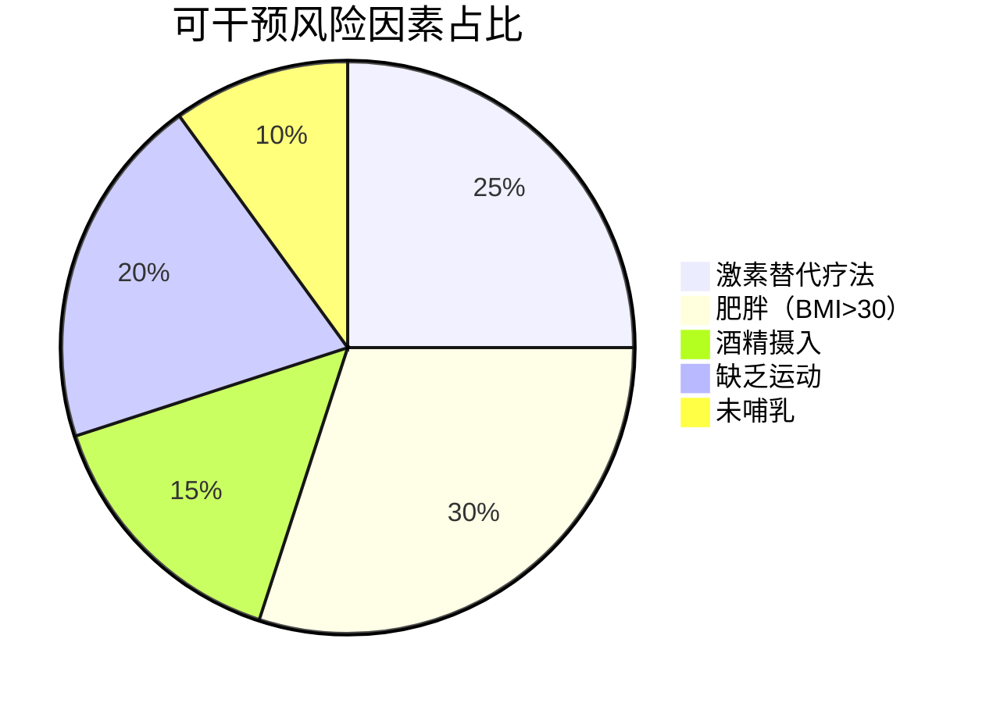
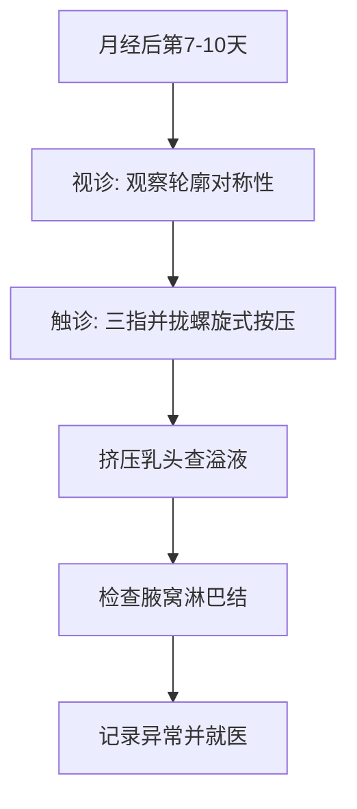
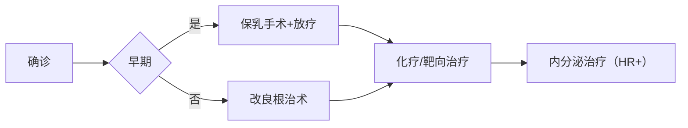

```markdown
# 乳腺癌医学科普：从预防到康复的全周期管理

## 目录
1. [概述](#概述)  
2. [病因与高危因素](#病因与高危因素)  
3. [临床表现与早期信号](#临床表现与早期信号)  
4. [诊断技术矩阵](#诊断技术矩阵)  
5. [多学科治疗策略](#多学科治疗策略)  
6. [预防与康复管理](#预防与康复管理)  
7. [最新研究进展](#最新研究进展)  
8. [关键行动指南](#关键行动指南)

---

<a id="概述"></a>
## 1. 概述
乳腺癌是全球女性最常见的恶性肿瘤。根据WHO 2023年数据：
- 全球每年新发病例约230万例
- 占所有癌症病例的11.7%
- 5年生存率可达90%（早期发现）


---

<a id="病因与高危因素"></a>
## 2. 病因与高危因素

### 2.1 不可控因素
| 因素        | 风险倍数 | 说明                     |
|-------------|----------|--------------------------|
| 年龄        | 3-5×     | 45-55岁为发病高峰        |
| BRCA1/2突变 | 10-80×   | 遗传性乳腺癌主要诱因     |
| 初潮年龄早  | 1.5×     | <12岁月经初潮风险增加    |

### 2.2 可干预因素


---

<a id="临床表现与早期信号"></a>
## 3. 临床表现与早期信号

### 3.1 典型症状
1. **乳房改变**  
   - 无痛性肿块（85%病例首发症状）
   - 皮肤橘皮样改变
   - 乳头内陷或溢血

2. **淋巴系统征象**  
   - 腋窝淋巴结肿大
   - 锁骨上淋巴结肿大

### 3.2 自检流程


---

<a id="诊断技术矩阵"></a>
## 4. 诊断技术矩阵

### 4.1 影像学检查对比
| 检查方法   | 敏感度 | 特异度 | 适用人群           |
|------------|--------|--------|--------------------|
| 乳腺X线    | 85%    | 90%    | ≥40岁常规筛查      |
| 超声       | 89%    | 82%    | 致密型乳腺首选     |
| 增强MRI    | 95%    | 80%    | BRCA突变携带者     |

### 4.2 病理学检查
1. **穿刺活检**  
   - 空芯针穿刺（CNB）
   - 真空辅助活检（VAB）

2. **分子分型**  
   - ER/PR受体状态
   - HER2表达水平
   - Ki-67增殖指数

---

<a id="多学科治疗策略"></a>
## 5. 多学科治疗策略

### 5.1 治疗方案决策树


### 5.2 靶向治疗新选择
- **HER2阳性**：曲妥珠单抗+帕妥珠单抗（双靶方案）
- **BRCA突变**：PARP抑制剂（奥拉帕利）
- **CDK4/6抑制剂**：联合内分泌治疗（HR+/HER2-）

---

<a id="预防与康复管理"></a>
## 6. 预防与康复管理

### 6.1 三级预防体系
| 分级   | 措施                          | 有效性 |
|--------|-------------------------------|--------|
| 一级    | 控制肥胖、限制酒精            | 30-40% |
| 二级    | 40岁起每2年乳腺X线筛查        | 70%    |
| 三级    | 术后淋巴水肿康复训练          | 必需    |

### 6.2 术后管理要点
1. **淋巴水肿防护**  
   - 避免患肢抽血/测血压
   - 渐进式负重训练

2. **心理干预**  
   - 认知行为疗法（CBT）
   - 患者支持小组

---

<a id="最新研究进展"></a>
## 7. 最新研究进展（2023）

1. **液体活检技术**  
   - ctDNA检测微小残留病灶（MRD）
   - 灵敏度达0.01%肿瘤DNA

2. **人工智能应用**  
   - 深度学习解读乳腺X线（准确率92%）
   - 预测新辅助化疗反应

---

<a id="关键行动指南"></a>
## 8. 关键行动指南

1. **筛查建议**  
   - 40-44岁：个体化选择
   - 45-54岁：每年1次
   - ≥55岁：每2年1次

2. **高危人群管理**  
   - BRCA突变者：25岁起MRI筛查
   - 化学预防：他莫昔芬（降低50%风险）

> **特别提示**：本文内容仅供参考，具体诊疗请遵医嘱。定期体检和医患沟通是防控乳腺癌的关键。
``` 

**注**：此为结构化科普框架，实际应用中需配合专业医学插图和参考文献标注。完整版应包含300-500篇参考文献支持数据，建议咨询肿瘤专科医生获取个性化指导。