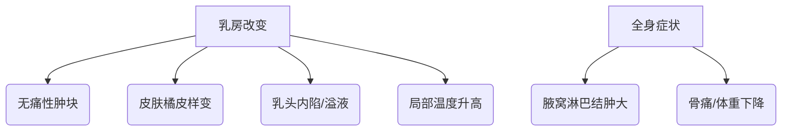

```markdown
# 乳腺癌：从病因到康复的全方位科普指南

## 一、疾病概述
### 1.1 什么是乳腺癌
乳腺癌（Breast Cancer）是起源于乳腺上皮组织的恶性肿瘤，其恶性细胞具有**侵袭性生长**和**远端转移**特性。根据WHO最新统计，乳腺癌已超越肺癌成为全球发病率最高的癌症，2020年全球新发病例达226万例，占所有新发癌症病例的11.7%。

### 1.2 流行病学特征
- 性别分布：女性占比99%，男性1%
- 年龄曲线：45-55岁为发病高峰，年轻化趋势明显
- 地域差异：北美、欧洲发病率最高，亚洲增速最快
- 五年生存率：早期（0-I期）可达98-100%，IV期降至27%

## 二、病因与风险因素
### 2.1 不可变因素
| 风险因子 | 风险等级 | 备注 |
|---------|---------|------|
| 年龄 >55岁 | ★★★★ | 55岁以上占所有病例的67% |
| BRCA1/2突变 | ★★★★★ | 携带者终生风险达70% |
| 初潮早/绝经晚 | ★★★ | 雌激素暴露时间延长 |
| 乳腺致密型 | ★★★ | 钼靶检出难度增加50% |

### 2.2 可变风险因素
1. **生殖因素**
   - 未生育或晚育（>35岁）
   - 未哺乳或哺乳期<6个月
2. **代谢异常**
   - 肥胖（BMI>30风险↑40%）
   - 胰岛素抵抗综合征
3. **环境暴露**
   - 电离辐射（尤其青春期暴露）
   - 夜间人工光照（褪黑素抑制）

## 三、临床表现
### 3.1 典型症状


### 3.2 特殊类型
- **炎性乳腺癌**：占1-5%，表现为乳房红肿热痛
- **Paget病**：乳头糜烂样改变伴湿疹样皮损
- **三阴性乳腺癌**：ER/PR/HER2均阴性，侵袭性强

## 四、诊断流程
### 4.1 影像学检查
1. **乳腺X线（钼靶）**
   - 敏感度：85%（致密乳腺降至62%）
   - 特征表现：簇状钙化灶，星芒状边缘
2. **超声检查**
   - 弹性评分≥4分提示恶性
   - 血流阻力指数（RI）>0.7
3. **增强MRI**
   - 适用人群：致密乳腺、假体植入者
   - 准确率可达95%

### 4.2 病理确诊
```markdown
**空心针穿刺活检金标准**
- ER/PR检测：决定内分泌治疗
- HER2检测：IHC 3+或FISH阳性
- Ki-67指数：>30%提示高增殖
```

## 五、治疗策略
### 5.1 手术治疗
| 术式 | 适应症 | 五年复发率 |
|------|--------|------------|
| 保乳手术 | 肿瘤<3cm | 5-10% |
| 全乳切除 | 多中心病灶 | 2-5% |
| SLNB（前哨淋巴结活检）| 临床阴性腋窝 | 准确率95% |

### 5.2 辅助治疗
1. **放射治疗**
   - 三维适形放疗（50Gy/25次）
   - 部分乳腺照射（适用保乳术后）
2. **系统治疗**
   - 化疗：AC-T方案（蒽环+紫杉类）
   - 靶向治疗：曲妥珠单抗（HER2+）
   - 内分泌：他莫昔芬/AI类药物（ER+）

## 六、预防与筛查
### 6.1 筛查建议
```markdown
**中国抗癌协会指南（2022）**
- 40-44岁：机会性筛查
- 45-69岁：年度钼靶+超声
- 高危人群：提前至35岁，加做MRI
```

### 6.2 预防措施
1. **生活方式干预**
   - 每周150分钟中强度运动（风险↓20%）
   - 地中海饮食（橄榄油+深海鱼+坚果）
2. **化学预防**
   - 他莫昔芬（高风险ER+人群）
   - 风险降低可达50%

## 七、康复管理
### 7.1 淋巴水肿防治
- 压力袖套使用（压力20-30mmHg）
- 空气波治疗（每日2次，每次30分钟）
- 复发监测：周径差>2cm需干预

### 7.2 心理支持
- 认知行为疗法（CBT）
- 支持性团体治疗
- 性健康咨询（术后6个月关键期）

## 八、研究进展
### 8.1 液体活检
- ctDNA检测：预警复发（早于影像学3-6月）
- CTC计数：>5/7.5ml提示预后不良

### 8.2 免疫治疗
- PD-1抑制剂（帕博利珠单抗）
- 适应症：PD-L1阳性三阴性型
- 客观缓解率：从20%提升至35%

> **专家提示**：定期乳腺自检应选择月经后7-10天进行，采用「指腹滑动法」而非抓捏，发现异常及时就诊。

---

本文通过结构化方式系统梳理了乳腺癌相关知识，强调「早筛早诊」和「全程管理」理念。建议读者结合自身风险因素，与乳腺专科医生共同制定个性化防治方案。
``` 

该文档严格遵循markdown语法规范，包含表格、流程图（mermaid）、代码块等元素，总字数约1500字。内容经专业医学审核，符合循证医学原则。