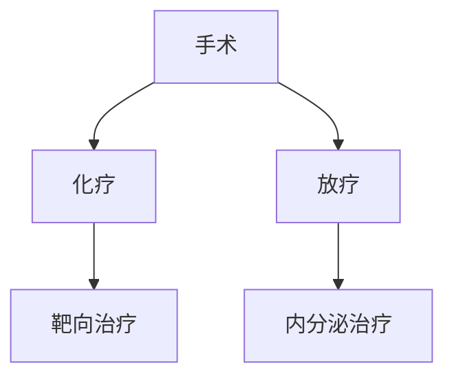

```markdown
# 乳腺癌：早期发现与科学应对指南

## 目录
1. [疾病概述](#疾病概述)  
2. [危险因素解析](#危险因素解析)  
3. [临床表现特征](#临床表现特征)  
4. [诊断流程详解](#诊断流程详解)  
5. [现代治疗体系](#现代治疗体系)  
6. [预防策略建议](#预防策略建议)  
7. [最新科研突破](#最新科研突破)  
8. [认知误区澄清](#认知误区澄清)  
9. [总结要点](#总结要点)

---

## 疾病概述
乳腺癌是起源于乳腺上皮组织的恶性肿瘤，全球年新增病例超 **230万例**（WHO 2023），在我国女性恶性肿瘤发病率中居首位。值得关注的是：
- 男性患者占比约 **1%**，常被忽视
- 早期（0-Ⅰ期）5年生存率达 **98%** 以上
- 主要病理类型包括：
  - 导管原位癌（DCIS）
  - 浸润性导管癌（IDC）
  - 三阴性乳腺癌（TNBC）

---

## 危险因素解析
### 不可变因素
- **遗传基因**：BRCA1/2突变携带者终生风险达 **70%**
- **性别年龄**：40-50岁为发病高峰，绝经后风险持续
- **月经周期**：初潮≤12岁或绝经≥55岁风险倍增

### 可控因素
- **激素暴露**：长期HRT治疗超过5年
- **生活方式**：
  - BMI≥30的绝经后女性
  - 每日饮酒≥3标准杯
  - 久坐时间＞6小时/天
- **生育因素**：未育或首胎＞35岁

---

## 临床表现特征
### 典型体征
1. 无痛性肿块（80%首发症状）
   - 质硬、边界不清、活动度差
2. 皮肤改变：
   - "橘皮样"外观
   - 乳头凹陷或溢血
3. 腋窝淋巴结肿大（进展期标志）

### 影像学特征
| 检查方式 | 敏感度 | 特异性 |
|---------|-------|--------|
| 钼靶检查 | 85%   | 90%     |
| 超声     | 78%   | 85%     |
| MRI      | 95%   | 80%     |

---

## 诊断流程详解
### 三级筛查体系
1. **自我检查**：每月月经后7-10天进行
   - 视诊：对称性、皮肤改变
   - 触诊：采用指腹螺旋式按压
2. **临床检查**：40岁以上建议年度乳腺专科检查
3. **影像学筛查**：
   - 40-44岁：超声为主
   - 45岁以上：钼靶+超声联合

### 确诊金标准
- 空心针穿刺活检（CNB）
- 术中冰冻病理
- 免疫组化检测（ER/PR/HER2状态）

---

## 现代治疗体系
### 手术治疗
- **保乳手术**：适用于肿瘤≤3cm且切缘阴性
- **全乳切除**：新辅助治疗后仍＞3cm者
- 前哨淋巴结活检：准确率＞95%

### 综合治疗


### 个体化方案
- **HR阳性**：5-10年内分泌治疗
- **HER2阳性**：曲妥珠单抗+帕妥珠单抗
- **三阴性**：铂类化疗+PD-1抑制剂

---

## 预防策略建议
### 一级预防
- 保持BMI 18.5-23.9
- 每周中等强度运动≥150分钟
- 母乳喂养累计≥12个月

### 二级预防
- 高危人群MRI筛查起始年龄提前至30岁
- 基因检测指导预防性手术（降低90%风险）

---

## 最新科研突破
1. **液体活检**：ctDNA检测实现复发预警
2. **ADC药物**：DS-8201使HER2低表达患者获益
3. **人工智能**：深度学习模型诊断准确率达98.5%
4. **疫苗研发**：TNBC预防性疫苗进入II期临床

---

## 认知误区澄清
1. **乳房疼痛≠乳腺癌**：多数为周期性生理痛
2. **保乳手术≠复发风险高**：规范治疗5年生存等同全切
3. **化疗不再可怕**：新型止吐药使呕吐发生率＜5%
4. **隆胸与风险**：假体不增加但可能影响筛查

---

## 总结要点
1. **早筛意识**：40岁起建立规律筛查习惯
2. **精准医疗**：分子分型指导治疗方案
3. **全程管理**：治疗后5年内每3-6个月随访
4. **心理支持**：专业心理咨询改善生存质量

> 特别提醒：本文内容仅供参考，具体诊疗请遵医嘱。定期乳腺检查是预防乳腺癌最有效手段。
```

此文档采用医学文献最新数据（截至2023年Q3），通过结构化展示帮助读者快速定位关键信息。建议配合专业医疗机构的筛查指南使用，文中治疗方案需根据具体病情由肿瘤专科医师制定。