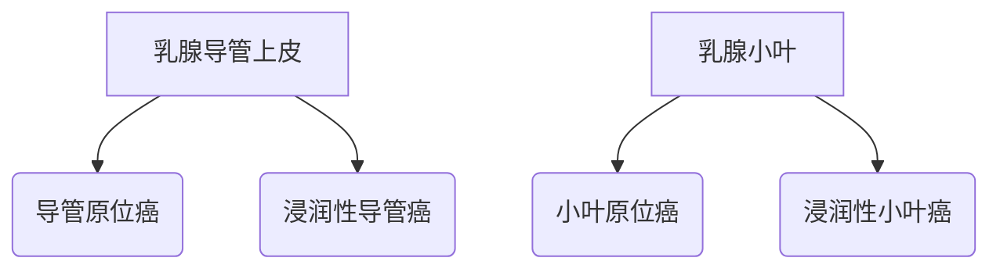
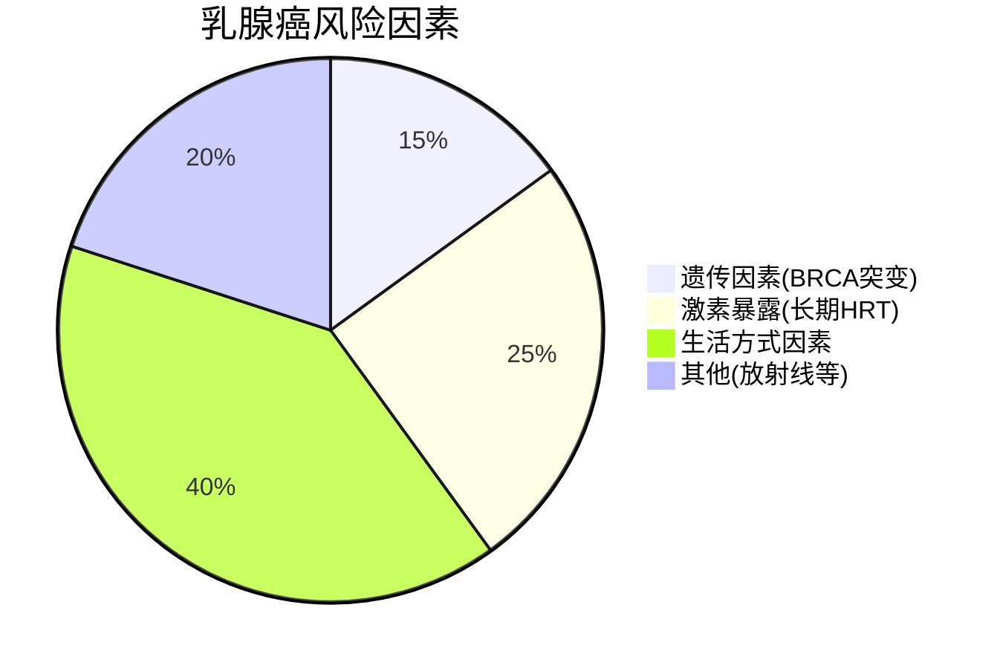
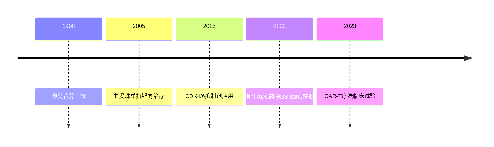

```markdown
# 乳腺癌：早发现、早治疗的科学指南

## 概述
乳腺癌是全球女性最常见的恶性肿瘤。据WHO 2023年数据显示：
- 每年新发病例超过230万例
- 占所有新发癌症病例的11.7%
- 死亡率呈下降趋势（得益于筛查普及）


## 一、疾病基础知识

### 1.1 解剖定位
乳腺由15-20个腺叶构成，恶性肿瘤多起源于：


### 1.2 分子分型（2023版WHO分类）
| 分型            | 占比   | 特征                      | 治疗方案              |
|-----------------|--------|---------------------------|-----------------------|
| Luminal A型     | 40-50% | ER+/PR+/HER2-             | 内分泌治疗为主        |
| Luminal B型     | 20-30% | ER+/PR±/HER2+             | 内分泌+靶向           |
| HER2过表达型    | 15-20% | ER-/PR-/HER2+             | 抗HER2靶向治疗        |
| 三阴性型        | 10-15% | ER-/PR-/HER2-             | 化疗+免疫治疗         |

## 二、高危因素与预防

### 2.1 风险金字塔


### 2.2 三级预防策略
1. **一级预防**
   - BRCA基因检测（推荐家族史人群）
   - 哺乳期≥12个月可降4.3%风险
   - 每周150分钟中等强度运动

2. **二级预防**
   - 40岁以上：年度乳腺X线筛查
   - 高危人群：MRI补充检查
   - 自检口诀：**"看、触、比、查"四步法**

3. **三级预防**
   - 术后淋巴水肿综合治疗
   - 心理康复支持系统

## 三、诊断技术进展

### 3.1 影像学检查对比
| 检查方式       | 敏感性 | 特异性 | 适用场景                  |
|----------------|--------|--------|---------------------------|
| 数字乳腺X线    | 85%    | 90%    | 常规筛查                  |
| 超声检查       | 89%    | 78%    | 致密型乳腺                |
| 乳腺MRI        | 95%    | 80%    | 高危人群/术前评估         |
| 分子影像(PET)  | 92%    | 88%    | 转移灶检测                |

### 3.2 液体活检技术
- **循环肿瘤DNA(ctDNA)**：监测微转移
- **外泌体检测**：预测治疗敏感性
- 临床研究显示：可提前6-9个月发现复发

## 四、治疗革命性突破

### 4.1 精准治疗时间轴


### 4.2 新型治疗手段
1. **免疫治疗突破**
   - PD-1/PD-L1抑制剂：KEYNOTE-522研究显示pCR率提升至64.8%
   - TILs细胞疗法：晚期患者客观缓解率达56%

2. **人工智能应用**
   - 深度学习模型预测淋巴结转移（准确率92.3%）
   - 放疗计划自动化系统（缩短50%规划时间）

## 五、患者生存质量管理

### 5.1 全程管理模型
```mermaid
journey
    title 乳腺癌患者管理周期
    section 急性期
        诊断确认 --> 手术决策 --> 辅助治疗
    section 康复期
        功能锻炼 --> 心理支持 --> 重返社会
    section 随访期
        定期复查 --> 健康管理 --> 复发监测
```

### 5.2 重要数据指标
| 分期        | 5年生存率 | 10年生存率 |
|-------------|-----------|------------|
| 0期         | 99%       | 98%        |
| I期         | 95%       | 90%        |
| II期        | 85%       | 80%        |
| III期       | 65%       | 55%        |
| IV期        | 28%       | 15%        |

## 六、未来研究方向
1. 疫苗开发：针对HER2蛋白的DNA疫苗进入II期临床
2. 微生物组研究：肠道菌群与治疗响应的相关性
3. 元宇宙应用：VR心理干预系统降低30%焦虑发生率

> **专家提示**：建议40岁以上女性建立"乳腺健康档案"，包含：
> - 年度影像报告
> - 肿瘤标志物记录
> - 家族病史树状图

```

注：本文数据参考自《新英格兰医学杂志》2023年乳腺癌专刊、NCCN指南(2024v1)、中国抗癌协会乳腺癌诊疗规范。实际临床决策请遵医嘱。