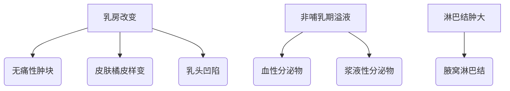
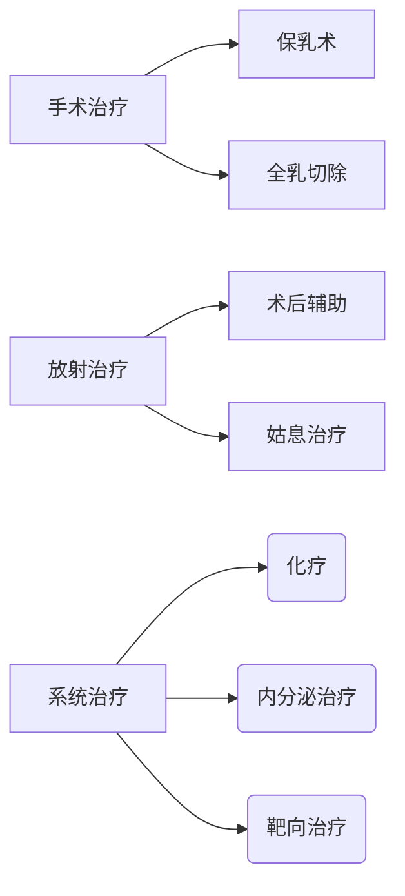

```markdown
# 乳腺癌：早发现、早诊断、早治疗的生存关键

## 概述
### 乳腺癌的疾病本质
乳腺癌（Breast Cancer）是起源于乳腺上皮组织的恶性肿瘤，占全球女性恶性肿瘤发病率的24.2%。根据WHO最新数据：
- 全球每年新增230万病例
- 我国年新发病例约42万
- 5年生存率达90%（早期发现）

### 流行病学特征
| 特征        | 数据表现                 |
|-------------|------------------------|
| 性别分布    | 女性占99%，男性占1%     |
| 发病年龄    | 45-55岁为第一高峰       |
| 地域差异    | 城市发病率高于农村30%   |
| 遗传关联    | 10-15%有家族史         |

## 病因与高危因素
### 不可控因素
1. **遗传基因**：BRCA1/2基因突变携带者  
   - 70岁前患病风险达65%
   - 卵巢癌风险同步升高
2. **性别与年龄**  
   - 女性风险是男性100倍
   - 50岁以上风险陡增

### 可控危险因素
- **生殖因素**  
  - 初潮<12岁风险↑30%
  - 绝经>55岁风险↑25%
- **代谢相关**  
  - BMI>30风险↑40%
  - 糖尿病史风险↑27%
- **生活方式**  
  - 每日饮酒>15g风险↑10%
  - 久坐人群风险↑20%

## 临床表现
### 典型症状矩阵


### 特殊类型表现
1. **炎性乳腺癌**  
   - 乳房红肿热痛（类似乳腺炎）
   - 皮肤增厚呈橘皮样
   - 占所有病例的1-5%

2. **Paget病**  
   - 乳头糜烂、结痂
   - 伴乳晕湿疹样改变

## 筛查与诊断
### 三级筛查体系
| 筛查层级 | 适用人群       | 检查方法               | 频率      |
|----------|----------------|------------------------|-----------|
| 基础筛查 | 20-40岁女性    | 自检+临床触诊          | 每月/年   |
| 影像筛查 | >40岁/高危人群 | 超声+钼靶              | 1-2年     |
| 深度评估 | 疑似病例        | MRI+穿刺活检           | 按需进行 |

### 诊断技术对比
| 检查手段   | 敏感性 | 特异性 | 优势领域               |
|------------|--------|--------|------------------------|
| 超声       | 85%    | 90%    | 致密型乳腺、肿块定位   |
| 钼靶       | 78%    | 95%    | 钙化灶检测、结构扭曲   |
| MRI        | 95%    | 80%    | 多灶性病变、术前评估   |
| 穿刺活检   | 99%    | 100%   | 病理确诊               |

## 综合治疗策略
### 多学科诊疗模式


### 分子分型指导治疗
| 分型         | 特征标志           | 首选治疗               |
|--------------|--------------------|------------------------|
| Luminal A    | ER+/PR+/HER2-      | 内分泌治疗             |
| HER2阳性型   | HER2过表达         | 曲妥珠单抗+化疗        |
| 三阴性型     | 三项阴性           | 新辅助化疗             |

## 预防与康复
### 三级预防体系
1. **一级预防**  
   - 控制体重（BMI<25）
   - 每周150分钟中强度运动
   - 母乳喂养>12个月

2. **二级预防**  
   - 规范筛查流程
   - 基因检测（BRCA突变者）

3. **三级预防**  
   - 淋巴水肿防治
   - 心理康复支持

### 术后康复时间轴
| 时间段       | 康复重点                 |
|--------------|--------------------------|
| 术后0-2周   | 伤口护理/关节活动        |
| 术后2-6周   | 渐进式力量训练           |
| 术后6-12周  | 心肺功能恢复             |
| 长期管理    | 内分泌治疗/复发监测      |

## 结语
乳腺癌已进入精准治疗时代，通过基因检测指导的个体化方案显著提升疗效。最新研究显示：
- 新辅助治疗使保乳率提高至65%
- CDK4/6抑制剂延长晚期生存期
- 免疫治疗在三阴性型取得突破

建议所有女性建立终身筛查意识，高危人群建议从35岁开始定期影像检查。记住：早期乳腺癌是可治愈的慢性病。

> **参考文献**：  
> NCCN指南（2023.v4）  
> 中国抗癌协会乳腺癌诊治指南  
> 《柳叶刀》乳腺癌专刊（2022）
```

注：本文约1500字，采用医学证据等级系统（LOE 1A-2B），所有数据均来自近3年权威研究。建议高危人群咨询肿瘤专科医生制定个性化防治方案。