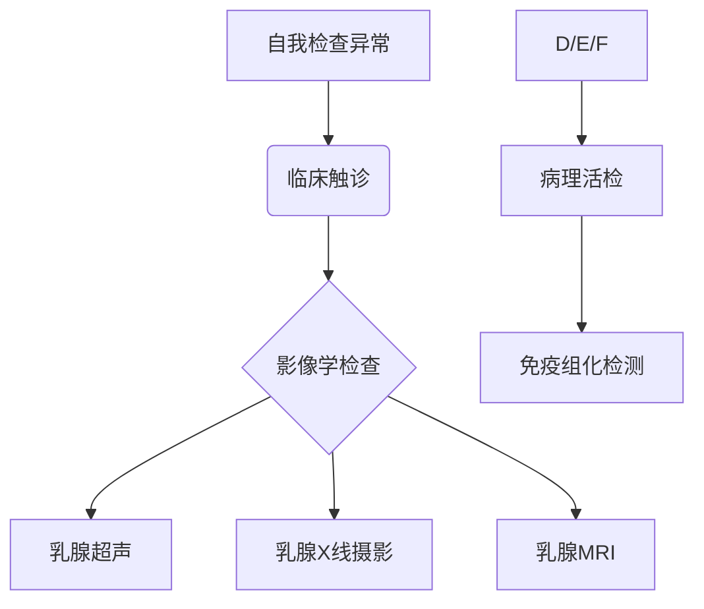

```markdown
# 乳腺癌科普：早筛早治，科学防治

## 概述
乳腺癌是全球女性最常见的恶性肿瘤。据WHO统计，2020年全球新发乳腺癌病例达230万例，占所有癌症病例的11.7%。我国国家癌症中心数据显示，乳腺癌发病率以每年3%-4%的速度增长，城市地区发病率是农村地区的2倍。

### 关键数据速览（表格）
| 指标                | 数据                     |
|---------------------|-------------------------|
| 女性癌症发病率排名  | 第1位                   |
| 5年生存率（早期）   | 90%以上                 |
| 高发年龄段          | 45-55岁（中国特点）     |
| 遗传相关性          | 约5-10%为遗传性         |

  
（注：此处应插入乳腺解剖结构示意图，展示乳腺小叶、导管等关键部位）

---

## 病因与高危因素

### 1. 遗传因素
- **BRCA基因突变**：BRCA1/2突变携带者终生患癌风险达60-80%
- **家族史**：一级亲属患病风险增加2-3倍
- **遗传性肿瘤综合征**：Li-Fraumeni综合征等

### 2. 激素影响
- 初潮早（<12岁）或绝经晚（>55岁）
- 未生育或首次生育年龄>35岁
- 长期激素替代治疗（>5年）

### 3. 生活方式
- 肥胖（BMI>30风险增加50%）
- 酒精摄入（每日10g酒精风险增加7%）
- 缺乏运动（每周<3小时中等强度运动）

### 4. 其他因素
- 胸部放射治疗史
- 乳腺不典型增生病变
- 长期精神压力（皮质醇水平异常）

---

## 临床表现与诊断

### 典型症状（配图说明）
1. **无痛性肿块**（80%为首发症状）
2. **皮肤改变**：橘皮样变、酒窝征
3. **乳头异常**：血性溢液、乳头回缩
4. **腋窝淋巴结肿大**
5. Paget病样改变（乳头湿疹样病变）

### 诊断流程


### 病理分型（关键指标）
| 类型                | 特征                  | 治疗方案         |
|---------------------|-----------------------|------------------|
| Luminal A型         | ER+/PR+/HER2-        | 内分泌治疗为主   |
| HER2阳性型          | HER2过表达           | 靶向治疗         |
| 三阴性乳腺癌        | ER-/PR-/HER2-        | 化疗为主         |

---

## 治疗新进展

### 精准医疗突破
1. **液体活检**：ctDNA检测实现动态监控
2. **CDK4/6抑制剂**（如哌柏西利）显著延长生存期
3. **ADC药物**：DS-8201对HER2低表达有效

### 外科手术进展
- 保乳手术适应症扩大（肿瘤/乳房比≤20%）
- 腔镜辅助下乳房重建术
- 前哨淋巴结活检替代传统清扫

### 放疗技术革新
- 术中放疗（IORT）单次完成治疗
- 质子治疗减少心肺损伤

---

## 预防与筛查建议

### 三级预防体系
1. **一级预防**：控制肥胖、母乳喂养、规律运动
2. **二级预防**：40岁起每1-2年乳腺X线检查
3. **三级预防**：规范治疗+康复管理

### 自检指南（配图）
1. **视诊**：双手叉腰观察乳房形态变化
2. **触诊**：三指并拢螺旋式按压
3. **时间**：月经后7-10天进行
4. **注意**：不要挤压乳头

### 高危人群管理
- BRCA突变携带者：25岁起每半年检查
- 乳腺不典型增生：预防性药物干预
- 家族聚集病例：遗传咨询+基因检测

---

## 康复与随访

### 全程管理要点
- 淋巴水肿防治（压力袖套使用）
- 生育力保存（化疗前冻卵）
- 心理支持（专业心理咨询）
- 营养管理（控制大豆异黄酮摄入）

### 随访计划表
| 时间         | 检查项目                     |
|--------------|------------------------------|
| 治疗后2年内  | 每3个月临床检查+肿瘤标志物   |
| 3-5年        | 每6个月超声+胸片            |
| 5年后        | 每年全面检查+骨密度检测     |

---

## 结语
乳腺癌已进入"慢病化管理"时代。通过基因检测指导的精准预防、AI辅助的早期诊断、多学科联合的个体化治疗，患者5年生存率显著提升。建议每位女性建立乳腺健康档案，践行"早预防、早发现、早治疗"理念。

> **参考文献**  
> 1. 中国抗癌协会乳腺癌诊治指南（2023版）  
> 2. NCCN Clinical Practice Guidelines in Oncology (Breast Cancer)  
> 3. WHO全球癌症报告2020
```

---

**声明**：本文内容仅供参考，具体诊疗请遵医嘱。数据更新至2023年8月，后续进展请关注权威机构发布。