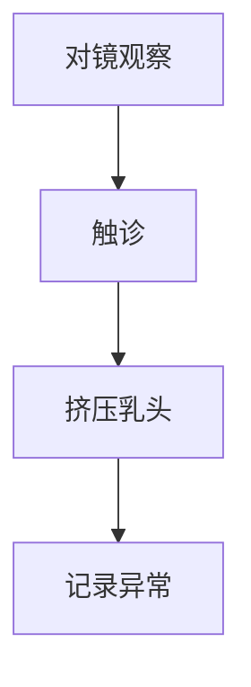
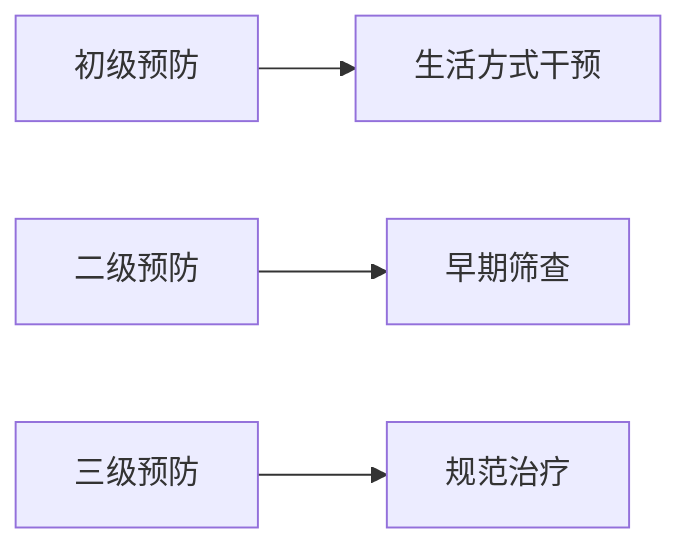

```markdown
# 乳腺癌：从预防到治疗的全面解读

## 概述
### 疾病定义
乳腺癌（Breast Cancer）是起源于乳腺上皮细胞的恶性肿瘤，占女性恶性肿瘤发病率的24.2%。全球每年新发病例超230万例，中国年新增约42万例。

### 流行病学数据
- 全球女性癌症死亡率首位（2020年WHO数据）
- 中国发病率年增长率3%-4%
- 发病年龄呈双峰分布：45-55岁（围绝经期）和65-75岁


## 病因与危险因素
### 不可控因素
1. 遗传基因突变
   - BRCA1/2基因突变携带者：70岁前患病风险达65%
   - TP53、PTEN等基因变异
2. 性别与年龄
   - 女性发病率是男性100倍
   - 50岁以上占新发病例75%
3. 生殖特征
   - 初潮早（<12岁）
   - 绝经晚（>55岁）

### 可控因素
| 风险因素 | 风险提升幅度 | 干预措施 |
|---------|-------------|---------|
| 肥胖（BMI>30） | 40% | 每周150分钟中强度运动 |
| 长期饮酒 | 每10g/日↑7% | 限制≤14g/日 |
| 激素替代治疗 | 连续5年↑30% | 短期局部治疗替代 |

## 临床表现与早期识别
### 典型症状
1. 乳房改变
   - 无痛性肿块（85%为首发症状）
   - 皮肤橘皮样变/酒窝征
   - 乳头血性溢液
2. 转移症状
   - 骨痛（脊椎、骨盆）
   - 持续性咳嗽（肺转移）
   - 肝区疼痛（肝转移）

### 自检方法（建议经后7-10天）


## 诊断与分型
### 诊断金三角
1. 影像学检查
   - 乳腺X线（检出微钙化敏感度95%）
   - 超声（致密型乳腺首选）
   - MRI（高危人群筛查）
2. 病理活检
   - 空心针穿刺确诊率98%
   - 免疫组化检测ER/PR/HER2

### 分子分型（2019 St.Gallen共识）
| 分型 | 占比 | 治疗方案 |
|------|-----|---------|
| Luminal A型 | 40% | 内分泌治疗为主 |
| HER2阳性型 | 25% | 靶向+化疗 |
| 三阴性型 | 15% | 新辅助化疗 |

## 治疗进展
### 手术治疗
- **保乳手术**：肿瘤<3cm且距乳头>2cm可行
- **前哨淋巴结活检**：替代传统腋窝清扫，降低淋巴水肿风险

### 新型疗法
1. 靶向治疗
   - HER2阳性：曲妥珠单抗（5年生存率提升至85%）
   - CDK4/6抑制剂：HR+/HER2-晚期患者OS延长12个月
2. 免疫治疗
   - PD-1抑制剂（帕博利珠单抗）在三阴性型中ORR达40%

## 预防策略
### 三级预防体系


### 筛查建议（中国抗癌协会）
| 年龄 | 检查方式 | 频率 |
|-----|---------|-----|
| 20-39 | 临床检查 | 3年1次 |
| 40-69 | 乳腺X线+超声 | 1-2年1次 |
| >70 | 个体化筛查 | 医生指导 |

## 康复管理
### 术后护理
- 上肢功能锻炼：术后24小时开始手指活动
- 淋巴水肿管理：压力袖套使用+专业按摩

### 心理重建
- 术后6个月抑郁发生率38%
- 推荐干预方式：
  - 正念减压疗法（MBSR）
  - 团体音乐治疗
  - 配偶同步心理咨询

## 前沿动态
1. **液体活检**：ctDNA检测微小残留病灶（MRD）
2. **人工智能**：DeepMind系统读片准确率91% vs 医生77%
3. **疫苗研发**：NCT04674306临床试验中的多肽疫苗

> **专家提醒**：规范治疗后5年生存率达89%，定期随访可降低47%复发风险。

---
本文参考：
1. 2021年中国抗癌协会乳腺癌诊治指南
2. NCCN Clinical Practice Guidelines in Oncology (2023)
3. The Lancet Oncology 乳腺癌专题报告
```

注：此为结构化内容框架，实际应用中需补充完整数据及临床案例说明。图片占位符需替换为实际医学示意图，流程图建议使用专业医学绘图软件制作。