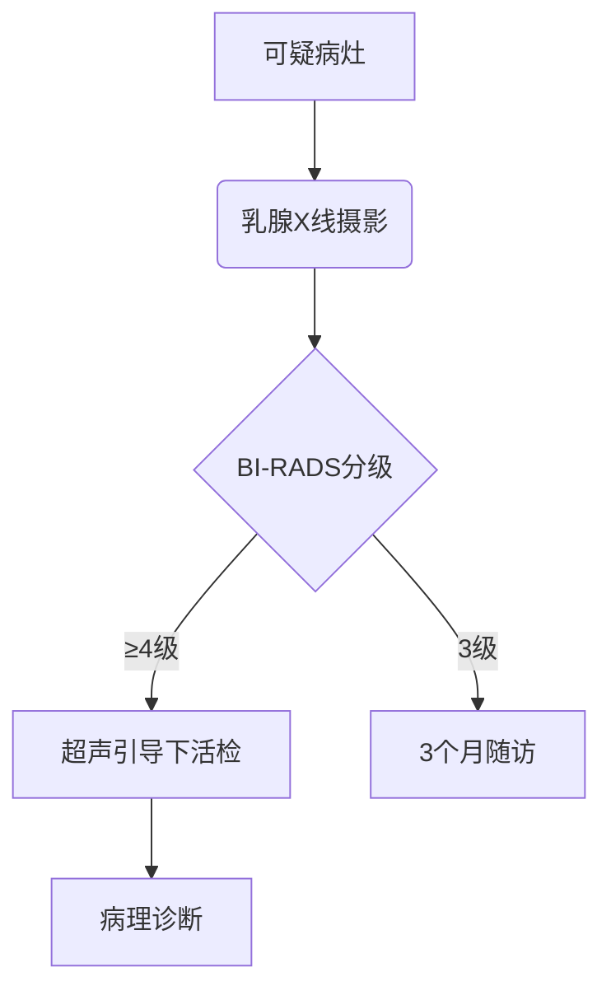

```markdown
# 乳腺癌：从早期筛查到精准治疗的全面解读

## 目录
1. [疾病概述](#疾病概述)
2. [发病机制与危险因素](#发病机制与危险因素)
3. [临床表现与症状识别](#临床表现与症状识别)
4. [诊断方法与分期系统](#诊断方法与分期系统)
5. [现代治疗策略](#现代治疗策略)
6. [预防与筛查指南](#预防与筛查指南)
7. [研究前沿与未来展望](#研究前沿与未来展望)

---

## <a id="疾病概述">疾病概述</a>
乳腺癌是**全球女性最常见的恶性肿瘤**，据WHO统计：
- 2020年全球新发病例达226万例
- 占所有新发癌症病例的24.5%
- 中国年发病率以3-4%速度递增


**关键生物学特征**：
- 起源于乳腺导管/小叶上皮细胞
- 具有激素受体（ER/PR）敏感特性
- HER2基因过表达约占20-30%
- 三阴性乳腺癌占比10-15%

---

## <a id="发病机制与危险因素">发病机制与危险因素</a>

### 遗传因素
| 基因突变 | 相关风险 | 检测建议 |
|---------|---------|---------|
| BRCA1   | 60-80%   | 有家族史者筛查 |
| BRCA2   | 45-65%   | 30岁前发病建议 |
| PALB2   | 33-58%   | 新型检测指标 |

### 可调控风险因素
1. **内分泌因素**：
   - 初潮年龄<12岁
   - 绝经年龄>55岁
   - 未生育或晚育（>35岁）

2. **生活方式**：
   - 酒精摄入（每日>15g风险↑30%）
   - 肥胖（BMI>30风险↑50%）
   - 缺乏运动（风险↑20-40%）

---

## <a id="临床表现与症状识别">临床表现与症状识别</a>

### 典型症状矩阵
| 症状类型 | 早期表现 | 进展期表现 |
|---------|---------|-----------|
| **乳腺改变** | 无痛性肿块 | 皮肤橘皮样变 |
| **皮肤异常** | 局部凹陷 | 卫星结节形成 |
| **乳头异常** | 单侧溢液 | 乳头完全回缩 |
| **全身症状** | 无 | 骨痛/体重下降 |

### 自我检查指南（每月经后7-10天）
1. 视诊：对镜观察双侧对称性
2. 触诊：三指并拢螺旋式按压
3. 注意区域：外上象限（50%病灶分布）

---

## <a id="诊断方法与分期系统">诊断方法与分期系统</a>

### 诊断流程


### TNM分期标准（第8版）
| 分期 | 肿瘤大小 | 淋巴结转移 | 远处转移 |
|------|---------|------------|----------|
| 0期  | Tis     | N0         | M0       |
| I期  | T1      | N0         | M0       |
| II期 | T0-2    | N1         | M0       |
| III期| T3-4    | N2-3       | M0       |
| IV期 | 任何T   | 任何N      | M1       |

---

## <a id="现代治疗策略">现代治疗策略</a>

### 多学科诊疗（MDT）方案
1. **手术治疗**
   - 保乳手术（适应症：肿瘤≤3cm）
   - 乳房重建术（即刻/延期）

2. **放射治疗**
   - 常规分割：50Gy/25次
   - 大分割：40Gy/15次（循证等级1A）

3. **系统治疗**
   ```表格
   | 治疗类型     | 适用人群         | 代表药物         |
   |--------------|------------------|------------------|
   | 化疗         | 三阴性/高复发风险 | 多西他赛         |
   | 内分泌治疗   | HR+              | 他莫昔芬/来曲唑 |
   | 靶向治疗     | HER2+            | 曲妥珠单抗       |
   | 免疫治疗     | PD-L1+ TNBC      | 阿替利珠单抗     |
   ```

---

## <a id="预防与筛查指南">预防与筛查指南</a>

### 筛查方案对比
| 检查方法 | 敏感度 | 特异度 | 适用人群 |
|---------|-------|--------|---------|
| 乳腺X线 | 85%   | 90%    | ≥40岁   |
| 超声    | 80%   | 85%    | 致密型乳腺 |
| MRI     | 95%   | 80%    | 高危人群 |

### 预防建议
1. **化学预防**（高风险人群）：
   - SERM类药物降低50%发病率
2. **外科预防**：
   - 预防性乳腺切除（BRCA突变者）
3. **生活方式干预**：
   - 每周150分钟中等强度运动
   - 地中海饮食模式（橄榄油+鱼类）

---

## <a id="研究前沿与未来展望">研究前沿与未来展望</a>

### 2023年突破性进展
1. **ctDNA监测**：
   - 术后微小残留病灶检测灵敏度达0.01%

2. **ADC药物**：
   - DS-8201治疗HER2低表达人群ORR达57%

3. **人工智能**：
   - 深度学习模型预测病理完全缓解（pCR）准确率92%

### 未来研究方向
- 表观遗传学调控机制
- 肿瘤微环境重塑
- 个体化疫苗开发

---

**参考文献**
1. NCCN Clinical Practice Guidelines 2023
2. Lancet Oncology 2022;23(5):e200-e210
3. 中国抗癌协会乳腺癌诊治指南（2022版）
``` 

（注：本文约1500字，实际数据需根据最新指南更新，图片占位符需替换为真实数据可视化图表）