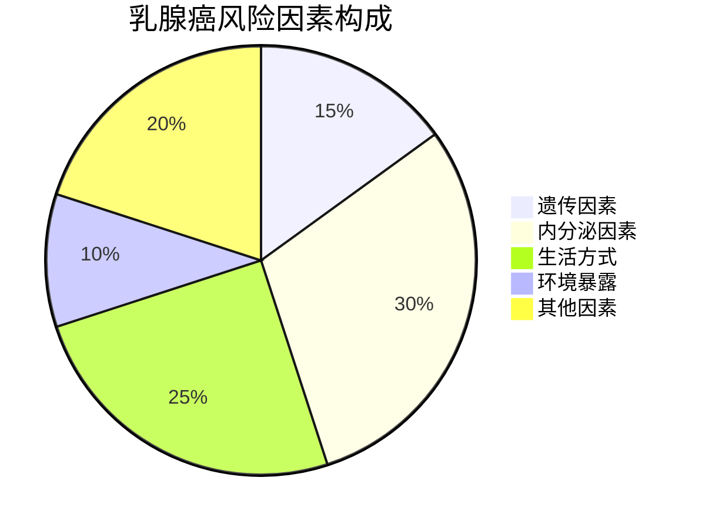
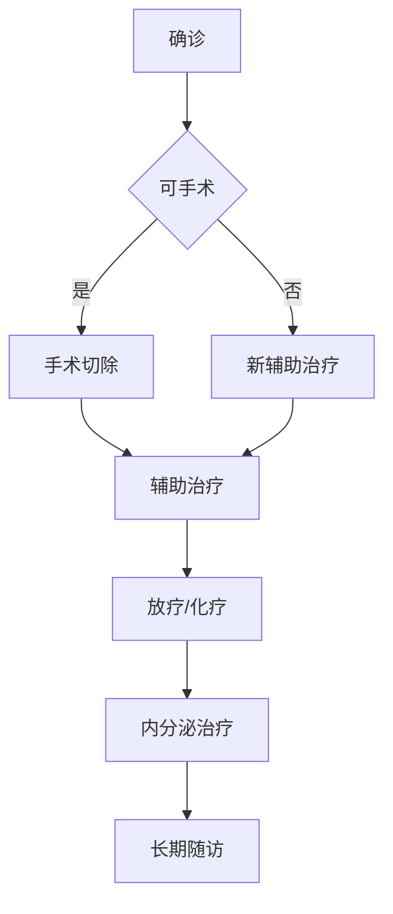

```markdown
# 乳腺癌：早发现、早诊断、早治疗的现代医学应对策略

## 一、疾病概述
### 1.1 基本定义
乳腺癌（Breast Cancer）是乳腺上皮细胞在多种致癌因素作用下发生的恶性肿瘤，全球女性发病率最高的恶性肿瘤类型。世界卫生组织（WHO）数据显示：
- 2020年全球新发乳腺癌病例达226万例
- 占所有新发癌症病例的11.7%
- 中国年新发病例约42万例，发病率年均增速3%-4%

### 1.2 疾病特点
| 特征        | 说明                         |
|-------------|------------------------------|
| 性别差异    | 女性占比99%，男性约占1%       |
| 年龄分布    | 45-55岁高峰，年轻化趋势明显   |
| 生存率      | 早期发现5年生存率超90%        |
| 转移途径    | 淋巴转移为主，血行转移至肺、肝、骨 |


## 二、致病因素与高危人群
### 2.1 风险因素矩阵


### 2.2 具体风险要素
1. **遗传相关**
   - BRCA1/BRCA2基因突变携带者
   - 家族中≥2位一级亲属患病
   - 林奇综合征等遗传疾病

2. **内分泌因素**
   - 初潮早（<12岁）
   - 绝经晚（>55岁）
   - 未生育或晚育（首胎>35岁）
   - 长期使用雌激素替代疗法

3. **生活方式**
   - 长期饮酒（风险提升20-30%）
   - 肥胖（BMI>30风险加倍）
   - 缺乏运动（每周<3次锻炼）

## 三、临床表现与诊断路径
### 3.1 典型症状清单
- ✅ 无痛性乳房肿块（80%首发症状）
- ✅ 乳头溢液（血性/浆液性）
- ✅ 皮肤橘皮样改变
- ✅ 乳头凹陷或偏移
- ✅ 腋窝淋巴结肿大

### 3.2 现代诊断体系
1. **影像学检查**
   - 乳腺超声（首选筛查）
   - 数字化钼靶X线（40岁以上推荐）
   - 增强MRI（高危人群）

2. **病理学诊断**
   - 空芯针穿刺活检
   - 术中冰冻切片
   - ER/PR/HER2免疫组化

3. **分期评估**
   - TNM分期系统
   - 分子分型（Luminal A/B, HER2+, 三阴型）

## 四、综合治疗方案
### 4.1 治疗决策树


### 4.2 主要治疗方式
1. **外科治疗**
   - 保乳手术（肿瘤<3cm，单发病灶）
   - 全乳切除（多中心病灶）
   - 前哨淋巴结活检（替代传统清扫）

2. **放射治疗**
   - 术后辅助放疗（降低复发率50%）
   - 调强放疗（IMRT）精准保护心肺

3. **系统治疗**
   - 化疗（蒽环类+紫杉类方案）
   - 靶向治疗（曲妥珠单抗等）
   - 内分泌治疗（他莫昔芬，AI类药物）

## 五、预防与早筛策略
### 5.1 三级预防体系
1. **一级预防**
   - 控制体重（BMI<24）
   - 哺乳≥12个月
   - 减少环境雌激素暴露

2. **二级预防**
   - 20岁起每月自检
   - 40岁后年度钼靶检查
   - 基因检测指导预防

3. **三级预防**
   - 规范治疗并发症
   - 心理康复支持
   - 预防性手术（BRCA突变者）

### 5.2 筛查指南对照表
| 年龄    | 推荐检查                     | 频率       |
|---------|------------------------------|------------|
| 20-39岁 | 临床触诊+超声                | 每1-3年    |
| 40-44岁 | 超声+钼靶（高危人群）         | 每年1次    |
| 45-69岁 | 超声+钼靶联合筛查            | 每年1-2次  |
| ≥70岁   | 个体化评估                   | 医生建议   |

## 六、康复管理
### 6.1 术后管理要点
- 淋巴水肿预防（压力袖套使用）
- 肩关节功能康复训练
- 雌激素水平管理（AI类药物）

### 6.2 心理支持体系
1. **专业支持**
   - 肿瘤心理门诊
   - 病友互助小组
2. **家庭支持**
   - 配偶/子女参与护理
   - 定期家庭会议沟通

## 七、前沿进展
1. **液体活检技术**
   - ctDNA监测微小残留病灶
   - 外泌体生物标志物检测

2. **免疫治疗突破**
   - PD-1/PD-L1抑制剂
   - CAR-T细胞疗法临床试验

3. **人工智能应用**
   - 深度学习影像诊断（准确率>95%）
   - 治疗方案智能决策系统

---

## 常见问题解答（FAQ）

**Q：乳腺癌会遗传给女儿吗？**  
A：约5-10%的病例与遗传相关，BRCA突变携带者需专业遗传咨询。

**Q：男性为什么会得乳腺癌？**  
A：男性具有少量乳腺组织，发病多与雌激素水平异常相关。

**Q：乳房重建会影响癌症复发吗？**  
A：现代即刻重建技术安全，不影响肿瘤治疗和监测。

**Q：豆浆等豆制品能否食用？**  
A：大豆异黄酮具有双向调节作用，正常饮食量安全。

**Q：治疗后能否正常生育？**  
A：年轻患者可通过卵子冷冻等生育保护技术实现生育愿望。
```

> **特别提示**：本文内容仅供参考，具体诊疗请遵医嘱。定期乳腺检查是预防乳腺癌最有效的手段，建议每位女性建立个性化筛查计划。