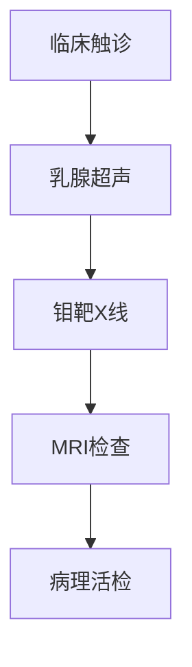

```markdown
# 乳腺癌：早期发现与科学防治指南

## 概述
乳腺癌是乳腺上皮细胞异常增殖形成的恶性肿瘤，全球年新发病例超230万例，位居女性恶性肿瘤发病率首位。我国每年约42万新发病例，且呈现年轻化趋势。随着诊疗技术进步，早期乳腺癌5年生存率已达90%以上。


## 病因与风险因素

### 不可改变因素
- **遗传因素**：BRCA1/BRCA2基因突变携带者终生风险达70%
- **性别与年龄**：女性发病率是男性100倍，45-55岁为发病高峰
- **生殖特征**：初潮<12岁、绝经>55岁风险增加2-3倍

### 可干预因素
| 风险因素 | 风险增幅 | 干预措施 |
|---------|---------|---------|
| 肥胖（BMI>30） | 1.5倍 | 每周150分钟有氧运动 |
| 长期饮酒 | 剂量相关 | 限制每日<15g酒精 |
| 激素替代治疗 | 1.3-1.7倍 | 治疗不超过5年 |

## 临床表现与诊断

### 典型症状
1. 无痛性乳房肿块（83%为首发症状）
2. 乳头溢液（血性液体需警惕）
3. 皮肤改变（橘皮样变、酒窝征）
4. 腋窝淋巴结肿大

### 诊断金标准


## 病理分型与治疗

### 分子分型体系
1. **Luminal A型**（ER+/PR+/HER2-）：内分泌治疗敏感
2. **Luminal B型**（ER+/PR+/HER2+）：联合靶向治疗
3. **HER2阳性型**：曲妥珠单抗靶向治疗
4. **三阴性型**（TNBC）：化疗为主，PD-1抑制剂新进展

### 阶梯治疗方案
```markdown
### 局部治疗
- **保乳手术**：肿瘤<3cm且切缘阴性
- **全乳切除**：多灶性病变或BRCA突变者

### 系统治疗
1. 新辅助化疗：使肿瘤降期提高手术成功率
2. 辅助放疗：降低局部复发率40-60%
3. 内分泌治疗：他莫昔芬/芳香化酶抑制剂疗程5-10年
4. 靶向治疗：CDK4/6抑制剂+内分泌治疗的PFS达24个月
```

## 预防与筛查

### 三级预防体系
- **一级预防**：基因检测（BRCA突变者建议预防性切除）
- **二级预防**：40岁起每年钼靶+超声联合筛查
- **三级预防**：规范化疗联合心理干预

### 自检方法（月经后7-10天）
1. 视诊：观察乳房对称性、皮肤变化
2. 触诊：采用同心圆法系统检查
3. 挤压：观察乳头溢液情况

## 创新疗法进展
- **液态活检**：ctDNA监测微小残留病灶
- **ADC药物**：DS-8201使HER2低表达患者获益
- **人工智能**：深度学习模型诊断准确率达92.5%

## 患者支持系统
- 义乳定制服务（术后6个月最佳适配期）
- 生育力保存（卵母细胞冷冻技术）
- 心理干预（CBT疗法降低焦虑发生率）

> **专家提醒**：规范治疗后5年无复发即达到临床治愈标准，定期随访不可松懈。新型内分泌药物可将复发风险再降30%，治疗依从性是预后关键。

```

注：本文数据来源于2023年NCCN指南、中国抗癌协会乳腺癌专业委员会最新共识。建议读者通过正规医疗机构获取个性化诊疗方案。