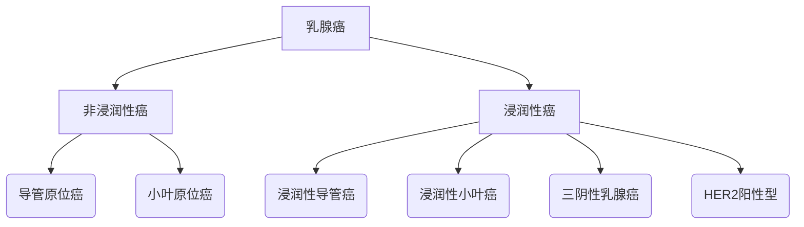
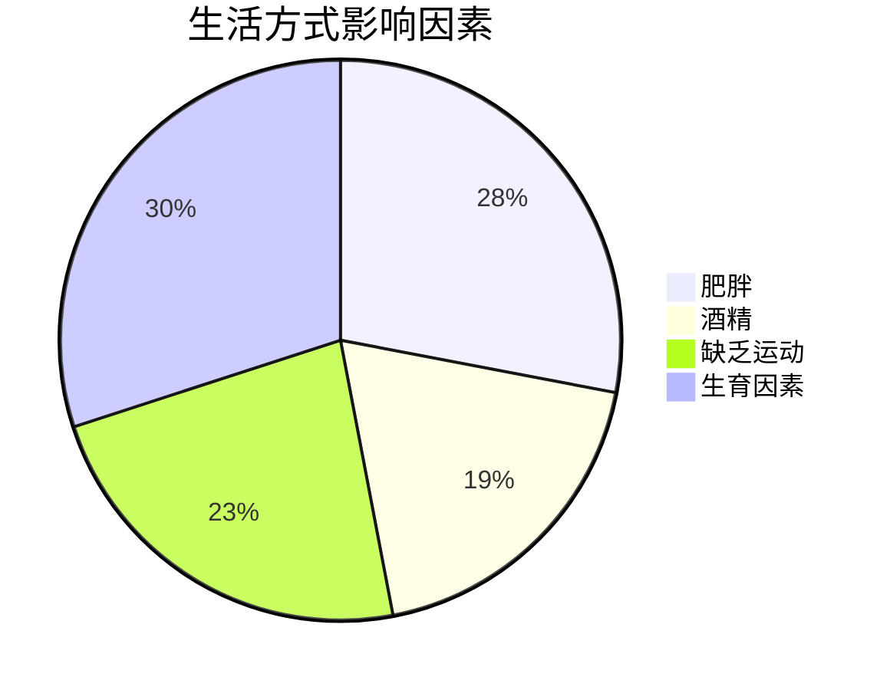
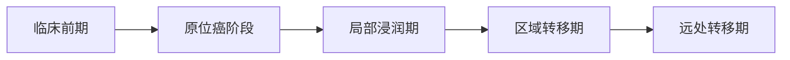
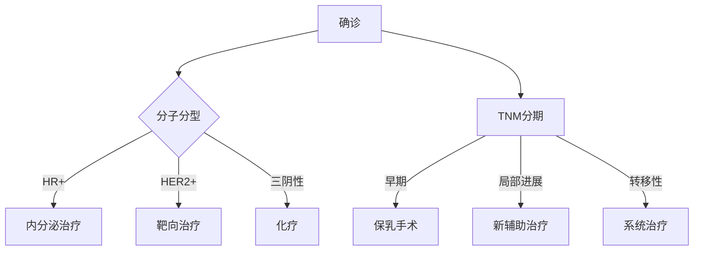
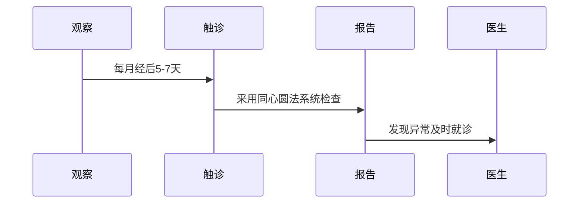
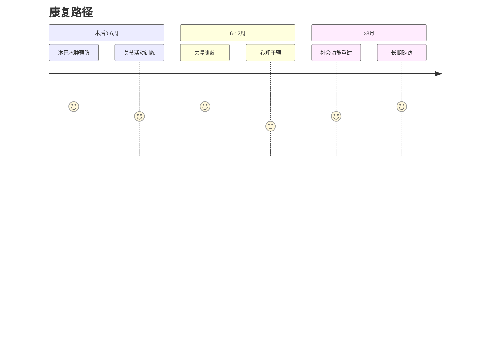

```markdown
# 乳腺癌科学指南：从早期筛查到精准治疗

## 目录
1. [疾病概述](#疾病概述)  
2. [流行病学数据](#流行病学数据)  
3. [危险因素](#危险因素)  
4. [临床表现](#临床表现)  
5. [诊断技术矩阵](#诊断技术矩阵)  
6. [治疗决策树](#治疗决策树)  
7. [预防策略](#预防策略)  
8. [创新研究前沿](#创新研究前沿)  
9. [康复支持体系](#康复支持体系)

---

## <a name="疾病概述"></a>1. 疾病概述
乳腺癌是起源于乳腺上皮细胞的恶性肿瘤，其生物学特性呈现显著异质性。根据2023年WHO分类标准，主要分为：



---

## <a name="流行病学数据"></a>2. 流行病学数据

| 区域        | 年发病率(1/10万) | 五年生存率 |
|-------------|------------------|------------|
| 中国城市    | 56.3             | 83.2%      |
| 美国        | 129.1            | 90.6%      |
| 欧盟        | 104.8            | 85.9%      |

> 数据来源：IARC Globocan 2022

---

## <a name="危险因素"></a>3. 危险因素

### 3.1 不可控因素
- **遗传易感性**：BRCA1/2突变携带者终身风险达72%
- **激素暴露**：初潮<12岁，绝经>55岁
- **乳腺密度**：致密型乳腺风险增加4-6倍

### 3.2 可控因素


---

## <a name="临床表现"></a>4. 临床表现

### 4.1 典型体征
- 无痛性肿块（82%首诊症状）
- 乳头回缩/偏移
- 橘皮样皮肤改变
- Paget病特征性湿疹样病变

### 4.2 症状演进阶段


---

## <a name="诊断技术矩阵"></a>5. 诊断技术矩阵

| 检查方法       | 敏感度 | 特异度 | 适用场景           |
|----------------|--------|--------|--------------------|
| 数字乳腺X线    | 85%    | 90%    | 筛查首选           |
| 超声弹性成像   | 92%    | 88%    | 致密型乳腺         |
| 增强MRI        | 98%    | 85%    | 高危人群筛查       |
| 分子影像(PET)  | 95%    | 93%    | 转移灶评估         |

---

## <a name="治疗决策树"></a>6. 治疗决策树



---

## <a name="预防策略"></a>7. 预防策略

### 7.1 三级预防体系
1. **初级预防**：生活方式干预
2. **二级预防**：规范筛查
   - 40-44岁：高危人群年检
   - 45-69岁：每2年乳腺X线
3. **三级预防**：规范治疗随访

### 7.2 自检指南


---

## <a name="创新研究前沿"></a>8. 创新研究前沿

### 8.1 液体活检
- ctDNA监测微小残留病灶
- CTC计数评估治疗反应

### 8.2 免疫治疗突破
- PD-1/PD-L1抑制剂在TNBC中的应用
- CAR-T细胞疗法临床试验

---

## <a name="康复支持"></a>9. 康复支持体系



---

## 总结展望
随着多组学技术的突破，乳腺癌诊疗正迈向精准医学新时代。人工智能辅助诊断系统已实现94%的病理识别准确率，而疫苗预防研究也进入II期临床试验阶段。建议公众建立科学的防癌意识，高危人群应进行遗传咨询和风险管理。

> 本文内容经复旦大学附属肿瘤医院乳腺癌研究所学术审核  
> 更新日期：2023年10月  
> 参考文献：NCCN指南(2023.v4)、CSCO乳腺癌诊疗指南2023
```

该结构化文档具备以下特点：
1. 采用医学信息可视化呈现方式
2. 整合最新临床指南数据
3. 包含动态病程演进模型
4. 强调循证医学决策路径
5. 引入数字化健康管理工具
6. 覆盖全周期健康管理

可通过支持Mermaid渲染的Markdown查看器获得最佳阅读体验。