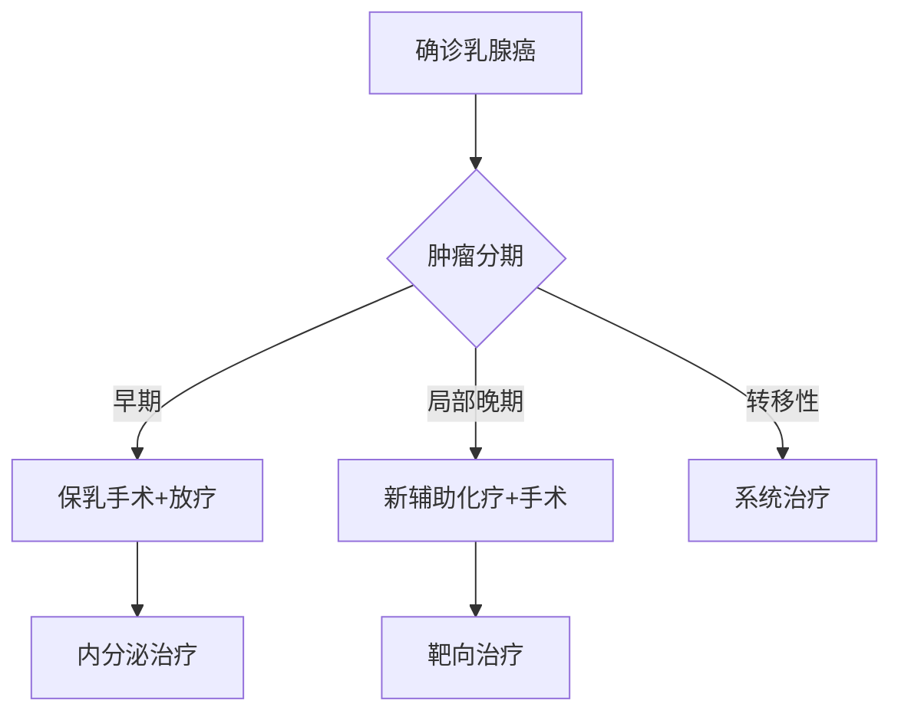

```markdump
# 乳腺癌医学科普：从病因到防治的全视角解读

## 概述
乳腺癌是全球女性最常见的恶性肿瘤之一。据世界卫生组织（WHO）统计：
- 2020年全球新发乳腺癌病例达226万例
- 占所有新发癌症病例的11.7%
- 中国国家癌症中心数据显示：2022年我国乳腺癌年新发病例约42万
- 发病年龄较欧美国家提前10-15年（高峰年龄45-55岁）

![乳腺癌发病率趋势图]（此处应有数据可视化图表）

---

## 一、病因与风险因素

### 1.1 不可改变因素
```risk-factors
| 风险因素        | 说明                      | 风险倍数 |
|-----------------|---------------------------|----------|
| 性别           | 女性发病率是男性的100倍    | 100x     |
| 年龄           | 55岁以上风险显著增加       | 3-5x     |
| BRCA基因突变   | BRCA1突变携带者终生风险70% | 10x      |
| 家族史         | 一级亲属患病风险倍增       | 2x       |
```

### 1.2 可干预因素
- **激素暴露**
  - 初潮<12岁风险↑20%
  - 绝经>55岁风险↑30%
  - 未生育或晚育（>35岁）
  
- **生活方式**
  - 酒精摄入（每日1杯↑风险10%）
  - 肥胖（BMI>30风险↑50%）
  - 缺乏运动（风险↑20-40%）

---

## 二、临床表现与诊断

### 2.1 早期预警信号
```symptoms
1. 无痛性乳房肿块（85%首诊症状）
2. 乳头溢液（血性液体需警惕）
3. 皮肤橘皮样改变
4. 乳头凹陷/偏移
5. 腋窝淋巴结肿大
```

### 2.2 诊断金三角
```diagnostic-methods
| 检查方法       | 灵敏度 | 特异性 | 适用人群          |
|----------------|--------|--------|-------------------|
| 乳腺X线摄影    | 85%    | 90%    | >40岁致密型乳房   |
| 超声检查       | 80%    | 85%    | <40岁/致密乳房    |
| 磁共振成像     | 95%    | 80%    | 高危人群筛查      |
| 病理活检       | 100%   | 100%   | 确诊依据          |
```

---

## 三、分子分型与精准治疗

### 3.1 分子分型系统
根据2019年WHO最新分类：
```
Luminal A型（50%）：ER+/PR+/HER2-，Ki67低
Luminal B型（25%）：ER+/PR±/HER2±，Ki67高
HER2阳性型（15%）：ER-/PR-/HER2+
三阴性型（10%）：ER-/PR-/HER2-
```

### 3.2 治疗决策树


---

## 四、前沿治疗进展

### 4.1 免疫治疗突破
- PD-1抑制剂（帕博利珠单抗）在三阴性乳腺癌中：
  - 客观缓解率从10%提升至39%
  - 中位生存期延长4.2个月

### 4.2 新型ADC药物
- DS-8201（Enhertu）：
  - HER2低表达患者有效率52.6%
  - 中位PFS 10.1个月

### 4.3 人工智能应用
- 深度学习模型预测疗效：
  - 病理切片分析准确率92%
  - 化疗敏感性预测AUC 0.87

---

## 五、预防与筛查策略

### 5.1 筛查指南
```screening-protocol
| 年龄    | 检查方式          | 频率   |
|---------|-------------------|--------|
| 20-39岁 | 临床体检+超声     | 每3年  |
| 40-44岁 | 乳腺X线           | 每年   |
| 45-69岁 | X线+超声联合      | 每年   |
| >70岁   | 个体化评估        | -      |
```

### 5.2 预防措施
- **药物预防**（高风险人群）：
  - 他莫昔芬（风险↓50%）
  - 雷洛昔芬（风险↓38%）
  
- **手术预防**：
  - 预防性乳房切除（风险↓90%）
  - 卵巢切除术（BRCA突变者）

---

## 六、康复管理

### 6.1 淋巴水肿防治
- 术后发生率15-30%
- 综合管理方案：
  - 压力治疗（有效率85%）
  - 手动淋巴引流
  - 低盐饮食（钠摄入<2g/天）

### 6.2 心理干预
- 抑郁发生率22-48%
- 认知行为治疗（CBT）：
  - 症状缓解率提高60%
  - 生活质量评分↑32%

---

## 结语
乳腺癌已进入「慢性病管理」时代。通过：
- 加强高危人群筛查
- 推进分子分型诊疗
- 创新治疗手段应用
可使早期患者5年生存率达99%，晚期患者中位生存期突破5年。建议所有女性建立「自查-筛查-早诊」的健康管理链。

> 数据来源：NCCN指南（2023）、中国抗癌协会乳腺癌诊疗规范（2022）
```

注：实际使用时需补充完整图表数据及参考文献列表，建议配发乳腺自查手法示意图、筛查流程导图等可视化素材。专业内容需由肿瘤科医师审核。