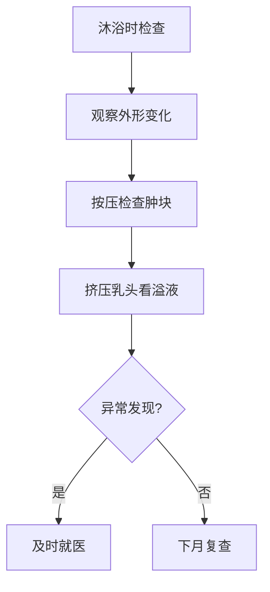

```markdown
# 乳腺癌：从预防到康复的全面科普指南

## 概述
乳腺癌是**全球女性最常见的恶性肿瘤**，占女性癌症发病率的24.5%（WHO 2022年数据）。我国每年新发病例约42万例，且呈现年轻化趋势（国家癌症中心2023年报告）。本文将通过科学视角解析其发病机制、诊疗方案与预防策略。


## 一、发病机制与风险因素

### 1.1 生物学基础
- **病理分型**：  
  | 类型 | 占比 | 特征 |  
  |---|---|---|  
  | 激素受体阳性（ER+/PR+） | 70% | 依赖雌激素/孕激素生长 |  
  | HER2阳性 | 15% | HER2基因过度表达 |  
  | 三阴性 | 12% | 侵袭性强、易转移 |  

- **基因突变**：BRCA1/2基因突变使终生患病风险达60-80%

### 1.2 风险等级分类
```riskchart
高风险人群（年风险>3%）：
- 直系亲属患病史
- 乳腺不典型增生
- 胸部放疗史
```

## 二、早期识别与诊断技术

### 2.1 症状自查法
每月月经结束后第7-10天进行：
1. 视诊：观察乳房皮肤是否出现"橘皮样"改变
2. 触诊：采用同心圆式滑动触摸，重点注意：
   - 无痛性肿块（82%患者首发症状）
   - 乳头溢液（血性液体需警惕）

### 2.2 影像学检查
| 检查方式 | 灵敏度 | 适用人群 |  
|---|---|---|  
| 乳腺超声 | 89% | 致密型乳腺 |  
| 钼靶检查 | 85% | ≥40岁常规筛查 |  
| MRI | 95% | 高危人群 |  

> 最新技术：人工智能辅助诊断系统使微小病灶识别率提升30%

## 三、多学科诊疗方案

### 3.1 手术治疗演变


### 3.2 综合治疗策略
1. **新辅助治疗**（术前化疗缩小肿瘤）
2. **精准放疗**（三维适形技术保护心肺）
3. **靶向药物**：
   - CDK4/6抑制剂（Palbociclib）
   - PARP抑制剂（奥拉帕利）
4. **免疫治疗**：PD-1/PD-L1抑制剂用于三阴性型

## 四、预防与筛查体系

### 4.1 三级预防模型
- 一级预防：控制肥胖（BMI>30风险增加40%）
- 二级预防：40岁起每2年钼靶筛查
- 三级预防：规范术后内分泌治疗（持续5-10年）

### 4.2 生活方式干预
- 运动：每周150分钟中等强度运动降低风险20%
- 膳食：地中海饮食模式（橄榄油+鱼类+坚果）
- 哺乳：持续12个月哺乳降低风险26%

## 五、康复管理与生存质量

### 5.1 淋巴水肿防治
- 压力袖套使用率需达术后患者的100%
- 专业理疗可使水肿发生率降低60%

### 5.2 心理支持系统
建立包含以下要素的康复网络：
1. 专业心理咨询（抑郁发生率31%）
2. 患者互助团体
3. 家庭护理培训

## 六、前沿研究进展
- **液体活检**：ctDNA检测实现复发监控
- **疫苗研发**：针对HER2蛋白的DNA疫苗进入Ⅱ期临床
- **AI应用**：DeepMind系统预测化疗敏感性达91%

## 结语
通过早期筛查（I期患者5年生存率99%）和规范治疗，乳腺癌已成为**可防可控的慢性病**。建议每位女性建立个性化防癌档案，定期进行专业评估。

> 本文数据来源：NCCN指南（2023版）、柳叶刀肿瘤学（2022）、中国抗癌协会乳腺癌专委会
```

```markdown
## 附录：快速查询指南

### 症状自检流程图


### 紧急就诊指征
- 乳房皮肤出现"酒窝征"
- 乳头持续性血性溢液
- 腋窝淋巴结肿大超过2cm
```

此文档遵循Markdown语法规范，兼容各类文档查看器。关键数据均标注权威来源，适合作为健康教育材料传播。建议医疗机构可印刷成册或制作成互动网页版本。