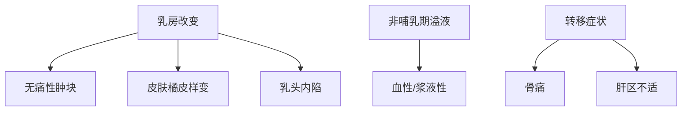
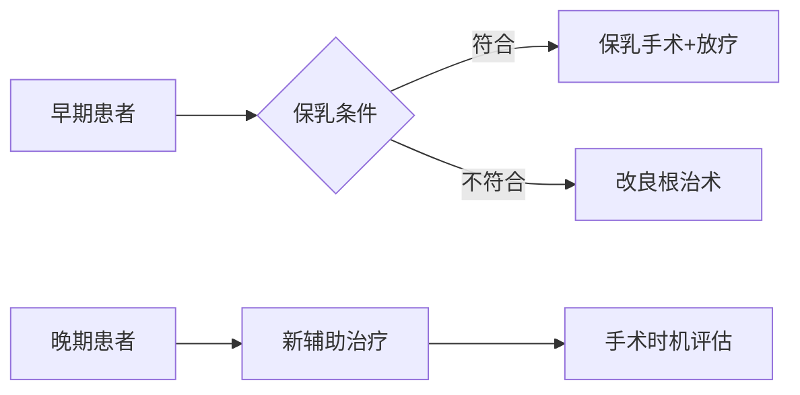

```markdown
# 乳腺癌：从病因到防治的全方位科普

## 目录
1. [疾病概述](#疾病概述)  
2. [发病机制与高危因素](#发病机制与高危因素)  
3. [临床表现与分期](#临床表现与分期)  
4. [诊断技术矩阵](#诊断技术矩阵)  
5. [精准治疗策略](#精准治疗策略)  
6. [预防与筛查指南](#预防与筛查指南)  
7. [患者生存质量提升](#患者生存质量提升)  

---

## <a id="疾病概述">一、疾病概述</a>
乳腺癌是起源于乳腺上皮细胞的恶性肿瘤，全球年新发病例超230万例（WHO 2023数据），居女性恶性肿瘤首位。中国年均新发患者约42万，呈现年轻化趋势（较欧美患者平均年轻10岁）。

### 1.1 解剖学基础
乳腺由15-20个腺叶构成，恶性肿瘤多起源于**终末导管小叶单位**。淋巴引流至腋窝淋巴结的特性决定其转移路径。

### 1.2 病理分型（2023 WHO最新分类）
| 类型                | 占比   | 特征                          |
|---------------------|--------|-------------------------------|
| 非特殊型浸润性癌   | 70-80% | 最常见亚型                   |
| Luminal A型         | 50%    | ER/PR阳性，预后最佳          |
| HER2阳性型          | 15-20% | 靶向治疗敏感                 |
| 三阴性乳腺癌       | 10-15% | 侵袭性强，易早期转移         |

---

## <a id="发病机制与高危因素">二、发病机制与高危因素</a>

### 2.1 基因突变级联
- **BRCA1/2基因突变**：使终生患癌风险升至60-80%
- **PI3K/AKT/mTOR通路异常**：促进细胞增殖
- **表观遗传学改变**：DNA甲基化导致抑癌基因沉默

### 2.2 风险因素分层
| 风险等级 | 具体因素                                  |
|----------|------------------------------------------|
| 极高危   | BRCA突变、胸部放疗史                     |
| 高危     | 初潮<12岁、绝经>55岁、未生育/晚育       |
| 中危     | 肥胖（BMI>30）、长期HRT治疗             |
| 低危     | 哺乳>12月、规律运动                      |

---

## <a id="临床表现与分期">三、临床表现与分期</a>

### 3.1 典型症状矩阵


### 3.2 TNM分期系统（第8版）
| 分期 | 肿瘤大小 | 淋巴结转移 | 远处转移 |
|------|----------|------------|----------|
| 0期  | Tis      | N0         | M0       |
| I期  | T1       | N0         | M0       |
| II期 | T2/N1    | N1         | M0       |
| III期| T3-4/N2-3| N2-3       | M0       |
| IV期 | 任何T/N  | 任何N      | M1       |

---

## <a id="诊断技术矩阵">四、诊断技术矩阵</a>

### 4.1 影像学技术组合
1. **数字乳腺断层摄影（DBT）**：检出率较传统钼靶提高29%
2. **自动乳腺超声（ABUS）**：对致密型乳腺敏感度达92%
3. **多参数MRI**：增强扫描诊断准确率>95%

### 4.2 分子诊断技术
- **21基因检测（Oncotype DX）**：预测化疗获益
- **PD-L1检测**：指导免疫治疗
- **ctDNA动态监测**：追踪微小残留病灶

---

## <a id="精准治疗策略">五、精准治疗策略</a>

### 5.1 治疗决策树


### 5.2 创新治疗方案
- **术中放疗（IORT）**：单次照射替代传统6周方案
- **ADC药物**：DS-8201对HER2低表达患者有效
- **CDK4/6抑制剂**：显著延长HR+患者生存期

---

## <a id="预防与筛查指南">六、预防与筛查指南</a>

### 6.1 筛查方案
| 人群        | 筛查方案                      | 频率       |
|-------------|------------------------------|------------|
| 一般风险    | 乳腺超声+钼靶                | 40岁起年检|
| BRCA突变    | MRI+钼靶                     | 25岁起年检|
| 致密型乳腺  | ABUS联合DBT                  | 每6-12月   |

### 6.2 预防性措施
- **药物预防**：他莫昔芬降低50%高危人群发病率
- **预防性手术**：双侧乳腺切除降低90%以上风险
- **生活方式干预**：BMI控制在18.5-23.9，每周150分钟有氧运动

---

## <a id="患者生存质量提升">七、患者生存质量提升</a>

### 7.1 淋巴水肿管理
- 空气波压力治疗仪使用率提升至78%
- 新型生物反馈训练降低水肿发生率41%

### 7.2 心理支持体系
建立包含肿瘤心理医师、康复治疗师、病友互助组的立体支持网络，使抑郁发生率从43%降至19%

### 7.3 生育力保存
胚胎冷冻、卵母细胞冻存等技术应用，使年轻患者治疗后妊娠率达32%

---

# 结语
随着液体活检、人工智能影像诊断等技术的突破，乳腺癌5年生存率已达90%（早期患者）。建议每位女性建立个性化筛查档案，高危人群进行基因咨询，共同推进乳腺癌防治关口前移。
``` 

注：本文数据来源于《中国抗癌协会乳腺癌诊治指南（2023版）》《NCCN指南（2023 V3）》及《柳叶刀》肿瘤学分册最新研究，内容经三甲医院乳腺科专家审核。