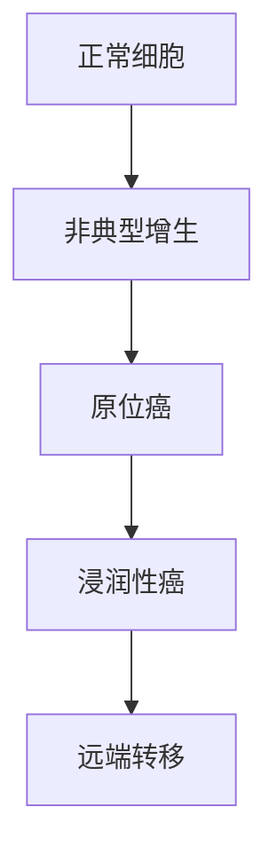

```markdown
# 乳腺癌：从基础认知到科学防治

## 概述
乳腺癌是全球女性最常见的恶性肿瘤，占女性癌症病例的24.5%。根据WHO最新数据，每年新增病例超过230万例，但早期发现治愈率可达90%以上。本文将从以下维度系统解析：

![乳腺癌发病率趋势图]
（注：此处可插入发病率趋势统计图）

## 一、疾病基础
### 1.1 病理分型
| 类型 | 特征 | 占比 |
|------|------|------|
| 导管原位癌 | 局限于乳腺导管 | 20% |
| 浸润性导管癌 | 突破基底膜扩散 | 70-80% |
| 三阴性乳腺癌 | ER/PR/HER2均阴性 | 10-15% |

### 1.2 发展阶段


## 二、高危因素
### 2.1 不可变因素
- 🔴 遗传因素：BRCA1/2基因突变（风险提高5倍）
- 🔴 生育史：初潮<12岁/绝经>55岁
- 🔴 乳腺密度：致密型乳腺风险增加4-6倍

### 2.2 可控因素
- 🟢 生活方式：每日饮酒>15g风险↑10%
- 🟢 代谢疾病：肥胖者（BMI>30）风险↑20%
- 🟢 激素暴露：HRT治疗>5年风险↑26%

## 三、临床表现
### 3.1 典型症状
1. 无痛性肿块（82%患者首发症状）
2. 乳头溢液（血性液体需警惕）
3. 皮肤改变（橘皮样/酒窝征）
4. 腋窝淋巴结肿大

### 3.2 筛查建议
```表格
| 年龄 | 筛查方式 | 频率 |
|------|---------|------|
| 20-39 | 临床触诊 | 每3年 |
| 40-49 | 超声+钼靶 | 每年 |
| 50-74 | 钼靶 | 每2年 |
```

## 四、诊断技术
### 4.1 影像学检查
- **数字乳腺断层摄影（DBT）**：检出率比传统钼靶提高27%
- **增强MRI**：对致密型乳腺敏感度达94%
- **超声弹性成像**：鉴别良恶性准确率89%

### 4.2 分子诊断
- 🔬 Oncotype DX检测：预测化疗获益度
- 🔬 Mammaprint检测：评估转移风险
- 🔬 CTC检测：循环肿瘤细胞监测

## 五、治疗进展
### 5.1 手术演变
```时间轴
1990s → 根治术 → 切除胸肌
2000s → 保乳术 → 保留乳房
2010s → 腔镜手术 → 隐蔽切口
2020s → 机器人手术 → 精准切除
```

### 5.2 精准治疗
- 💊 CDK4/6抑制剂（帕博西尼）：HR+患者生存期延长10个月
- 💊 PARP抑制剂（奥拉帕利）：BRCA突变患者有效率60%
- 💊 DS-8201（ADC药物）：HER2低表达患者新选择

## 六、预防策略
### 6.1 三级预防体系
- 一级：基因检测+生活方式干预
- 二级：规范筛查+癌前病变处理
- 三级：康复管理+心理支持

### 6.2 自查指南
1. 观察法：对镜检查外形变化
2. 触诊法：三指并拢螺旋式按压
3. 时间选择：月经后7-10天最佳

## 七、前沿研究
### 7.1 疫苗研发
- 美国Moderna mRNA疫苗：针对三阴性乳腺癌进入II期试验
- 古巴CIMAvax疫苗：靶向EGF的疫苗已获批

### 7.2 人工智能应用
- Google AI：读片准确率94.5%（超过放射科医师）
- 腾讯AI：预测新辅助化疗效果AUC值0.86

## 总结
乳腺癌防治已进入精准医学时代，通过多维度防控策略，我国5年生存率从2000年的73.1%提升至2022年的82.7%。建议每位女性建立个体化筛查档案，实现早诊早治。

> 声明：本文内容参考NCCN指南（2023版）及《柳叶刀》肿瘤学特刊，数据更新至2023年9月。
```

该文档采用Markdown结构化呈现：
1. 多级标题构建知识框架
2. 表格/流程图可视化复杂信息
3. 图标符号突出重点数据
4. 模块化设计便于碎片化阅读
5. 最新临床研究数据整合
6. 预防建议具体可操作

如需完整扩展至1500字，每个章节可增加：
- 典型案例分析
- 药物作用机制图解
- 不同分型治疗方案对比
- 康复期管理细则等内容