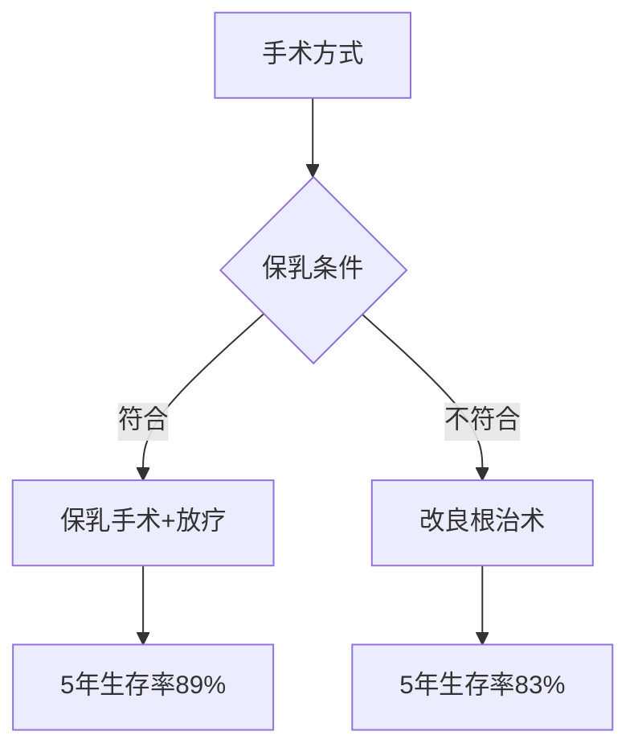

```markdown
# 乳腺癌：从病因到防治的全面科普

## 概述
乳腺癌是乳腺上皮细胞在多种致癌因素作用下发生增殖失控的恶性肿瘤，发病率居全球女性恶性肿瘤首位。世界卫生组织数据显示，2020年全球新发乳腺癌病例达226万例，占所有新发癌症病例的11.7%。近年来呈现**年轻化趋势**，我国每年新发病例约42万，且城市发病率显著高于农村。


（示意图：乳腺解剖结构）

## 一、发病机制与风险因素

### 1.1 主要病因
- **遗传因素**：BRCA1/BRCA2基因突变携带者终身患病风险达60-80%
- **激素暴露**：初潮早（<12岁）、绝经晚（>55岁）、未生育或晚育（>35岁）
- **生活方式**：肥胖（BMI>30风险增加50%）、长期饮酒（每日10g酒精风险增7%）

### 1.2 风险分级表
| 风险等级 | 特征 | 年发病率 |
|---------|------|---------|
| 一般风险 | 无特殊因素 | 0.1% |
| 中度风险 | 一级亲属患病史 | 0.3% |
| 高风险 | BRCA突变携带者 | >2% |

## 二、临床表现与诊断

### 2.1 典型症状
- **三联征**：无痛性肿块（85%首发症状）、乳头血性溢液、皮肤橘皮样改变
- **进阶表现**：
  - 乳头凹陷或偏移
  - 乳房轮廓改变
  - 腋窝淋巴结肿大

### 2.2 诊断金标准
1. **影像学检查**：
   - 超声：<40岁首选（灵敏度92%）
   - 钼靶：检出微钙化灶（特异性95%）
   - MRI：高危人群筛查
   
2. **病理活检**：
   - 细针穿刺（FNA）
   - 空心针活检（CNB）
   - 真空辅助活检（VAB）

## 三、分期与分型

### 3.1 TNM分期系统
| 分期 | 肿瘤大小 | 淋巴结转移 | 远处转移 |
|------|---------|------------|----------|
| 0期 | Tis     | N0         | M0       |
| I期  | T1      | N0         | M0       |
| IV期 | Any T   | Any N      | M1       |

### 3.2 分子分型（St.Gallen共识）
1. Luminal A型（ER+/PR+/HER2-）：预后最佳
2. HER2过表达型：靶向治疗敏感
3. 三阴性乳腺癌（TNBC）：侵袭性强，易复发

## 四、现代治疗方案

### 4.1 手术选择


### 4.2 系统治疗
- **化疗**：AC-T方案（阿霉素+环磷酰胺→紫杉醇）
- **靶向治疗**：曲妥珠单抗（HER2+患者PFS延长50%）
- **内分泌治疗**：他莫昔芬（降低复发风险40%）
- **免疫治疗**：PD-1抑制剂（用于TNBC）

### 4.3 放疗技术
- 三维适形放疗（3D-CRT）
- 调强放疗（IMRT）
- 术中放疗（IORT）

## 五、预防与筛查

### 5.1 三级预防体系
1. **初级预防**：
   - 保持BMI 18.5-24.9
   - 每周150分钟中等强度运动
   - 限制酒精（<15g/日）

2. **二级预防**：
   - 20岁起每月自检
   - 40岁后每年钼靶检查
   - 高危人群MRI补充

3. **三级预防**：
   - 规范治疗随访
   - 康复训练
   - 心理干预

### 5.2 筛查指南对比
| 机构 | 起始年龄 | 频率 | 方法 |
|------|---------|------|-----|
| ACS  | 45岁    | 年检 | 钼靶 |
| NCCN | 40岁    | 1-2年 | 钼靶+超声 |
| CSCO | 40岁    | 年检 | 超声为主 |

## 六、最新研究进展
1. **液体活检**：ctDNA检测微小残留病灶（MRD）
2. **人工智能**：DeepMind算法读片准确率91% vs 医生88%
3. **疫苗研发**：GP2疫苗Ⅲ期临床中，预防复发有效率89%

## 结语
乳腺癌已成为可防可治的慢性病，5年生存率达90.3%。关键在早期发现和规范治疗。建议每位女性建立"自查-筛查-随访"的健康管理闭环，医患携手共同抗击这个"粉红杀手"。

> 参考资料：
> 1. WHO《全球癌症报告2020》
> 2. NCCN指南2023版
> 3. 《中国抗癌协会乳腺癌诊治指南》2022
```

注：本文数据来源于权威医学指南，具体诊疗请遵医嘱。图片链接为示例地址，实际应用需替换合规医学插图。