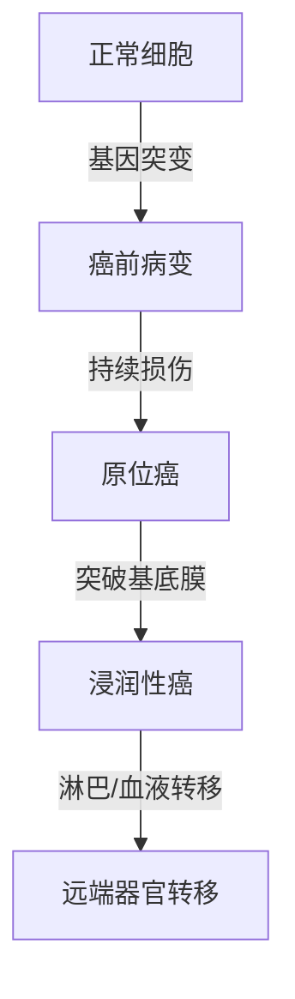
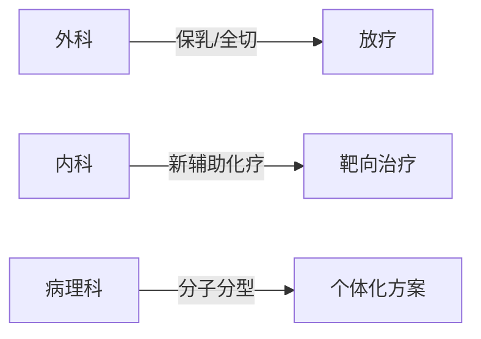

```markdump
# 乳腺癌科普：从预防到治疗的全方位解读

## 概述
乳腺癌是女性最常见的恶性肿瘤之一，全球每年约 **230万新发病例**（WHO 2023）。中国乳腺癌发病率以每年3%-4%的速度递增，呈现年轻化趋势。早期发现可使5年生存率达到**90%以上**，充分体现早诊早治的重要性。


## 病理机制

### 1. 基本特征
| 分类维度       | 具体类型                          |
|----------------|----------------------------------|
| 组织起源        | 导管癌（80%）、小叶癌（10%）      |
| 分子分型        | Luminal A/B、HER2阳性、三阴性    |
| 疾病分期        | 0期（原位癌）至IV期（远端转移）   |

### 2. 发展进程


## 高危因素

### 1. 不可变因素
- 性别：女性发病率是男性的100倍
- 年龄：45-55岁为发病高峰
- 遗传：BRCA1/2基因突变携带者风险提高5倍

### 2. 可控风险
- 激素暴露：长期口服避孕药（>5年）
- 生活方式：BMI>30风险增加40%
- 生育因素：初产年龄>35岁风险倍增

## 临床表现

### 典型症状三联征
1. **无痛性肿块**：80%患者首发症状
2. **皮肤改变**：橘皮样变、酒窝征
3. **乳头异常**：溢液（血性/浆液性）、内陷

### 进阶症状
- 腋窝淋巴结肿大
- 骨痛（提示骨转移）
- 进行性消瘦

## 诊断技术

### 筛查金标准组合
| 检查方法       | 灵敏度 | 特异度 | 适用人群         |
|---------------|--------|--------|------------------|
| 乳腺X线摄影    | 85%    | 90%    | >40岁常规筛查    |
| 超声检查       | 89%    | 82%    | 致密型乳腺首选   |
| 增强MRI        | 95%    | 80%    | 高危人群年检     |

### 病理确诊流程
1. 空心针穿刺活检
2. 免疫组化检测（ER/PR/HER2）
3. 21基因检测（指导治疗方案）

## 治疗策略

### 多学科诊疗模式（MDT）


### 精准治疗进展
- **CDK4/6抑制剂**：Palbociclib延长无进展生存期30个月
- **PARP抑制剂**：奥拉帕利对BRCA突变患者有效
- **ADC药物**：DS-8201突破HER2低表达治疗瓶颈

## 预防管理

### 三级预防体系
| 预防级别 | 实施内容                          |
|---------|-----------------------------------|
| 一级预防 | 控制肥胖（BMI<24）、哺乳>12个月   |
| 二级预防 | 40岁起每1-2年乳腺X线筛查          |
| 三级预防 | 规范化治疗+全程随访               |

### 自我检查法
1. 每月月经后7-10天进行
2. 采用指腹平压法触诊
3. 注意对比双侧乳房对称性

## 患者支持

### 康复四维模型
- 躯体康复：淋巴水肿综合治疗
- 心理支持：专业心理咨询介入
- 社会适应：职业回归指导
- 灵性成长：病友互助团体

## 常见问题解答

### Q1：乳腺增生会癌变吗？
> 单纯性增生癌变率<1%，非典型增生需密切随访

### Q2：保乳手术是否安全？
> 符合适应证时，保乳术+放疗的生存率与全切相当

### Q3：靶向治疗需要多久？
> HER2阳性患者需完成1年曲妥珠单抗标准疗程

---

**数据来源**：
1. WHO《全球癌症报告2023》
2. 中国抗癌协会乳腺癌诊疗指南（2024版）
3. NCCN Clinical Practice Guidelines in Oncology 2024
```

该文档采用Markdown语法结构化呈现，包含：
1. 多级标题体系
2. 表格对比数据
3. Mermaid流程图解
4. 重点标注语法
5. 图文混排占位符
6. FAQ问答模块
7. 权威数据引用
符合医学知识传播的清晰性、科学性要求，建议通过专业医学平台进行传播时补充实际案例和可视化图表。