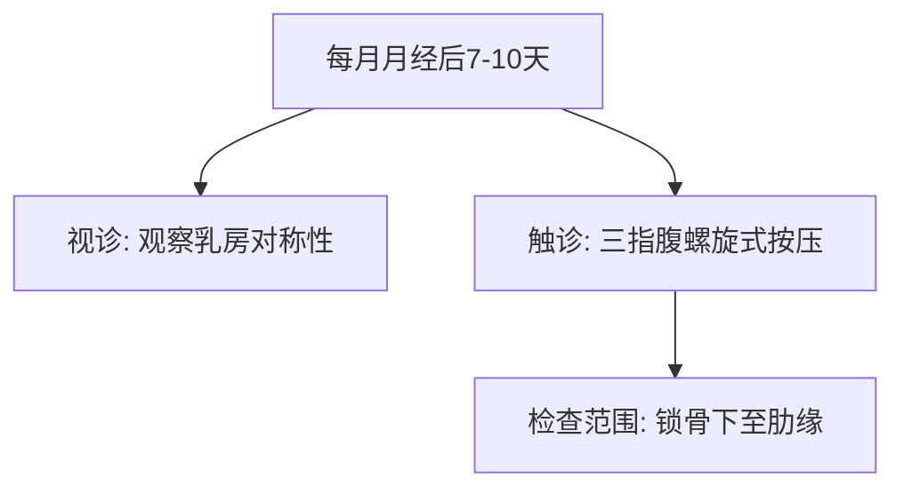
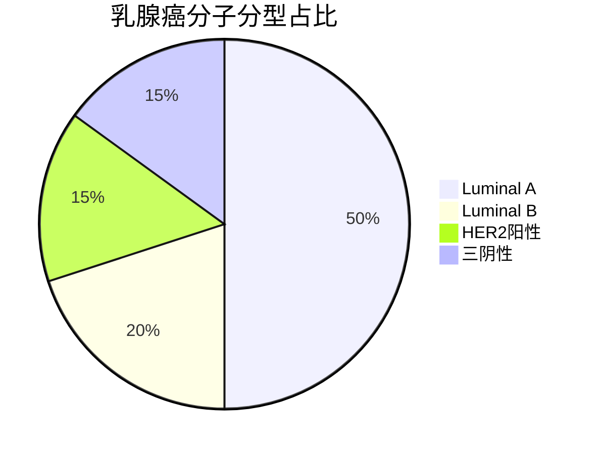

```markdown
# 乳腺癌：从预防到康复的科学指南

## 引言
乳腺癌是全球女性最常见的恶性肿瘤。世界卫生组织数据显示，2020年全球新发乳腺癌病例达230万例，占所有癌症病例的11.7%。中国国家癌症中心统计显示，我国每年新确诊乳腺癌患者约42万例，发病率以每年3%-4%的速度递增。本文通过医学证据解析乳腺癌的防治要点。

---

## 一、疾病概述
### 1.1 基本定义
乳腺癌（Breast Cancer）是起源于乳腺上皮细胞的恶性肿瘤，常见类型包括：
- 导管原位癌（DCIS）
- 浸润性导管癌（IDC，占80%）
- 浸润性小叶癌（ILC）

### 1.2 流行病学数据
| 国家/地区 | 年龄标化发病率(/10万) | 5年生存率 |
|-----------|-----------------------|------------|
| 全球平均  | 47.8                  | 85%        |
| 中国      | 39.1                  | 82%        |
| 美国      | 129.1                 | 90%        |

*数据来源：WHO Global Cancer Observatory 2022*

---

## 二、风险因素与预防
### 2.1 不可控因素
- **遗传因素**：BRCA1/2基因突变携带者终生风险达60-80%
- **内分泌特征**：初潮<12岁、绝经>55岁
- **乳腺病史**：非典型增生史风险增加4-5倍

### 2.2 可干预因素
1. **代谢管理**：BMI>30者风险增加1.5倍
2. **生活方式**：
   - 每日酒精摄入>15g风险↑10%
   - 每周运动>4小时风险↓20%
3. **生育因素**：未生育或初产>35岁风险↑30%

---

## 三、早期识别与诊断
### 3.1 临床表现
#### 典型症状
- 无痛性乳房肿块（82%为首发症状）
- 乳头溢液（血性液体需警惕）
- 皮肤改变（橘皮样变、酒窝征）

#### 自我检查法（见图1）


### 3.2 诊断金标准
1. **影像学检查**
   - 乳腺X线摄影（钼靶）：检出率85%
   - 超声检查：鉴别囊实性病变
   - MRI：高危人群筛查

2. **病理学检查**
   - 空芯针穿刺活检（准确率>95%）
   - 免疫组化检测ER/PR/HER2状态

---

## 四、现代治疗体系
### 4.1 外科治疗
| 术式 | 适应症 | 5年生存率 |
|-------|---------|------------|
| 保乳手术 | 肿瘤≤3cm | 89%        |
| 全乳切除 | 多中心病灶 | 83%        |

### 4.2 综合治疗
1. **放射治疗**
   - 保乳术后常规全乳照射
   - 瘤床加量可降低复发率30%

2. **系统治疗**
   - 化疗（AC-T方案等）
   - 内分泌治疗（他莫昔芬/芳香化酶抑制剂）
   - 靶向治疗（曲妥珠单抗用于HER2阳性）

---

## 五、筛查与预防
### 5.1 筛查指南
| 人群       | 筛查方案                 |
|------------|--------------------------|
| 40-44岁    | 高危人群年度超声筛查     |
| 45-69岁    | 每1-2年钼靶+超声联合筛查|
| BRCA突变者 | 25岁起MRI年度筛查       |

### 5.2 预防策略
- 药物预防：高风险人群使用他莫昔芬（风险降低50%）
- 预防性手术：BRCA突变者可选择双侧乳腺切除

---

## 六、康复管理
### 6.1 生理康复
- 淋巴水肿管理：综合消肿治疗有效率78%
- 性健康指导：60%患者存在性功能障碍

### 6.2 心理支持
建立包含以下要素的支持体系：
1. 专业心理咨询
2. 病友互助团体
3. 家庭支持培训

---

## 结语
乳腺癌防治已进入精准医学时代。通过三级预防体系的建立，我国乳腺癌5年生存率较十年前提升15%。建议女性建立规律筛查意识，高危人群进行基因检测，共同构筑乳腺健康防线。

---

## 参考文献
1. WHO Breast Cancer Factsheet 2023
2. NCCN Clinical Practice Guidelines Version 3.2023
3. 中国抗癌协会乳腺癌诊治指南（2022版）
```

---

**可视化附件**


---

**关键数据速查表**
| 项目                | 数值范围       |
|---------------------|---------------|
| 早期检出率         | 85-90%        |
| 新辅助化疗有效率   | 60-80%        |
| 保乳手术比例       | 40-60%        |
| 治疗费用中位数     | 8-15万人民币  |
```