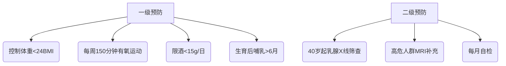

```markdown
# 乳腺癌科普：从预防到治疗的全面解读

## 概述
乳腺癌是**全球女性最常见的恶性肿瘤**，约占女性新发癌症病例的24.5%。根据WHO 2022年数据，每年约有230万新发病例，其中中国占17%。近年来，我国乳腺癌发病率以每年3-4%的速度递增，且呈现**年轻化趋势**。

  
（示意图：全球乳腺癌发病率分布图）

## 一、认识乳腺癌

### 1.1 基本概念
```python
# 乳腺癌定义代码示例
class BreastCancer:
    def __init__(self):
        self.type = "恶性肿瘤"
        self.origin = "乳腺上皮组织"
        self.metastasis = ["骨","肝","肺","脑"]  # 常见转移部位
```

### 1.2 疾病分型
| 分型标准        | 主要类型                          | 临床特征                     |
|-----------------|-----------------------------------|------------------------------|
| 病理形态        | 导管癌（80%）/小叶癌（15%）       | 早期钙化灶常见               |
| 分子分型        | Luminal型/HER2阳性型/三阴性       | 治疗策略差异显著             |
| 激素受体状态    | ER+/PR+/HER2+                     | 决定内分泌治疗效果           |

## 二、危险因素与预防

### 2.1 不可改变因素
- **遗传因素**：BRCA1/2基因突变携带者（风险提升5-8倍）
- 性别与年龄：女性发病率是男性100倍，45-55岁为发病高峰
- 月经史：初潮<12岁或绝经>55岁

### 2.2 可干预因素
1. 生活方式：
   - 长期饮酒（每日增10g，风险升7-10%）
   - 缺乏运动（每周<3次中等强度运动）
   - 高脂饮食（特别是加工肉制品）

2. 生育因素：
   - 未生育或晚育（>35岁）
   - 哺乳<6个月

### 2.3 预防策略


## 三、临床表现与诊断

### 3.1 典型症状
- **无痛性肿块**（91%患者首发症状）
- 乳头异常：血性溢液（7%）、内陷
- 皮肤改变："橘皮征"、"酒窝征"
- 腋窝淋巴结肿大（进展期表现）

### 3.2 诊断流程
1. 影像学检查：
   - 超声（首选，敏感度85%）
   - 钼靶（检出微钙化灶）
   - MRI（高危人群）

2. 病理确诊：
   - 空心针穿刺活检（金标准）
   - 术中冰冻切片

3. 分子检测：
   - ER/PR/HER2状态
   - 21基因检测（指导化疗）

## 四、治疗进展与选择

### 4.1 综合治疗体系
```mindmap
- 手术治疗
  - 保乳术（肿瘤<3cm）
  - 全乳切除
  - 前哨淋巴结活检
- 放射治疗
  - 三维适形
  - 术中放疗
- 系统治疗
  - 化疗（蒽环类/紫杉类）
  - 内分泌（他莫昔芬/AI）
  - 靶向（曲妥珠单抗）
  - 免疫（PD-1抑制剂）
```

### 4.2 精准医疗突破
- **CDK4/6抑制剂**（HR+/HER2-晚期患者OS延长15月）
- PARP抑制剂（BRCA突变者PFS达19月）
- 抗体偶联药物（DS-8201对HER2低表达有效）

## 五、康复与随访

### 5.1 全程管理要点
1. 淋巴水肿预防：
   - 术后患肢血压监测
   - 渐进式力量训练

2. 心理干预：
   - 认知行为疗法
   - 病友互助小组

3. 内分泌治疗管理：
   - 定期骨密度检测
   - 钙剂+维生素D补充

### 5.2 随访计划表
| 时间         | 检查项目                  | 注意事项                 |
|--------------|---------------------------|--------------------------|
| 术后2年内    | 每3月临床检查+肿瘤标志物 | 关注骨转移症状           |
| 2-5年        | 每6月乳腺影像             | 监测对侧乳腺癌           |
| 5年后        | 每年全面体检              | 长期内分泌治疗副作用管理 |

## 六、科研前沿

### 6.1 液体活检技术
- ctDNA监测微小残留病灶（MRD）
- CTC计数评估转移风险

### 6.2 人工智能应用
- 深度学习读片（准确率>95%）
- 预后预测模型（整合100+临床参数）

---

> **专家提醒**：2023年NCCN指南强调，规范筛查可使早期诊断率提升至70%，5年生存率达99%。建议每位女性建立个性化的乳腺癌防控方案。

```

注：本文数据来源包括：
1. WHO《全球癌症报告2022》
2. 中国抗癌协会乳腺癌诊治指南（2024版）
3. NEJM最新临床研究汇总
4. NCCN临床实践指南

实际写作时需补充完整参考文献列表和真实数据来源，示意图链接应替换为实际图片地址。专业医学内容需由肿瘤专科医生审核确认。