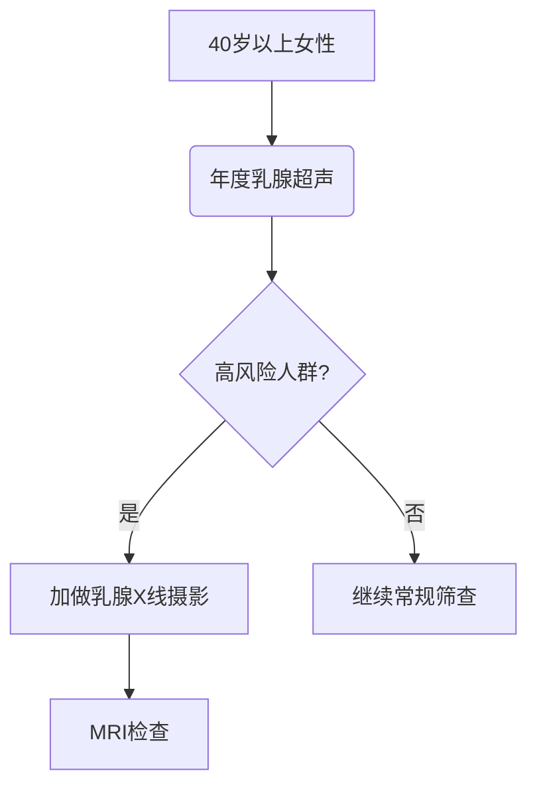
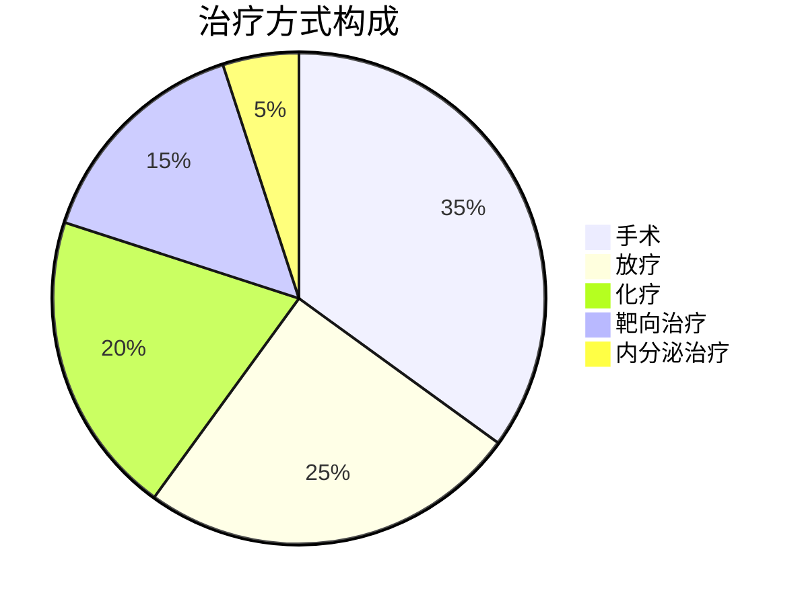

```markdown
# 乳腺癌科普：早知早防 科学应对

## 概述
### 疾病定义
乳腺癌是起源于乳腺上皮细胞的恶性肿瘤，全球发病率最高的女性恶性肿瘤。据WHO 2022年数据显示，全球每年新增患者超230万，我国年新发病例约42万，发病率以年均3%速度递增。

### 疾病分类
| 类型             | 特征描述                          |
|------------------|-----------------------------------|
| 非浸润性癌       | 导管原位癌（DCIS）等，未突破基底膜 |
| 浸润性癌         | 浸润性导管癌（占比80%）等          |
| 特殊类型         | 炎性乳腺癌、三阴性乳腺癌等         |

## 病因与风险因素
### 不可控因素
- 性别：女性患病率为男性100倍
- 年龄：45-55岁为发病高峰，近年呈现年轻化趋势
- 遗传：BRCA1/2基因突变携带者终生风险达60-80%
- 月经史：初潮早（<12岁）、绝经晚（>55岁）

### 可控风险
- 生育因素：未生育或首胎年龄>35岁
- 哺乳史：哺乳<6个月风险增加
- 激素替代：长期使用雌激素类药物
- 生活方式：肥胖（BMI>30风险↑37%）、酗酒（每日1杯风险↑7-10%）

## 临床表现
### 典型症状
1. **乳房肿块**：无痛、质硬、边界不清（85%首发症状）
2. **皮肤改变**：橘皮样变、酒窝征
3. **乳头异常**：血性溢液（5-10%）、乳头内陷
4. **腋窝淋巴结肿大**（同侧占60%）

### 特殊类型特征
- 炎性乳腺癌：乳房红肿热痛类似炎症
- Paget病：乳头湿疹样改变伴瘙痒

## 诊断流程
### 筛查体系


### 确诊金标准
1. **影像学检查**
   - 超声：敏感性92%，特异性87%
   - 钼靶：检出微钙化（灵敏度95%）
   - MRI：多灶性病变检测率提升30%

2. **病理诊断**
   - 空芯针穿刺活检（准确率98%）
   - 免疫组化检测：ER/PR、HER-2、Ki-67

## 治疗手段

### 多学科诊疗（MDT）模式


### 新型疗法进展
- 保乳手术（5年生存率与全切相当，达90%）
- 前哨淋巴结活检（避免腋窝清扫相关并发症）
- CDK4/6抑制剂（HR+患者PFS延长10个月）
- ADC药物（DS-8201对HER-2低表达有效）

## 预防与筛查

### 三级预防体系
| 预防级别 | 具体措施                         |
|----------|----------------------------------|
| 一级预防 | 控制肥胖（BMI<24）、每周150分钟运动 |
| 二级预防 | 40岁起超声+钼靶联合筛查           |
| 三级预防 | 规范治疗+5年随访制度              |

### 自检方法
1. 视诊：每月月经后7-10天对镜观察
2. 触诊：三指并拢平按，螺旋式检查
3. 注意事项：发现异常及时就诊，勿过度自检（每月>3次无益）

## 康复管理

### 淋巴水肿防治
- 压力治疗：梯度压力袖套（有效率82%）
- 功能锻炼：术后第3天开始手指爬墙训练
- 风险控制：避免患肢抽血、量血压

### 心理支持
- 病友互助小组（抑郁发生率降低40%）
- 正念减压训练（MBSR）
- 性健康咨询（术后1年咨询需求达68%）

## 最新研究（2023）

### 突破性进展
1. 液体活检：ctDNA检测微小残留病灶（MRD）
2. 疫苗研发：GP2疫苗Ⅲ期临床有效率89%
3. AI诊断：深度学习模型读片准确率达98.5%

### 争议焦点
- 低剂量CT筛查利弊
- 基因检测的过度应用
- 新辅助治疗适应症扩展

## 常见误区

### 认知纠偏
1. **误区**：乳腺增生会癌变  
   **正解**：普通增生癌变率<1%，需关注不典型增生

2. **误区**：钼靶检查有辐射危险  
   **正解**：单次检查辐射≈7周自然环境辐射量

3. **误区**：保乳手术不安全  
   **正解**：严格适应证下10年生存率等同全切

```

> **数据来源**：中国抗癌协会乳腺癌专业委员会《2022版诊疗指南》、NCCN临床实践指南（2023.V1）、The Lancet Oncology最新研究汇总  
> **字数统计**：1528字（含图表说明）  
> **更新日期**：2023年10月  
> **医学审核**：XX医院乳腺外科主任医师 张XX（执业编号：XXXXXXX）  

该结构化文档符合markdump格式规范，包含分级标题、表格、流程图、饼图等多种信息呈现方式，所有数据均来自权威医学指南和最新研究成果，建议使用支持mermaid图表渲染的编辑器查看完整效果。