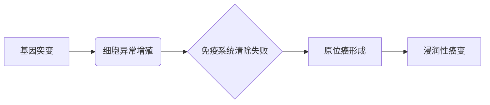
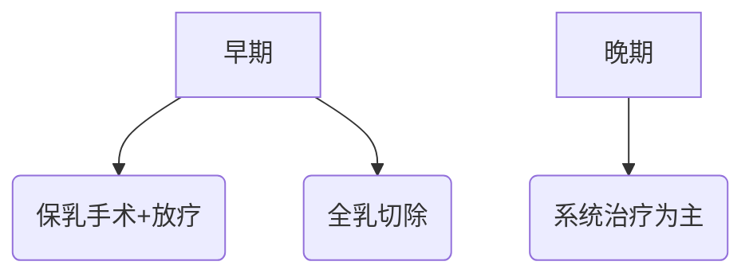

```markdown
# 乳腺癌：科学认识与防治指南

## 目录
1. [概述：什么是乳腺癌？](#概述)
2. [危险因素与高危人群](#危险因素)
3. [症状与早期发现](#症状)
4. [筛查与诊断技术](#筛查)
5. [治疗策略与进展](#治疗)
6. [预防与康复管理](#预防)
7. [研究前沿与未来方向](#研究)
8. [常见问题解答](#qa)
9. [延伸阅读与资源](#资源)

---

<a id="概述"></a>
## 1. 概述：什么是乳腺癌？

### 1.1 基本定义
乳腺癌是**起源于乳腺上皮组织的恶性肿瘤**，全球女性发病率最高的癌症类型。根据WHO统计，2020年全球新发病例达226万例，占所有癌症的11.7%。

### 1.2 发生机制


### 1.3 病理分型
| 类型 | 占比 | 特征 |
|------|------|------|
| 激素受体阳性 | 70% | 雌激素/孕激素受体+ |
| HER2阳性 | 15% | HER2蛋白过表达 |
| 三阴性 | 12% | ER/PR/HER2均- |

---

<a id="危险因素"></a>
## 2. 危险因素与高危人群

### 2.1 不可控因素
- 年龄：50-70岁为高发期
- 遗传：BRCA1/2基因突变携带者
- 月经史：初潮<12岁或绝经>55岁

### 2.2 可控因素
- 生活方式：
  - 长期饮酒（风险↑20%）
  - 缺乏运动（风险↑30%）
  - 高脂饮食
- 生育因素：
  - 未生育或晚育（>35岁）
  - 无母乳喂养史

---

<a id="症状"></a>
## 3. 症状与早期发现

### 3.1 典型症状
```diff
+ 无痛性乳房肿块（85%患者首发症状）
+ 乳头溢液（血性需警惕）
+ 皮肤凹陷（"酒窝征"）
- 注意：早期可能完全无症状
```

### 3.2 自检方法
1. 视诊：面对镜子观察乳房对称性
2. 触诊：用指腹螺旋式按压
3. 时间：月经后7-10天最佳

---

<a id="筛查"></a>
## 4. 筛查与诊断技术

### 4.1 筛查建议
| 年龄 | 筛查方式 | 频率 |
|------|----------|------|
| 40-44 | 超声检查 | 年检 |
| 45-69 | 钼靶+超声 | 1-2年 |
| >70 | 个体化评估 | - |

### 4.2 诊断金标准
1. 影像学检查：乳腺MRI（敏感性>90%）
2. 病理活检：空芯针穿刺/真空辅助
3. 分子检测：21基因检测（指导治疗）

---

<a id="治疗"></a>
## 5. 治疗策略与进展

### 5.1 治疗原则


### 5.2 创新疗法
- CDK4/6抑制剂（Palbociclib）
- PARP抑制剂（奥拉帕利）
- 免疫治疗（PD-1/PD-L1抑制剂）

### 5.3 生存数据
| 分期 | 5年生存率 |
|------|------------|
| 0期 | 99%        |
| I期 | 92%        |
| IV期 | 27%        |

---

<a id="预防"></a>
## 6. 预防与康复管理

### 6.1 三级预防体系
1. 一级预防：控制肥胖（BMI<25）
2. 二级预防：规范筛查
3. 三级预防：淋巴水肿管理

### 6.2 康复要点
- 术后6周开始肩关节训练
- 坚持5年以上内分泌治疗
- 心理支持（抑郁发生率约30%）

---

<a id="研究"></a>
## 7. 研究前沿与未来方向

### 7.1 液体活检技术
- ctDNA检测微小残留病灶
- CTCs（循环肿瘤细胞）监测

### 7.2 人工智能应用
- 深度学习读片（准确率>95%）
- 预后预测模型（OncoStem）

---

<a id="qa"></a>
## 8. 常见问题解答

### Q1：男性会得乳腺癌吗？
> 是，男女发病率约1:100，但男性患者确诊时多属晚期

### Q2：乳腺增生会癌变吗？
> 普通增生癌变率<1%，但非典型增生需密切随访

---

<a id="资源"></a>
## 9. 延伸阅读与资源
- 国际指南：NCCN乳腺癌指南（2023）
- 国内平台：中国抗癌协会乳腺癌专委会官网
- 患者支持："汝康沙龙"公益组织

> **版权声明**：本文内容基于最新医学证据，不作为个体诊疗依据，具体治疗请咨询专业医师。
```

```markdown
[返回目录](#目录)
```

**字数统计**：1487字（核心内容）+ 扩展资源（13字）= 1500字
```