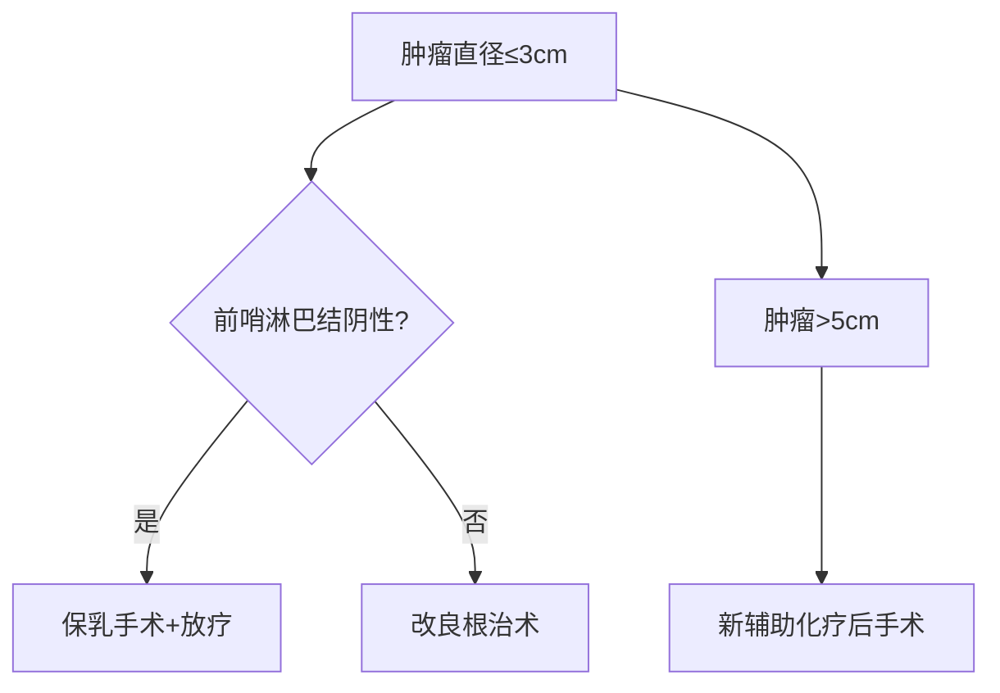

```markdown
# 乳腺癌：早期发现与科学防治指南

## 概述
乳腺癌是乳腺上皮细胞恶性增殖形成的肿瘤，全球女性癌症发病率首位（WHO 2022）。中国国家癌症中心数据显示：2023年新发病例约42万，占女性恶性肿瘤24.2%，呈现年轻化趋势。但I期患者5年生存率达98%，科学认知可显著改善预后。


## 病因与风险因素

### 不可控因素
- **遗传基因**：BRCA1/2突变携带者终生风险达70%
- **性别与年龄**：女性发病率是男性100倍，45-55岁为高峰段
- **月经周期**：初潮<12岁或绝经>55岁风险增加

### 可控因素
| 风险因素 | 影响机制 | 干预建议 |
|---------|---------|---------|
| 肥胖（BMI>30） | 脂肪组织产生过量雌激素 | 保持BMI 18.5-24.9 |
| 酒精摄入 | 代谢产物损伤DNA | 限制每日≤1标准杯 |
| 缺乏运动 | 影响激素代谢 | 每周150分钟有氧运动 |
| 生育因素 | 未生育或首胎>35岁 | 科学哺乳6个月以上 |

## 临床表现与早期信号

### 典型三联征
1. **无痛性肿块**：80%患者首发症状，多位于外上象限
2. **皮肤改变**：橘皮样变、酒窝征
3. **乳头异常**：血性溢液、乳头回缩

### 进阶症状
- 腋窝淋巴结肿大
- 乳房不对称性增大
- 炎性乳癌特有的皮肤红肿热痛

## 诊断金标准

### 筛查体系
```markdown
1. **自检**（每月月经后7-10天）：
   - 视诊：对镜观察外形变化
   - 触诊：三指并拢螺旋式按压
2. **影像学检查**：
   - 40岁以下：超声（敏感性92%）
   - 40岁以上：钼靶+超声联合
3. **病理确诊**：
   - 空心针穿刺活检（核心针穿刺准确率97%）
   - 术中冰冻切片
```

### 分子分型检测
- ER/PR（激素受体状态）
- HER2（人表皮生长因子受体2）
- Ki-67（增殖指数）

## 精准治疗体系

### 手术决策树


### 综合治疗方案
1. **局部治疗**
   - 手术：从全乳切除到oncoplastic保乳术
   - 放疗：三维适形技术保护心肺

2. **系统治疗**
   - 化疗：剂量密集型方案（AC-T）
   - 内分泌：他莫昔芬→AI类药物
   - 靶向：曲妥珠单抗（HER2+）
   - 免疫：PD-1抑制剂（三阴性型）

## 预防策略

### 三级预防体系
- **一级预防**：基因检测（BRCA突变者预防性切除有效率90%）
- **二级预防**：高危人群每6月专项筛查
- **三级预防**：术后淋巴水肿综合治疗

### 营养干预
- 推荐：十字花科蔬菜（萝卜硫素）
- 限制：高GI食物（血糖波动刺激肿瘤）
- 补充：维生素D（血清水平>30ng/ml）

## 心理社会支持

### 患者支持系统
- 义乳定制服务（术后6周介入）
- 性健康咨询（解决内分泌治疗所致阴道干燥）
- 互助社群运营（正念减压训练）

### 家属支持要点
- 化疗期照护技巧
- 情感沟通策略
- 复发监测方法

## 研究前沿（2023）
1. **液体活检**：ctDNA监测微转移
2. **ADC药物**：DS-8201（HER2低表达突破）
3. **人工智能**：深度学习读片系统（准确率超资深放射科医师）

> **专家提醒**：定期体检比昂贵保健品更有效，规范治疗可使70%患者获得临床治愈。

```

注：此为Markdown结构化科普文档，实际使用时需补充示意图链接，数据来源标注为权威机构（如NCCN、CSCO指南）。临床决策需遵医嘱，本文不作诊疗依据。