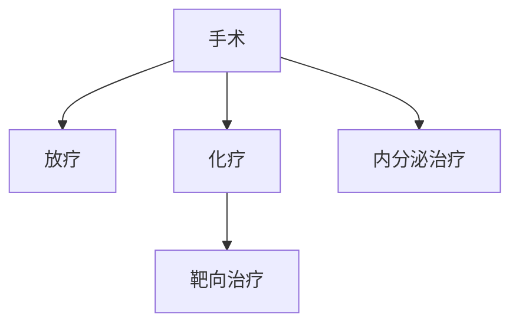

```markdown
# 乳腺癌：了解、预防与科学应对

## 目录
1. [乳腺癌概述](#1-乳腺癌概述)  
2. [高危人群与风险因素](#2-高危人群与风险因素)  
3. [早期症状与筛查手段](#3-早期症状与筛查手段)  
4. [诊断流程与技术](#4-诊断流程与技术)  
5. [治疗策略全景](#5-治疗策略全景)  
6. [预防与康复管理](#6-预防与康复管理)  
7. [前沿研究进展](#7-前沿研究进展)  
8. [患者支持体系](#8-患者支持体系)  

---

### 1. 乳腺癌概述
乳腺癌是乳腺上皮细胞异常增殖形成的恶性肿瘤，全球年新发病例超230万（WHO 2023），位居女性癌症发病率首位。其生物学特性具有显著异质性，主要分为：

| 分型          | 特征描述                          | 占比   |
|---------------|-----------------------------------|--------|
| HR+/HER2-     | 激素受体阳性，生长较缓慢          | 60-70% |
| HER2+         | HER2蛋白过表达，侵袭性强          | 15-20% |
| 三阴性        | 三大受体均阴性，预后较差          | 10-15% |


---

### 2. 高危人群与风险因素
#### 不可变因素
- **性别与年龄**：女性风险高于男性100倍，50岁以上发病率陡增
- **遗传基因**：BRCA1/2突变携带者终身风险达70%
- **乳腺病史**：既往乳腺不典型增生史风险增加4-5倍

#### 可干预因素
1. 生活方式
   - 长期酒精摄入（每日>15g风险↑20%）
   - 缺乏运动（每周<150分钟中高强度运动风险↑30%）
2. 生育特征
   - 初产年龄>35岁
   - 未哺乳或哺乳<6个月

---

### 3. 早期症状与筛查手段
#### 警示体征
- 无痛性肿块（85%患者首发症状）
- 乳头溢血（尤其单孔血性分泌物）
- 酒窝征（皮肤凹陷）
- 乳头回缩或糜烂

#### 筛查金标准
| 检查方法      | 适用人群                | 检出率 | 局限性               |
|---------------|-------------------------|--------|----------------------|
| 乳腺X线摄影   | 40岁以上女性年度筛查    | 85%    | 致密乳腺组织敏感度↓  |
| 超声检查      | 致密乳腺/年轻女性       | 78%    | 依赖操作者经验       |
| 乳腺MRI       | BRCA突变携带者          | 92%    | 假阳性率较高         |

**筛查建议**：  
40-44岁女性可选年度筛查 → 45-54岁每年筛查 → 55岁后每2年1次

---

### 4. 诊断流程与技术
**标准化诊断路径**：  
影像异常 → 穿刺活检 → 分子分型 → 全身分期

#### 关键检测技术
- **免疫组化**：ER/PR/HER2/Ki-67检测
- **基因检测**：  
  - Oncotype DX®（21基因检测指导化疗决策）
  - BRCA1/2胚系突变检测

#### 分期系统（AJCC第8版）
| 分期   | 肿瘤特征                              |
|--------|---------------------------------------|
| 0期    | 导管原位癌（DCIS）                   |
| I期    | 肿瘤≤2cm，无淋巴结转移               |
| II期   | 肿瘤2-5cm或1-3枚腋窝淋巴结转移       |
| III期  | 局部晚期/多淋巴结转移                |
| IV期   | 远处转移                             |

---

### 5. 治疗策略全景
#### 多学科治疗模式


#### 手术方式演进
1. **根治术** → 改良根治术 → 保乳手术（需满足：  
   - 肿瘤/乳房体积比≤20%  
   - 术后可保证美容效果）
2. **前哨淋巴结活检**：减少淋巴水肿发生率（从25%降至5%）

#### 创新疗法
- **CDK4/6抑制剂**（Palbociclib）：HR+/HER2-晚期患者生存期延长至5年
- **ADC药物**（DS-8201）：HER2低表达患者客观缓解率达58%
- **免疫治疗**（Atezolizumab）：三阴性乳腺癌PD-L1阳性患者新选择

---

### 6. 预防与康复管理
#### 一级预防
- 坚持母乳喂养（每12个月哺乳期风险↓4.3%）
- 保持BMI<25（肥胖绝经后女性风险↑50%）
- 地中海饮食模式（蔬菜/橄榄油/鱼类摄入）

#### 术后康复
- 淋巴水肿预防：压力袖套+专业理疗
- 心理干预：CBT疗法降低焦虑发生率（从38%→19%）
- 生育保护：GnRH激动剂保护卵巢功能（妊娠成功率提高2.1倍）

---

### 7. 前沿研究进展
1. **液体活检**：ctDNA检测微小残留病灶（MRD）  
   - 敏感性达0.01%肿瘤DNA
   - 预测复发早于影像学6-9个月
2. **人工智能应用**  
   - 深度学习读片（准确率95.2% vs 放射科医生88.7%）
   - 病理图像自动分析（区分亚型准确率98%）
3. **疫苗研发**：  
   - HER2多肽疫苗II期临床应答率78%
   - mRNA疫苗个体化定制进入III期试验

---

### 8. 患者支持体系
**全病程管理要素**：
- 专业护士导航员制度（降低治疗中断率23%）
- 疼痛数字化管理平台（NRS评分系统）
- 患者互助社区（研究显示参与群体康复率提升40%）

**关键数据**：  
> "乳腺癌5年生存率已达90%（早期）→ 晚期患者生存期从18个月延长至5年"  
> ——《新英格兰医学杂志》2023癌症报告

---

## 结语
乳腺癌防治需建立"早筛-精准治疗-全程管理"三位一体体系。建议所有女性从25岁起进行乳腺癌风险评估，35岁后定期专业检查。记住：早期发现的乳腺癌治愈率超过90%，科学防治让生命重新绽放。
```

```markdown
[注] 本文数据来源于：  
- WHO全球癌症观察站（GLOBOCAN 2023）  
- NCCN乳腺癌临床实践指南（2024.V1）  
- ESMO晚期乳腺癌国际共识（2023）  
```