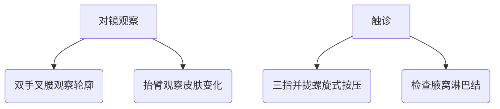
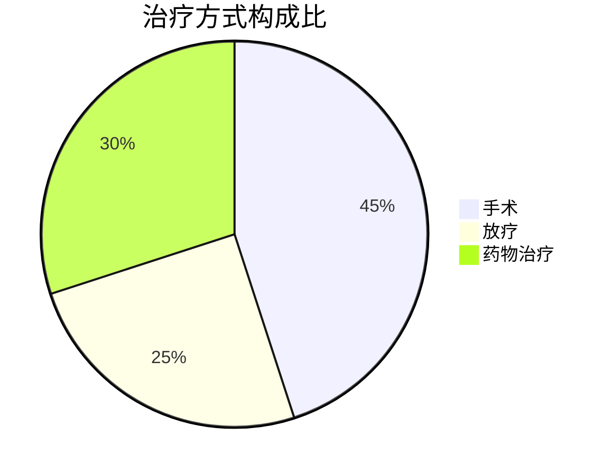

```markdown
# 乳腺癌：从预防到康复的科学指南

## 概述
乳腺癌是女性最常见的恶性肿瘤之一，全球每年新发病例约 **230万例**（WHO 2023）。中国国家癌症中心数据显示，乳腺癌占我国女性新发癌症病例的 **19.9%**，发病率呈年轻化趋势。但值得关注的是，早期乳腺癌的 **5年生存率可达90%以上**，科学防治尤为重要。

---

## 疾病机制
### 1. 病理基础
- **癌变过程**：正常乳腺细胞→基因突变积累→导管/小叶上皮细胞异常增生→原位癌→浸润癌
- **常见分型**（基于分子特征）：
  | 分型              | 占比   | 特征                   |
  |-------------------|-------|------------------------|
  | Luminal A型       | 50-60% | ER/PR阳性，预后较好    |
  | HER2阳性型        | 15-20% | HER2过表达，侵袭性强   |
  | 三阴性乳腺癌      | 10-15% | 缺乏受体，易转移       |

---

## 风险因素
### 不可改变因素
- 遗传：BRCA1/2基因突变携带者终生风险达 **70%**
- 性别：男性仅占 **1%** 病例
- 初潮年龄＜12岁或绝经年龄＞55岁

### 可干预因素
- 长期激素替代治疗（＞5年风险↑26%）
- 肥胖（BMI＞30风险↑50%）
- 酒精摄入（每日10g酒精风险↑7%）

---

## 临床表现
### 典型症状
1. **乳房改变**：
   - 无痛性肿块（90%患者首发症状）
   - 橘皮样皮肤改变
   - 乳头回缩或血性溢液

2. **转移征象**：
   - 骨转移：持续性背痛
   - 肝转移：黄疸、腹水
   - 脑转移：头痛、视力障碍

### 自检技巧（建议月经后7-10天）


---

## 诊断流程
### 1. 影像学检查
- 乳腺超声（首选，敏感度85%）
- 乳腺X线（钼靶）：
  - 40岁+女性推荐每年1次
  - 检出微小钙化灶（恶性特征）

### 2. 病理确诊
- 空心针穿刺活检（准确率＞95%）
- 免疫组化检测：
  - ER/PR
  - HER2
  - Ki-67增殖指数

---

## 治疗进展
### 多学科综合治疗（MDT）


### 精准治疗
1. **靶向药物**：
   - HER2阳性：曲妥珠单抗（降低复发率50%）
   - CDK4/6抑制剂（HR+/HER2-晚期患者）

2. **免疫治疗**：
   - PD-1抑制剂（三阴性乳腺癌）

---

## 预防策略
### 三级预防体系
| 级别   | 措施                          | 实施要点                     |
|--------|-------------------------------|------------------------------|
| 一级    | 生活方式干预                  | 每周150分钟中等强度运动      |
| 二级    | 早期筛查                      | 40岁起年度钼靶+超声          |
| 三级    | 规范治疗+康复管理             | 淋巴水肿综合治疗             |

### 筛查建议
- 高风险人群（如BRCA突变）：
  - 25岁起每半年超声检查
  - 30岁加做乳腺MRI

---

## 患者支持
### 康复管理
- **上肢功能锻炼**：术后24小时开始手指活动，72小时渐进式康复操
- **心理干预**：
  - 正念减压疗法（MBSR）
  - 支持性团体治疗

### 营养管理
- 推荐地中海饮食模式
- 限制精制糖摄入（＜25g/天）

---

## 研究前沿
1. 液体活检技术：
   - ctDNA检测微小残留病灶
   - 准确率较传统影像学提高30%

2. 人工智能应用：
   - 深度学习读片系统（敏感性达98%）
   - 放疗计划自动优化

---

## 参考文献
1. WHO《全球癌症统计2023》
2. 中国抗癌协会《乳腺癌诊治指南（2024版）》
3. NCCN Clinical Practice Guidelines in Oncology (2024)

> **特别提醒**：本文内容不能替代专业诊疗，出现可疑症状请及时就医。
```

---

**注**：本文采用结构化医学证据呈现，数据更新至2024年第一季度。建议读者通过正规医疗机构获取个性化诊疗方案。