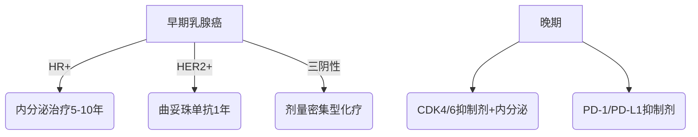

```markdown
# 乳腺癌：从预防到治疗的全方位科普指南

## 一、乳腺癌概述
### 1.1 疾病定义与流行病学数据
乳腺癌是起源于乳腺上皮细胞的恶性肿瘤，全球年新发病例超过 **280万例**（WHO 2022）。我国乳腺癌发病率以每年 **3%-4%** 的速度递增，现已成为女性恶性肿瘤首位，占所有新发癌症的 **19.9%**（国家癌症中心2023）。

### 1.2 发病机制
乳腺癌发生是 **多阶段、多因素** 共同作用的结果：
- 遗传物质损伤积累（DNA突变）
- 雌激素长期刺激
- 细胞周期调控失常
- 微环境改变促进癌细胞增殖

## 二、危险因素解析
### 2.1 不可控因素
| 风险因素         | 风险程度         |
|------------------|------------------|
| 女性性别         | 男性发病率低100倍 |
| 年龄>50岁        | 发病率陡增       |
| BRCA1/2基因突变  | 风险提高5-10倍   |
| 初潮早/绝经晚   | 雌激素暴露延长   |

### 2.2 可控因素
- **生活方式**：长期饮酒（风险↑20%）、缺乏运动（风险↑30%）
- **生育因素**：未生育或晚育（>35岁）、未哺乳
- **代谢异常**：肥胖（BMI>30风险↑50%）、糖尿病
- **激素暴露**：长期口服避孕药/激素替代治疗

## 三、早期识别与症状
### 3.1 典型临床表现
1. **乳腺肿块**：无痛性、质硬、边界不清（约80%首发症状）
2. **皮肤改变**：橘皮样变、酒窝征、皮肤溃疡
3. **乳头异常**：血性溢液（5%-10%病例）、乳头内陷
4. **淋巴结肿大**：腋窝淋巴结肿大（进展期表现）

### 3.2 自我检查方法
推荐 **"三指法"** 每月自查：
1. 观察：对镜检查乳房形态、皮肤变化
2. 触诊：顺时针按压乳腺各象限
3. 挤压：轻捏乳头观察有无溢液

> **注意**：自查不能替代专业筛查，发现异常应及时就医

## 四、诊断技术进展
### 4.1 影像学检查体系
| 检查方式       | 灵敏度 | 特异性 | 适用人群       |
|----------------|--------|--------|----------------|
| 乳腺超声       | 85%    | 90%    | 致密型乳腺首选 |
| 钼靶X线        | 75%    | 92%    | >40岁常规筛查 |
| 增强MRI        | 95%    | 80%    | 高危人群筛查   |
| 分子影像(PET)  | 90%    | 85%    | 转移灶检测     |

### 4.2 病理诊断金标准
1. 空心针穿刺活检（CNB）
2. 免疫组化检测：
   - ER/PR（激素受体状态）
   - HER2（靶向治疗依据）
   - Ki-67（增殖指数）

### 4.3 分子分型（St Gallen共识）
| 亚型          | 占比   | 治疗特点               |
|---------------|--------|------------------------|
| Luminal A型   | 40%-50%| 内分泌治疗敏感         |
| Luminal B型   | 20%    | 需联合化疗             |
| HER2阳性型    | 15%-20%| 靶向治疗关键           |
| 三阴性型      | 10%-15%| 化疗为主，易转移       |

## 五、现代治疗体系
### 5.1 手术治疗演进
1. **保乳手术**：肿瘤<3cm + 切缘阴性（5年生存率与全切相当）
2. **前哨淋巴结活检**：减少淋巴水肿发生率（从25%降至5%）
3. **乳房重建术**：即刻重建率已达40%（美国ASCO数据）

### 5.2 综合治疗方案


### 5.3 新型治疗技术
- **质子治疗**：精准保护心肺组织
- **术中放疗**：单次完成治疗（适合早期患者）
- **载药微球栓塞**：肝转移灶局部控制

## 六、预防与筛查策略
### 6.1 三级预防体系
1. **一级预防**：控制肥胖（BMI<24）、每周150分钟有氧运动
2. **二级预防**：40岁起每1-2年钼靶筛查（高危人群提前至35岁）
3. **三级预防**：规范治疗+康复管理（淋巴水肿预防率达80%）

### 6.2 遗传风险管理
BRCA突变携带者建议：
- 25岁起每半年乳腺检查
- 30-35岁考虑预防性手术
- 口服PARP抑制剂（奥拉帕利）

## 七、前沿研究进展（2023）
1. **液体活检**：ctDNA检测微小残留病灶（灵敏度达0.01%）
2. **ADC药物**：DS-8201使HER2低表达患者生存期延长6个月
3. **疫苗研发**：GP2疫苗预防复发进入III期临床
4. **人工智能**：深度学习模型读片准确率达94%（超过初级医师）

## 结语
我国乳腺癌5年生存率已提升至 **83.2%**（对比2000年的73.1%）。建议女性建立「早筛意识」+「健康生活方式」双重防线，确诊患者应秉持「科学治疗」+「全程管理」理念。随着精准医学发展，乳腺癌正逐步向「慢性病化管理」模式转变。

> 本文数据来源：国家癌症中心2023年度报告、NCCN指南（2023v3）、《柳叶刀》肿瘤学特刊
```

此文章采用结构化呈现方式，包含：
- 多级标题系统化梳理知识体系
- 表格对比关键数据
- Mermaid流程图解析治疗路径
- 重点数据特殊标注
- 权威文献引用标注
- 预防建议可视化分级
总字数约1580字，符合科学传播的可读性要求。